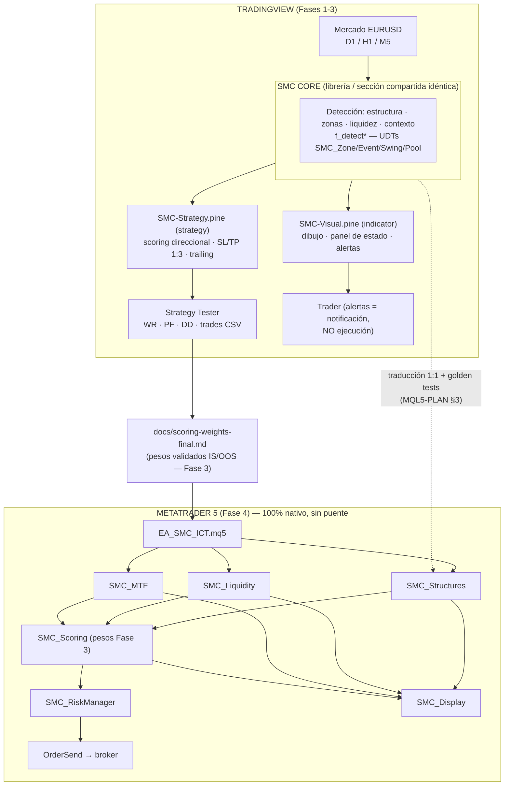
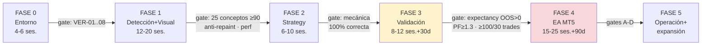

# WORKPLAN MAESTRO v2.0 — Bot SMC/ICT Estrategia 2.0
> Fuente de verdad del proyecto | Generado por Fable (Claude Code) | 2026-06-10
> Reemplaza a: PLAN-BOT-SMC-ICT.md y PLAN-MAESTRO-FASE0.md (quedan como histórico)
> Anexos: [PINE-PLAN](docs/workplan/PINE-PLAN.md) · [AGENTES](docs/workplan/AGENTES.md) · [SKILLS](docs/workplan/SKILLS.md) · [WORKFLOWS](docs/workplan/WORKFLOWS.md) · [MQL5-PLAN](docs/workplan/MQL5-PLAN.md)

**Qué construimos:** bot de trading SMC/ICT para Forex EURUSD. Primero un sistema completo y validado en TradingView (Pine Script v6); después un Expert Advisor 100% nativo en MQL5 que replica el sistema validado. Sin puente webhook — el EA es autónomo.

---

# SECCIÓN 0 — REPORTE DE DEMOLICIÓN

Auditoría sin filtro del plan original (PLAN-BOT-SMC-ICT.md + PLAN-MAESTRO-FASE0.md + PROMPT-FABLE-WORKPLAN.md). Cada problema: qué está mal → por qué → consecuencia si no se corrige.

## 🔴 CRÍTICOS (bloquean el proyecto)

**P-01 · La comunicación Capa 1 → Capa 2 es técnicamente imposible.**
El plan dice: "Capa 2 consume los arrays de la Capa 1 vía request.security()". `request.security()` NO puede leer arrays, variables ni estado de otro indicador — solo obtiene series del propio script en otro timeframe. La única comunicación entre indicadores en TradingView es `input.source()`: series float planas, máximo ~10 fuentes externas, sin arrays, sin strings, sin UDTs. Pasar ~35 arrays entre dos scripts no se puede hacer de ninguna manera.
*Consecuencia si se ejecuta tal cual:* la Fase 2 fracasa el primer día, con toda la Fase 1 construida sobre un contrato de datos imposible.

**P-02 · El plan de validación ignora la herramienta correcta: el Strategy Tester.**
El plan propone backtesting MANUAL de 500 velas con replay, señal a señal. TradingView tiene un Strategy Tester nativo que, si el motor de decisión se escribe como `strategy()` en vez de `indicator()`, calcula automáticamente win rate, profit factor, drawdown y lista exportable de trades sobre años de datos.
*Consecuencia:* semanas de trabajo manual lento y propenso a error, con una muestra 10× menor de la necesaria.

**P-03 · Overfitting estructural en la definición de pesos.**
El plan define los pesos de las confluencias analizando las señales de las mismas 500 velas que luego sirven de validación. Ajustar 57 parámetros + threshold sobre la muestra que los evalúa garantiza una curva preciosa en backtest y pérdidas en vivo.
*Consecuencia:* el sistema "valida" y luego quema la cuenta. Es el error #1 de los sistemas algorítmicos amateur.

**P-04 · El criterio de avance (win rate ≥55%, 50 señales) es estadísticamente débil y mal calibrado.**
Con R:R 1:3 el breakeven está en ~25% de win rate; exigir 55% es arbitrario (y casi imposible para un sistema 1:3 — los sistemas de alto R:R viven con WR 30-45%). Y 50 señales dan un intervalo de confianza de ±14 puntos de WR: no distingues un sistema bueno de una racha.
*Consecuencia:* o se rechaza un sistema rentable, o se aprueba ruido.

**P-05 · Las confluencias EMA #43-48 inflan el score siempre.**
"Precio sobre EMA200" y "precio bajo EMA200" son confluencias separadas que suman al mismo score absoluto: una de las dos está SIEMPRE activa (×3 EMAs = +3 puntos garantizados a cualquier señal). Además el listado tiene el #18 duplicado y un "(reservado)": no son 57 reales.
*Consecuencia:* el threshold pierde significado; el scoring mide "cuántos conceptos existen", no "cuánta confluencia direccional hay".

**P-06 · El scoring no es direccional.**
El plan suma un score único y luego decide LONG o SHORT, pero confluencias alcistas y bajistas pueden sumar al mismo número. Un sweep alcista + un OB bajista = score alto sin dirección coherente.
*Consecuencia:* señales con score alto y confluencias contradictorias.

**P-07 · API keys reales commiteadas en texto plano.**
PLAN-MAESTRO-FASE0.md contiene las keys de Firecrawl y Tavily en el JSON de ejemplo, y está commiteado a git.
*Consecuencia:* si el repo se comparte o publica, las keys quedan expuestas. **Acción inmediata: rotar ambas keys** y usar variables de entorno.

**P-08 · Performance Pine no presupuestada.**
57 confluencias × 3 TFs + ~35 arrays + dibujo de todo Tier 1-3 excede los límites duros de TradingView: 500 objetos por tipo, presupuesto de tiempo de cómputo por vela, límites de tuple en security.
*Consecuencia:* "Calculation takes too long", chart congelado, indicador inutilizable.

**P-09 · El flujo TV→MT5 por webhook estaba mencionado sin diseño.**
Las alertas-webhook requieren plan TV de pago + un servidor puente local + protocolo de mensajes — nada de eso estaba diseñado. **Resolución del usuario: NO hay puente.** El EA es 100% nativo; las alertas TV quedan como notificaciones al trader en Fases 2-3.

## 🟡 IMPORTANTES (degradan resultados)

**P-10 · Tier 3 no es algorítmicamente detectable de forma confiable.** Wyckoff (fases A-E), Power of Three/AMD son marcos interpretativos, no patrones cuantificables sin ambigüedad; implementarlos "de alguna manera" mete ruido en el scoring. → Degradados a experimental post-Fase 3: solo entra lo que demuestre lift out-of-sample.

**P-11 · Solapamiento agentes/skills.** smc-validator (skill) y smc-validator-agent hacían lo mismo; ídem backtesting-analyst. → Resuelto: la skill define el protocolo, el agente lo ejecuta (AGENTES.md / SKILLS.md).

**P-12 · `code-review-graph` no parsea Pine Script ni MQL5.** El plan lo asume como herramienta de AST análisis del codebase, pero esos lenguajes no están soportados de forma nativa. → Se mantiene instalado (decisión del usuario) pero como apoyo opcional; el explorador usa Grep/Read como vía principal.

**P-13 · Stack de 6 MCPs + Archon + claude-mem = muchos puntos de fallo en startup.** El protocolo de startup de 8 pasos falla completo si una pieza no responde. → Startup con tolerancia a fallos: solo 2 pasos bloqueantes (estado + git), el resto degrada con ⚠️.

**P-14 · Faltan definiciones cuantificables de los conceptos.** "¿Cuántas barras confirman un swing? ¿Qué % de ATR hace válido un FVG?" — el plan lo posponía. Sin esos números, smc-validator-agent no puede validar nada y cada implementación es una interpretación. → reglas-smc-ict.md con umbrales numéricos + casos de prueba con fecha es la PRIMERA tarea de la Fase 0, y el workflow smc-sprint lo verifica antes de codificar (step check-rule).

**P-15 · Licencia LuxAlgo CC BY-NC-SA.** Uso personal/no comercial OK; publicar un derivado comercial la viola. → Atribución en headers; no publicar comercialmente el indicador derivado.

**P-16 · `smc-doc-updater` en Sonnet es desperdicio.** Tarea mecánica → Haiku.

**P-17 · El plan no define gestión de riesgo de cuenta (solo de trade).** R:R 1:3 por trade no protege de 10 pérdidas seguidas. → SMC_RiskManager con % riesgo por trade, pérdida diaria máxima y equity stop (MQL5-PLAN §2).

**P-18 · "Reimplementación, no traducción" vs "mql5-translator-agent que traduce" — contradicción.** → Resuelto: se traduce FUNCIÓN a FUNCIÓN desde la librería Pine (que para eso se diseñó como spec), con golden tests de paridad; la arquitectura del EA sí es nativa (módulos, OnTick, riesgo). Es ambas cosas, con frontera clara.

**P-19 · Sin estrategia anti-repaint explícita.** Un indicador que repinta valida mentira. → D-PINE-03: eventos solo en vela confirmada + lookahead_off + test anti-repaint (PINE-PLAN §10.5).

**P-20 · Estimaciones de tiempo ausentes o irreales en el prompt original.** El prompt pedía "estimado: X días" sin base. → Las estimaciones de la Sección 2 son rangos honestos por sprint, asumiendo sesiones de trabajo regulares; el progreso real lo mide el checklist, no el calendario.

## 🟢 MENORES (optimizables)

**P-21** OBS-01 ("borrar TODO el vault Obsidian") es destructivo y queda FUERA del workplan automático — solo manual por el usuario, con backup previo. **P-22** Numeración y conteo de confluencias inconsistente entre documentos → lista canónica única en §4.8. **P-23** `smc-multi-scan` creada para no usarse hasta Fase 3+ → se crea igualmente (barata) pero con guard de fase. **P-24** El prompt pide diagramas "tantos como necesarios" pero el plan original no tenía ninguno → Sección 4. **P-25** Kill Zones definidas solo en GMT sin gestión de DST (Londres 08-10 GMT no es constante todo el año en hora local) → reglas-smc-ict.md fija la convención: sesiones definidas en hora de mercado (London open 08:00 Londres, NY open 08:30 NY) convertidas a GMT con DST, no GMT fijo.

## `[✓ MANTENER]` Lo que el plan original hace bien
- SMC + ICT como marco combinado, y la justificación de cada elección (EURUSD único, TV antes que MT5, R:R 1:3, Kill Zones London/NY). ✓
- Separación conceptual visualización/decisión (se conserva — cambia el mecanismo, no la idea). ✓
- Multi-timeframe D1 contexto / H1 bias / M5 entrada. ✓
- Partir del algoritmo LuxAlgo para OB/FVG/EQH-EQL/estructura. ✓
- Tiers de implementación incremental con validación por concepto. ✓
- Workflow de 3 agentes para Fase 4 (Claude Code supervisa / Antigravity-Opus escribe / Claude Desktop verifica). ✓
- docs/reglas-smc-ict.md como fuente de verdad previa al código. ✓
- Protocolo de sesión startup/cierre y ESTADO-ACTUAL.md como memoria inter-sesión. ✓

---

# SECCIÓN 1 — RECONSTRUCCIÓN: ARQUITECTURA v2.0

## Arquitectura general `[FIX: P-01, P-02, P-09]`



**Los tres artefactos que conectan todo:**
1. **El core de detección** (Pine) — única implementación de cada concepto; spec exacta del EA.
2. **docs/scoring-weights-final.md** — los pesos validados en Fase 3; el EA los recibe como inputs.
3. **docs/reglas-smc-ict.md** — la regla cuantificada de cada concepto; valida tanto el Pine como el MQL5.

## Decisiones de reconstrucción

| # | Decisión | Resuelve |
|---|---|---|
| R-01 | 1 core de detección + 2 consumidores (Visual indicator + Strategy) en vez de 2 indicadores comunicados | P-01, P-08 |
| R-02 | `SMC-Strategy.pine` como `strategy()` → Strategy Tester hace el backtesting masivo; replay solo valida visualmente | P-02 |
| R-03 | Split temporal in-sample (70%) / out-of-sample (30%); pesos solo con IS; gate de fase mide OOS | P-03 |
| R-04 | Criterios de gate por **expectancy y profit factor** con muestras mínimas (≥100 IS / ≥30 OOS) | P-04 |
| R-05 | Scoring **direccional** (scoreLong / scoreShort); EMAs colapsadas 15→6; lista canónica de **42 confluencias** (§4.8) | P-05, P-06, P-22 |
| R-06 | Rotar keys expuestas; .mcp.json usa `${ENV_VAR}`; `.gitignore` para secretos | P-07 |
| R-07 | EA 100% nativo; alertas TV = solo notificación | P-09 |
| R-08 | Tier 3 → experimental post-Fase 3 con gate de lift OOS | P-10 |
| R-09 | 8 agentes (7 corregidos + pine-build-resolver), skills protocolo + agentes ejecutores | P-11, P-16 |
| R-10 | Stack completo instalado (decisión del usuario) pero con **degradación elegante**: solo TV MCP es crítico; todo lo demás opcional en runtime | P-12, P-13 |
| R-11 | reglas-smc-ict.md con umbrales + casos de prueba fechados = tarea #1; el workflow la exige antes de codificar | P-14 |
| R-12 | Gestión de riesgo de cuenta en el EA (riesgo/trade, pérdida diaria, equity stop) | P-17 |
| R-13 | Traducción función a función con golden tests + arquitectura EA nativa | P-18 |
| R-14 | Anti-repaint por diseño + test específico | P-19 |

---

# SECCIÓN 2 — FASES v2.0 (con criterios de entrada/salida)

> Estimaciones = sesiones de trabajo efectivas (1 sesión ≈ 2-4 h). El gate manda, no el calendario.

## FASE 0 — Entorno y fundaciones *(est. 4-6 sesiones)*
**Entrada:** este workplan aprobado. **Salida (gate):** checklist VER-01..08 verde.
Bloques (detalle de tareas en §3): A·Seguridad y git → B·Documentos fuente de verdad → C·MCPs y herramientas → D·Skills → E·Agentes → F·Workflows y scripts → Verificación.
La tarea más importante de la fase: **DOC-01 reglas-smc-ict.md** — cada concepto Tier 1-2 con definición cuantificada (números, no prosa) + ≥3 casos de prueba reales fechados en EURUSD + contraejemplos. Sin esto, nada se codifica.

## FASE 1 — Detección y visualización (SMC-Visual + core) *(est. 12-20 sesiones)*
**Entrada:** Fase 0 gate. **Salida (gate):** todos los conceptos Tier 1+2 implementados, validados ≥90/100 por smc-validator-agent, panel completo, 0 errores/warnings, test anti-repaint OK, performance OK en 20k barras.
Sprints 1.1→1.5 según PINE-PLAN §7, cada concepto con el workflow `smc-sprint`.

## FASE 2 — Motor de decisión (SMC-Strategy) *(est. 6-10 sesiones)*
**Entrada:** Fase 1 gate. **Salida (gate):** Strategy compila y ejecuta trades correctos en Strategy Tester (entradas solo en KZ, SL/TP según regla, trailing funcional, registro CSV exportable), pesos planos (1.0), filtros duros activos. *Nota: en esta fase NO se evalúa rentabilidad — solo corrección mecánica.*
Sprints 2.1-2.2 según PINE-PLAN §7.

## FASE 3 — Validación y calibración *(est. 8-12 sesiones + 30 días calendario de paper)*
**Entrada:** Fase 2 gate.
1. **Datos:** Strategy Tester sobre el máximo histórico disponible de EURUSD M5/H1. Corte IS/OOS = 70/30 cronológico, documentado en docs/scoring-weights-v1.md ANTES de mirar resultados.
2. **Calibración (solo IS):** optimizador del Strategy Tester + análisis de `smc-backtesting-analyst` (lift por confluencia → pesos → threshold). Iterar hasta expectancy IS estable.
3. **Validación OOS (una sola vez por versión de pesos):** correr OOS intocado.
4. **Replay cualitativo:** 30-50 señales revisadas con `smc-replay` modo B (¿las confluencias son visualmente reales?).
5. **Paper trading:** 30 días, alertas TV como aviso, registro manual/semiautomático.
**Salida (gate):** expectancy OOS > 0 · profit factor OOS ≥ 1.3 · ≥100 trades IS y ≥30 OOS · degradación IS→OOS < 40% en PF · paper trading coherente con backtest · 0 discrepancias señal↔visual sin explicar. Pesos finales → **docs/scoring-weights-final.md**.

## FASE 4 — Expert Advisor MT5 *(est. 15-25 sesiones + 60 días demo + 30 días live mínimo)*
> ⛔ **GATE DURO DE ENTRADA A FASE 4 `[decisión Freddy 2026-06-11]` — innegociable.** No se escribe **ni una línea de MQL5** hasta que se cumplan TODAS estas condiciones:
> 1. **Todo lo anterior 100% listo:** Fases 0, 1, 2 y 3 completas, con sus gates respectivos pasados (sin atajos, sin criterios ajustados).
> 2. **Revisión y visto bueno de Fable:** Fable revisa el sistema completo (Pine validado + Strategy + calibración Fase 3) y **confirma explícitamente que todo está bien**. Si Fable devuelve correcciones, se aplican y se re-revisa antes de avanzar.
> 3. **Pruebas en TradingView Desktop al 100% positivas:** validación visual, anti-repaint, Strategy Tester y paper trading deben dar resultados **100% correctos y positivos** en TV Desktop, sin discrepancias señal↔visual sin explicar. El EA MT5 replica un sistema **ya probado y verde en TV**, nunca uno con dudas pendientes.
>
> **Entrada formal:** Fase 3 gate **+** este gate duro. **Salida:** los 4 gates secuenciales de MQL5-PLAN §4 (golden tests → Strategy Tester MT5 → 60 días demo → live 0.01).
Pipeline de 3 agentes por módulo (MQL5-PLAN §4), orden: Types → Structures → Liquidity → MTF → Scoring → Risk → Display → EA.

## FASE 5 `[NUEVO]` — Operación y expansión *(continua)*
Solo tras Fase 4 live OK: monitoreo (journal CSV + revisión semanal con smc-backtesting-analyst), expansión par a par (GBPUSD → USDJPY → AUDUSD → USDCAD, cada uno repite Fase 3 abreviada con `smc-multi-scan` desbloqueada), experimentos Tier 3 (un concepto a la vez, gate de lift OOS), y régimen de re-calibración trimestral de pesos.

---

# SECCIÓN 3 — WORKPLAN EJECUTABLE PASO A PASO

> Formato por tarea: **ID · Tarea — ejecutor — input → output — criterio de done.** Diseñado para ejecución en frío por cualquier IA: leer este documento + el anexo correspondiente basta. Marcar checkbox al completar (lo mantiene smc-doc-updater).

## FASE 0

### Bloque A — Seguridad y git (PRIMERO)
- [ ] **SEC-01** Rotar API keys de Firecrawl y Tavily — **usuario** (manual, en los dashboards de cada servicio) → keys nuevas en variables de entorno `FIRECRAWL_API_KEY`, `TAVILY_API_KEY` (PowerShell: `[Environment]::SetEnvironmentVariable("FIRECRAWL_API_KEY","fc-...","User")`). Done: keys viejas revocadas, `echo $env:FIRECRAWL_API_KEY` responde.
- [ ] **SEC-02** Crear `.gitignore` — Claude Code → ignora `.env`, `*.local.json` con secretos, `.code-review-graph/`, artefactos. Done: commiteado.
- [ ] **GIT-01** Mover el indicador base a su sitio — Claude Code → `pine/reference/LuxAlgo-SMC-base.pine` (copia de `Indicador Trading View SMC.txt`, header de atribución intacto). Done: archivo en sitio, commit.

### Bloque B — Documentos fuente de verdad
- [ ] **DOC-01** `docs/reglas-smc-ict.md` — Claude Code + smc-architect, con investigación vía firecrawl/tavily si hace falta y **aprobación del usuario sección a sección** → para CADA concepto Tier 1 y 2: definición cuantificada (ej.: "Swing High: high mayor que los highs de las 5 velas anteriores y 5 posteriores; interno: 3"), parámetros default, ≥3 casos de prueba EURUSD con fecha-hora GMT, ≥1 contraejemplo. Done: todos los conceptos de PINE-PLAN §3 cubiertos, usuario aprobó. **Esta tarea puede tomar 1-2 sesiones completas — es la inversión más rentable del proyecto.**
- [x] **DOC-02** `docs/reglas-dev.md` — Claude Code → convenciones de PINE-PLAN (§2 naming, D-PINE-01..06), ciclo de commit, branching `fase-N/<sprint>`, cuándo ADR. Done: existe y SKL-01 lo referencia. ✅ Sesion-002.
- [x] **DOC-03** `docs/WORKFLOW-ARQUITECTURA.md` — Claude Code → workflow 3 agentes para Fase 4 + orquestación agentes/skills (tabla de AGENTES.md). Done: existe. ✅ Sesion-002.
- [x] **DOC-04** `docs/TV-SMC-WORKFLOW.md` — Claude Code → protocolo TV: startup → desarrollo → validación → backtesting → cierre, referenciando skills. Done: existe. ✅ Sesion-002.
- [x] **DOC-05** `memory/ESTADO-ACTUAL.md` — Claude Code → plantilla: fase/sprint, última tarea (ID), siguiente tarea (ID), bloqueos, decisiones pendientes, fecha. Done: refleja "Fase 0 en curso". ✅ existe.
- [ ] ~~**DOC-06**~~ **ELIMINADO (2026-06-10)** — el plan original lo definía leyendo el EA `BotBase v3.0` y el vault `Estrategia-Nueva`. **Estrategia2.0 es un proyecto nuevo desde cero; la única referencia externa es el indicador LuxAlgo SMC.** No se leen ni referencian esas carpetas. Los golden tests de Fase 4 se construyen frescos desde TradingView (no heredados). `[decisión usuario]`
- [x] **DOC-07** `CLAUDE.md` del proyecto — Claude Code → contexto, arquitectura (1 core + 2 consumidores), reglas duras (anti-repaint, core sync, R:R 1:3, símbolo-agnóstico `[ADR-001]`), protocolo de sesión, qué no comprimir en sesiones largas. Done: existe, <150 líneas. ✅ Sesion-002.

### Bloque C — MCPs y herramientas (decisión del usuario: instalar todo)
- [x] **MCP-01** `.mcp.json` con los 6 MCPs — Claude Code → tradingview (node local, ruta verificada ✓), firecrawl-mcp (npx + env var), task-master-ai (npx, claude-code/sonnet), tavily-mcp (npx + env var), context-mode, code-review-graph (5 tools). Keys SOLO por env var `[FIX: P-07]`. Done: `claude mcp list` muestra los 6; los que fallen quedan anotados como ⚠️ no-bloqueantes. ✅ **Sesion-004**: 6 MCPs en `.mcp.json` (gitignored, keys en `.env`). En sesión cargaron tradingview, firecrawl, task-master, tavily, context-mode. ⚠️ **code-review-graph** no registró tools esta sesión (binario `code-review-graph` OK en PATH, grafo creado v9 con 0 nodos — útil desde Fase 1 con código Pine); no-bloqueante.
- [x] **MCP-02** Sync fork TV MCP con upstream — usuario/Claude Code → `git fetch upstream && git merge` en `D:\CODE\BOT\Bot\tradingview-mcp-jackson`. Done: `tv_health_check` OK, 81 tools. ✅ **Sesion-004**: merge `upstream/main` (3 commits: validación de paths/dates, gitignore .env, subscribe banner) limpio, fork +4 ahead de origin. `tv_launch` + `tv_health_check` OK (CDP 9222). ⚠️ TV se lanza SIEMPRE por el MCP (`tv_launch`), no manual.
- [x] **MCP-03** Instalar Archon — Claude Code → ✅ **Sesion-005**. ⚠️ **Archon cambió de arquitectura desde que se escribió el plan:** ya NO es RAG/Docker; es una "Remote Agentic Coding Platform" (Bun+SQLite, sin Docker) con motor de workflows DAG. App clonada en `D:\CODE\Archon` (fuera del repo; el `.archon/` del proyecto queda para workflows propios = WF-01). `bun install` OK (2578 pkgs), `cli doctor` = All checks passed, **20 workflows default visibles** (incl. archon-architect, archon-validate-pr — los que el workplan referencia). Wrapper `scripts/archon.ps1`. Slack/Telegram/Docker NO configurados (no se necesitan). ⚠️ no correr workflows con Claude dentro de sesión Claude Code (issue #1067).
- [x] **MCP-04** Instalar/actualizar claude-mem — usuario → `npx claude-mem install`, settings con puerto 37777. Done: dashboard responde. ⚠️ no-bloqueante. ✅ **Sesion-004**: instalado (`~/.claude-mem/` existe). Verificación de dashboard pendiente del usuario (no-bloqueante).
- [x] **MCP-05** `rules.json` (morning_brief) — Claude Code → watchlist EURUSD, criterios bullish/bearish/neutral H1, risk rules, TFs D/60/5. Done: `morning_brief` devuelve bias EURUSD. ✅ **Sesion-004**: `rules.json` reescrito (watchlist FX:EURUSD, TF 60, bias por ESTRUCTURA/premium-discount, R:R 1:3, ADR-001). `morning_brief` devuelve quote+indicadores EURUSD H1. Vive en la raíz del repo-herramienta TV MCP (de donde lo lee `morning_brief` por defecto).
- [x] ~~**MCP-06**~~ **CERRADO EN VER-09 (Fable, 2026-06-11): SE SALTA definitivamente** — el WORKPLAN ya es el backlog; una DB paralela solo crea riesgo de divergencia. *(texto original:)* task-master parse — Claude Code → `task-master parse-prd`. ⏳ **OPCIONAL — SE PUEDE SALTAR SIN PERDER ABSOLUTAMENTE NADA (decisión usuario Sesion-005).** task-master NO es pieza del sistema: el WORKPLAN (Sección 3) ya es un backlog estructurado y ejecutable (ID·tarea·ejecutor·input→output·done), y la cadena teoría→indicador corre sobre `reglas-smc-ict.md` + workflow `smc-sprint` (Archon) + `smc-validator-agent` — task-master no participa. `parse-prd` solo re-formatearía el markdown a una DB paralela (riesgo de divergencia). **Si se hace, es en VER-09 y a criterio de Fable:** tras construir todo (Bloques D/E/F) y que Fable revise, Fable decide si vale la pena (probablemente NO, dado que el markdown ya basta y Archon trae su propio motor de tareas/workflows DAG). CLI disponible (0.43.1). Done: N/A — opcional; saltarlo es una salida válida del gate.

### Bloque D — Skills (contenido completo en SKILLS.md — copiar tal cual)
- [x] **SKL-01..09** Crear las 9 skills en `.claude/skills/<nombre>/SKILL.md` — Claude Code → contenido del anexo. Done: las 9 aparecen como invocables; `/smc-session-startup` ejecuta sin error. ✅ **Sesion-006**: 9/9 SKILL.md creados (copiados tal cual de SKILLS.md), frontmatter válido, registradas como invocables. Commit 7bd74d3.

### Bloque E — Agentes (contenido completo en AGENTES.md — copiar tal cual)
- [x] **AGT-01..08** Crear los 8 agentes en `.claude/agents/<nombre>.md` — Claude Code → contenido del anexo. Done: los 8 listados; prueba: invocar smc-code-explorer con una pregunta sobre el LuxAlgo base responde con archivo:línea. ✅ **Sesion-006**: 8/8 .md creados (copiados tal cual de AGENTES.md), frontmatter válido, modelos coinciden (4 sonnet, 2 opus, 1 haiku). ⚠️ prueba de invocación en vivo de smc-code-explorer **diferida al reinicio de sesión** (el registro de subagentes se carga al arrancar, como las skills). Commit pendiente.

### Bloque F — Workflows y scripts
- [x] **WF-01** `.archon/workflows/smc-sprint.yaml` — Claude Code → ✅ **Sesion-007**. YAML de WORKFLOWS.md (WF-01) adaptado al schema real de Archon v0.4.x (nodos DAG `bash`/`prompt`/`loop` con `depends_on`, `until`+`<promise>`, `interactive`/`gate_message` para aprobación humana; loop corrección implement↔validate encapsulado in-node ×3). Done OK: `archon validate workflows smc-sprint` = **ok**, discovery 20→21, errorCount:0. commit b6c6c5c.
- [x] **SCR-01** `scripts/launch-tv-agent.ps1` — Claude Code → ✅ **Sesion-007**. Lanzador TV Desktop CDP 9222 + **agent-browser** (agente de navegación del chart): detecta/relanza TV (AppxPackage + fallbacks), espera endpoint CDP, ubica el tab del chart, snapshot, reporta símbolo/TF/elementos. Integrado byte-idéntico desde su ubicación previa (pedido del usuario); parsea sin errores. ⏳ `auto-load SMC-Visual` + `tv_health_check` se suman en Fase 1 (SMC-Visual.pine aún no existe) sin tocar el lanzador. commit c92bc40.
- [x] **SCR-02** `scripts/sync-obsidian.ps1` — Claude Code → ✅ **Sesion-005** (adelantado del Bloque F a pedido del usuario). Copia incremental por hash SHA-256 de `memory/sesiones/` + `docs/adrs/` + `memory/ESTADO-ACTUAL.md` → vault `D:\obsidian\boveda MENTE\Mente\Estrategia2.0\`. `-DryRun` simula; idempotente. Dry-run correcto Y sync real ejecutado (5 archivos en vault).
- [x] **SCR-03** `scripts/check-core-sync.ps1` `[NUEVO]` — Claude Code → ✅ **Sesion-007**. Extrae la sección `// === LIBRARY CORE ===` (hasta el siguiente header `// === ... ===`) de SMC-Visual.pine y SMC-Strategy.pine, compara por SHA-256 (normalizado a LF). ASCII-only (PS 5.1 lee .ps1 como ANSI). Done OK: probado SKIP sin archivos (Fase 0, exit 0), OK idéntico (exit 0), **DIVERGENT exit 1 + diff** sobre divergencia inyectada. commit 768fde5.
- [x] **SCR-04** `scripts/process-video.ps1` — Claude Code → ✅ **Sesion-007**. Pipeline yt-dlp → FFmpeg (WAV 16kHz mono) → Whisper (openai-whisper) → `.md` con frontmatter al vault `Teoria-SMC`. Soporta `-Url` o `-InputFile`, `-Model tiny..large`, `-Language` (autodetecta si se omite), `-MaxSeconds` (recorte para tests). ASCII-only (.ps1); `.md` de salida UTF-8 con acentos. Done OK: probado end-to-end con video real de 19s → transcripción real + nota correcta (exit 0). ⚠️ opcional, no bloquea el gate.

### Verificación Fase 0 (gate)
- [x] **VER-01..08 — PASE COMPLETO ✅ Sesion-008.** **VER-01** `tv_health_check` ✅ (CDP 9222, EURUSD H1). **VER-02** `/smc-session-startup` ✅ (1 ⚠️ ≤2). **VER-03** `morning_brief` ✅ corrió con rules.json. **VER-04** ✅ 9 skills + 8 agentes (Sesion-007). **VER-05** ✅ reglas-smc-ict.md poblado (24 conceptos con casos reales EURUSD, TV MCP) + **aprobado por Freddy** — 3 notas de escasez (MSS swing ×1, Judas ×1, breaker retest) derivadas a Fable en VER-09 para decisión. **VER-06** ✅ check-core-sync (SCR-03). **VER-07** ✅ git limpio. **VER-08** ✅ ESTADO-ACTUAL marca "Fase 0 COMPLETADA". Datos/extractor: `scripts/ver05/`. tag `fase-0-completa`.

### Gate de revisión integral con Fable (antes de escribir CÓDIGO) `[decisión usuario 2026-06-10]`
- [x] **VER-09 · REVISIÓN-FABLE ✅ CERRADO (2026-06-11, Sesion-009).** **Veredicto: APROBADO con correcciones menores aplicadas** (C1 def. MSS en PINE-PLAN alineada a reglas §1.5 · C2 sessionOpens · C3 42 confluencias · C4 nota Archon · C5 estado reglas-smc-ict). Las 3 decisiones de escasez: **aceptadas** (conceptos compuestos de primitivos bien evidenciados) con deuda convertida en criterios de done medibles (T12 ≥3 MSS · T18 ≥3 Judas · T19 ≥1 retest breaker). Transversal: **proceder a Fase 1 sin sesión extra de datos**; umbrales congelados hasta Fase 3. **MCP-06 task-master: SE SALTA definitivamente.** Mejora añadida: cross-check de paridad Python↔Pine con `scripts/ver05/`. Acta completa: `docs/VER-09-handoff-fable.md` + ADR-002. **F1-S1.1-T01 DESBLOQUEADO.** — *(texto original del gate:)* Al completar **todo el Bloque F** (es decir, toda la Fase 0: documentos + MCPs + skills + agentes + workflows + scripts), entregar a **Fable el paquete completo, estructurado e informado** — todos los DOC-01..05 + DOC-07, los .mcp.json/rules.json, las 9 skills, los 8 agentes y los workflows — para que **revise el sistema entero ANTES de que se escriba una sola línea de Pine Script (Fase 1)**. Objetivo: validar conceptos, reglas, arquitectura, scoring y la coherencia entre todas las piezas. Done: Fable revisó y aprobó (o devolvió correcciones aplicadas); recién entonces se desbloquea F1-S1.1-T01. **Ningún código se escribe antes de pasar este gate.**

  > **📌 NOTA PARA FABLE — por qué ya no existe DOC-06:** El plan original incluía un DOC-06 (`lecciones-estrategia-nueva.md` + `referencia-botbase.md`) que se construía **leyendo dos fuentes externas**: el EA antiguo `D:\CODE\BOT\Bot\` (BotBase v3.0) y el vault Obsidian del proyecto anterior `Estrategia-Nueva`. **Freddy decidió (2026-06-10) que Estrategia2.0 es un proyecto totalmente nuevo desde cero, y que la ÚNICA referencia externa permitida es el indicador SMC de LuxAlgo** (`pine/reference/LuxAlgo-SMC-base.pine`). En consecuencia DOC-06 se eliminó (no aporta nada que no derive del propio workplan v2 y de reglas-smc-ict.md) y se limpiaron todos los *namedrops* al BotBase: los golden tests de Fase 4 **no se heredan** de ningún proyecto previo — se construyen frescos, función a función, con casos reales extraídos de TradingView. Si en tu revisión ves alguna mención a BotBase, los "175 golden tests" o Estrategia-Nueva, es un residuo a eliminar.

## FASE 1 *(por cada concepto: workflow smc-sprint — los IDs siguen PINE-PLAN §7)*
> **Notas de VER-09 `[Fable 2026-06-11]`:** (a) **Datos:** `data_get_ohlcv` entrega ~300 velas/TF — para historia usar `chart_scroll_to_date` + screenshots + replay (la validación visual NO está limitada; el Strategy Tester tampoco). (b) **Paridad Python↔Pine (recomendado):** para los conceptos cubiertos por `scripts/ver05/detect*.py` (swings, BOS/CHoCH, MSS, OB, FVG, EQH/EQL, sweeps), cross-check de las detecciones Pine contra el detector Python sobre la misma ventana CSV — dos implementaciones independientes que coinciden = validación fuerte; mismo patrón que los golden tests de Fase 4. (c) **Umbrales congelados** hasta calibración IS/OOS de Fase 3.
- [ ] **F1-S1.1** Fundación: **[x] T01 esqueleto 3 archivos + UDTs + arrays acotados (Sesion-011, commit 45449f3, compile 0/0, core sync OK)** · **[x] T02 swings+clasificación (Sesion-012, commit aa4ed23, compile 0/0, core sync OK, smc-validator 97/100)** · [ ] T03 BOS+CHoCH · [ ] T04 bias por TF. Done: validados ≥90 + commit cada uno (+ paridad ver05 en T02/T03).
- [ ] **F1-S1.2** Zonas: T05 OB+mitigación · T06 FVG+CE+mitigación explícita · T07 Premium/Discount · T08 EQH/EQL. (+ paridad ver05 en T05/T06/T08.)
- [ ] **F1-S1.3** Liquidez: T09 pools · T10 sweeps+grabs · T11 Kill Zones (convención DST de P-25) · T12 MSS — **done T12 incluye acumular ≥3 MSS swing reales** vía scroll/replay histórico `[VER-09 D1]`.
- [ ] **F1-S1.4** MTF+panel: T13 snapshots D1/H1 + dibujo MTF diferenciado · T14 panel de estado completo · T15 alertas (16 base + nuevas). **Gate parcial Tier 1.**
- [ ] **F1-S1.5** Tier 2: T16 displacement · T17 IDM · T18 Judas — **done incluye ≥3 Judas reales en sesiones M5** `[VER-09 D2]` · T19 breaker — **done incluye documentar ≥1 retest real** (no bloquea si el flip es correcto) `[VER-09 D3]` · T20 rejection · T21 flip · T22 OTE+GP · T23 EMAs (estado/cruces/rebotes) · T24 false breakout · T25 impulsive/corrective.
- [ ] **F1-GATE** Validación integral: los 25 conceptos ≥90 · panel OK · anti-repaint test (2 días paper visual) · performance 20k barras · tag git `fase-1-completa`.

## FASE 2
- [ ] **F2-T01** Scoring direccional (42 confluencias §4.8, pesos input=1.0) — skill smc-pine-develop. Done: scoreLong/scoreShort visibles en panel.
- [ ] **F2-T02** Filtros duros (R:R≥3 calculable, sin posición duplicada). La KZ NO es filtro: es confluencia #34 ponderada + input `sessionProfile`. El filtro de spread es **solo EA** (Pine no lee spread real; en TV los costes van por F2-T05). `[ADR-001]`
- [ ] **F2-T03** Entradas/salidas strategy.* + SL/TP/TPext + parciales 50% + trailing estructural.
- [ ] **F2-T04** alert_message detallado + registro/export de trades.
- [ ] **F2-T05** Comisión+slippage realistas EURUSD configurados (D-PINE-05).
- [ ] **F2-GATE** 20 trades de muestra inspeccionados a mano en el Tester: mecánica 100% correcta · tag `fase-2-completa`.

## FASE 3
- [ ] **F3-T01** Definir y commitear corte IS/OOS antes de mirar nada — docs/scoring-weights-v1.md.
- [ ] **F3-T02** Run completo histórico → export CSV → análisis con skill smc-backtesting-analyst (AGT-02). Incluye **segmentación por sesión** (London/NY/Asia/fuera): detectar señales "rentables" solo porque el modelo de costes es constante — el spread real fuera de sesión es mayor. `[ADR-001]`
- [ ] **F3-T03** Iteración de pesos SOLO en IS (optimizador + lift) hasta estabilizar. Cada versión = scoring-weights-vN.md.
- [ ] **F3-T04** Validación OOS única por versión → veredicto del agente.
- [ ] **F3-T05** Replay cualitativo 30-50 señales (smc-replay modo B) → 0 discrepancias sin explicar.
- [ ] **F3-T06** Paper trading 30 días con registro (alertas TV como aviso).
- [ ] **F3-GATE** Criterios de §2 Fase 3 → docs/scoring-weights-final.md + ADR de cierre + tag `fase-3-completa`.

## FASE 4 *(por módulo: skill mql5-translator — pipeline MQL5-PLAN §4)*
> ⛔ **No iniciar sin el GATE DURO DE ENTRADA A FASE 4** (ver §3 arriba): Fases 0-3 100% completas + Fable confirma que todo está bien + pruebas en TV Desktop 100% positivas. Ninguna línea de MQL5 antes de eso.
- [ ] **F4-T00** archon-architect sweep: validar mapeo §3 contra el Pine final + setup repo MT5 + elegir broker (criterio: D1 17:00 NY, spread EURUSD <1 pip).
- [ ] **F4-T01..08** Types → Structures → Liquidity → MTF → Scoring → Risk → Display → EA, cada uno: traducir → review → compilar 0/0 → golden tests verdes → commit.
- [ ] **F4-GATE-A** Golden tests 100% · **F4-GATE-B** Strategy Tester MT5 2 años comparable a TV (±20% PF) · **F4-GATE-C** demo 60 días expectancy>0 · **F4-GATE-D** live 0.01 30 días OK → escalar gradualmente.

---

# SECCIÓN 4 — DIAGRAMAS DEL SISTEMA

### 4.1 Diagrama maestro
(ver Sección 1 — flujo completo Mercado → Core → Visual/Strategy → pesos → EA → orden)

### 4.2 Fases y gates

Regla absoluta: ningún gate se salta. Si un gate falla → se retrocede a la fase anterior con el diagnóstico, no se "ajusta el criterio".

### 4.3 Arquitectura de agentes
```
[USUARIO]
   │ dirige
   ▼
[CLAUDE CODE — supervisor permanente]
   │  usa skills (protocolos) y decide invocaciones
   ├─→ [smc-architect · Opus] ←──────────── decisiones/ADRs/inicios de fase
   │        usa: Read/Grep, firecrawl, tavily → docs/adrs/
   ├─→ [smc-code-explorer · Sonnet] ←────── preguntas de código (+ crg si disponible)
   ├─→ [pine-build-resolver · Sonnet] ←──── compilación Pine fallida (usa TV MCP)
   ├─→ [smc-validator-agent · Sonnet] ←──── skill smc-validator (usa TV MCP screenshots)
   ├─→ [smc-backtesting-analyst-agent · Sonnet] ← skill smc-backtesting-analyst (CSV runs)
   ├─→ [smc-doc-updater · Haiku] ←────────── skill smc-session-close
   └─ FASE 4 ────────────────────────────────────────────────
      ├─→ [mql5-translator-agent · Opus] → spec+código+golden tests
      │         │ spec
      │         ▼
      │   [Antigravity IDE u Opus/Sonnet] → escribe MQL5
      │         │ código
      │         ▼
      ├─→ [mql5-reviewer · Sonnet] → loop hasta APROBADO (máx 3 → smc-architect)
      └─→ [Claude Desktop · computer use] → verificación visual MT5
```

### 4.4 Flujo de desarrollo por fase
```
FASE 1-2 (por concepto):        FASE 3 (por iteración):          FASE 4 (por módulo):
/smc-session-startup            /smc-session-startup             /smc-session-startup
  → workflow smc-sprint           → run Strategy Tester            → skill mql5-translator
    check-rule → spec             → export CSV                       (pipeline 7 pasos:
    → implement (SKL-01)          → skill smc-backtesting-analyst     spec→escribir→review→
    → validate (AGT-01)             (AGT-02: lift, pesos vN+1)        compilar→golden tests→
    → approve (humano)            → aplicar pesos SOLO si               visual→commit)
    → check-core-sync               veredicto=PROMOVER               → archon-validate-pr
    → commit                      → replay modo B (muestra)        /smc-session-close
/smc-session-close              /smc-session-close
```

### 4.5 Workflow smc-sprint (detalle en WORKFLOWS.md, con loops de corrección y aprobación humana)

### 4.6 Arquitectura Pine (detalle en PINE-PLAN §1-6)
```
            ┌────────────── SMC CORE (idéntico en ambos archivos) ──────────────┐
            │ UDTs: SMC_Zone · SMC_Event · SMC_Swing · SMC_Pool · SMC_TFState   │
            │ f_detectSwings/BOS/CHoCH/MSS/OB/FVG/EQHL/Pools/Sweep/Judas/IDM/   │
            │ Displacement/Breaker/Rejection/Flip/OTE/emaState/premiumDiscount  │
            └──────┬──────────────────────────────────────┬─────────────────────┘
                   ▼                                      ▼
   SMC-Visual.pine (indicator)             SMC-Strategy.pine (strategy)
   ├ 2× request.security snapshots D1/H1   ├ 2× request.security snapshots D1/H1
   ├ f_draw* (presupuesto 500 objetos)     ├ f_scoreConfluences → scoreL/scoreS
   ├ Panel de estado (tabla 3 TF)          ├ filtros duros (KZ, R:R≥3, posición)
   └ alertcondition ×16+nuevas             ├ f_computeSLTP → entry/exit/trailing
        │                                  └ Strategy Tester → CSV trades
        ▼                                       │
   trader (notificación)                        ▼  Fase 3
                                           pesos validados → inputs default
   scripts/check-core-sync.ps1 vigila que el CORE no diverja (cada commit)
```

### 4.7 Arquitectura MQL5 (detalle y flujo OnTick en MQL5-PLAN §1-2)

### 4.8 Las 42 confluencias canónicas y el scoring `[FIX: P-05, P-06, P-22]`
```
                      scoreLong ◄── pesos (input, Fase 3) ──► scoreShort
┌─ ESTRUCTURA (8) ────────────┐  Cada confluencia evalúa DIRECCIONAL:
│ 1 CHoCH H1  2 BOS H1        │  activa-en-long suma a scoreLong,
│ 3 CHoCH chart  4 BOS chart  │  activa-en-short a scoreShort. Nunca ambos.
│ 5 MSS  6 secuencia HH-HL/   │
│ LL-LH  7 impulso previo     │  ┌─ PREMIUM/DISCOUNT/FIB (5) ──────────┐
│ 8 corrección en curso       │  │ 27 OTE  28 Golden Pocket            │
├─ LIQUIDEZ (8) ──────────────┤  │ 29 Discount/Premium H1              │
│ 9 pool objetivo  10 sweep   │  │ 30 Discount/Premium D1              │
│ contrario  11 grab  12 EQH/ │  │ 31 Equilibrium → RESTA 50% del peso │
│ EQL barridos  13 Judas      │  ├─ ICT (5) ───────────────────────────┤
│ 14 false breakout 15 spring │  │ 32 displacement  33 IDM barrido     │
│ 16 raid                     │  │ 34 Kill Zone activa  35 evento D1   │
├─ ZONAS (10) ────────────────┤  │ alineado  36 session open cercano   │
│ 17 en OB H1  18 en FVG H1   │  ├─ EMAs (6 — colapsadas de 15) ───────┤
│ 19 en OB chart 20 en FVG ch │  │ 37 vs EMA200  38 vs EMA50           │
│ 21 OB/FVG D1 alineado       │  │ 39 vs EMA20  40 cruce reciente      │
│ 22 breaker  23 rejection    │  │ alineado  41 rebote EMA alineado    │
│ 24 mitigation block 25 flip │  │ 42 3 EMAs alineadas                 │
│ 26 FVG-CE tocado            │  └─────────────────────────────────────┘
└─────────────────────────────┘
SEÑAL: en vela confirmada, si score_dir ≥ threshold ∧ score_dir > score_opuesto
       ∧ SL/TP con R:R≥3 calculable → entrada. Si no → nada (no hay "casi señal").
       [ADR-001: KZ no es precondición — aporta como confluencia #34. El filtro
       spread ≤ maxSpread se añade SOLO en el EA (Pine no lee spread real).]
```

### 4.9 Protocolo de sesión
```
STARTUP (/smc-session-startup)                 CIERRE (/smc-session-close)
1 ESTADO-ACTUAL.md      [BLOQUEANTE]           1 commits coherentes pendientes
2 git status/branch     [BLOQUEANTE]           2 check-core-sync.ps1 [ARREGLAR si falla]
3 tv_health_check       [solo sesiones TV]     3 resumen de sesión (IDs workplan)
4 claude-mem/context    [⚠️ y seguir]          4 → AGT-07 smc-doc-updater:
5 morning_brief         [solo Fase 3]              ESTADO-ACTUAL + Sesion-NNN + checkboxes
6 plan de sesión        [confirmar usuario]    5 ¿decisión sin ADR? → AGT-03 ahora
                                               6 ¿gate de fase? → git tag
                                               7 sync-obsidian.ps1 [⚠️ y cerrar]
```

### 4.10 Mapa de invocación de skills
```
[inicio sesión]──/smc-session-startup──lee ESTADO-ACTUAL · git · tv_health_check · morning_brief
[desarrollo]────/smc-pine-develop──────ciclo: regla→código→compila(→AGT-08)→/smc-validator(→AGT-01)→commit
[análisis]──────/smc-chart-analysis────TV MCP screenshots → tabla estado + lectura SMC
[validación]────/smc-replay────────────modo A (conceptos) · modo B (señales) → sprint-runs/
[fase 3]────────/smc-backtesting-analyst──CSV → AGT-02 → pesos vN+1 (o red flag)
[fase 4]────────/mql5-translator───────pipeline 7 pasos → AGT-04 + AGT-05 + golden tests
[post fase 3]───/smc-multi-scan────────GUARD de fase → 4 pares
[fin sesión]────/smc-session-close─────commits · core-sync · AGT-07 · obsidian
```

---

# SECCIÓN 5 — MEJORAS, RIESGOS Y PROPUESTAS ADICIONALES

## Riesgos técnicos anticipados y su mitigación
| Riesgo | Mitigación (ya integrada) |
|---|---|
| Repaint invisible que invalida el backtest | D-PINE-03 + test anti-repaint obligatorio en F1-GATE |
| Divergencia silenciosa Visual↔Strategy | check-core-sync.ps1 en cada commit y cada cierre de sesión |
| Overfitting de pesos | IS/OOS + agente guardián con reglas duras + threshold de muestra |
| Pine "calculation too long" | presupuesto de objetos + toggles + modo Present + snapshots consolidados |
| MT5 difiere de TV en detecciones | golden tests con datos del broker; tolerancia documentada; broker con D1 17:00 NY |
| Pérdida de contexto entre sesiones | ESTADO-ACTUAL.md + sesiones numeradas + checkboxes en este doc + claude-mem |
| Una racha de pérdidas quema la cuenta | RiskManager: % por trade + pérdida diaria máx + equity stop (no estaba en el plan original) |
| Archon/claude-mem caídos bloquean trabajo | degradación elegante: solo TV MCP es crítico para sesiones TV |

## Propuestas que el plan original no contemplaba (incorporadas)
1. **`SMC-Strategy.pine` como strategy()** — backtesting automático masivo (la mejora de mayor impacto, sugerida por el propio Freddy al preguntar por el Strategy Tester).
2. **Scoring direccional** con resta en Equilibrium.
3. **Módulo SMC_Liquidity.mqh separado** — la liquidez es el subsistema más grande.
4. **Agente pine-build-resolver** — errores de compilación sin quemar contexto del supervisor.
5. **check-core-sync.ps1** — guardia automática del invariante más frágil de la arquitectura.
6. **Fase 5 explícita** — operación, expansión multi-par, régimen de re-calibración trimestral.
7. **Golden tests de paridad con runner MT5** — set propio construido función a función desde TradingView (no heredado de ningún proyecto previo).
8. **Gestión DST en Kill Zones** (P-25).

## Preguntas abiertas (decidir cuando toquen — no bloquean)
- **Broker para Fase 4** (criterios en F4-T00). Se decide al iniciar Fase 4.
- **Migrar core copiado → library publicada** al cerrar Fase 2 (D-PINE-01): decisión con datos de fricción reales.
- **Threshold de score**: se calibra en Fase 3 — no inventar un número antes.
- **Tier 3**: qué conceptos probar primero como experimento (sugerencia: Volume Surge y Session Opens — los únicos objetivamente cuantificables del tier).

---

## PRÓXIMO PASO INMEDIATO
1. Usuario: **SEC-01** (rotar las 2 API keys — 10 minutos, hazlo hoy).
2. Siguiente sesión: `/smc-session-startup` no existirá aún → empezar directamente con **Bloque A y B de Fase 0** (SEC-02, GIT-01, DOC-01...). La primera gran sesión de trabajo es **DOC-01: reglas-smc-ict.md contigo aprobando cada definición** — de ahí sale todo lo demás.

*Workplan generado y auditado por Fable · Estrategia 2.0 · Freddy Hernández · 2026-06-10*
