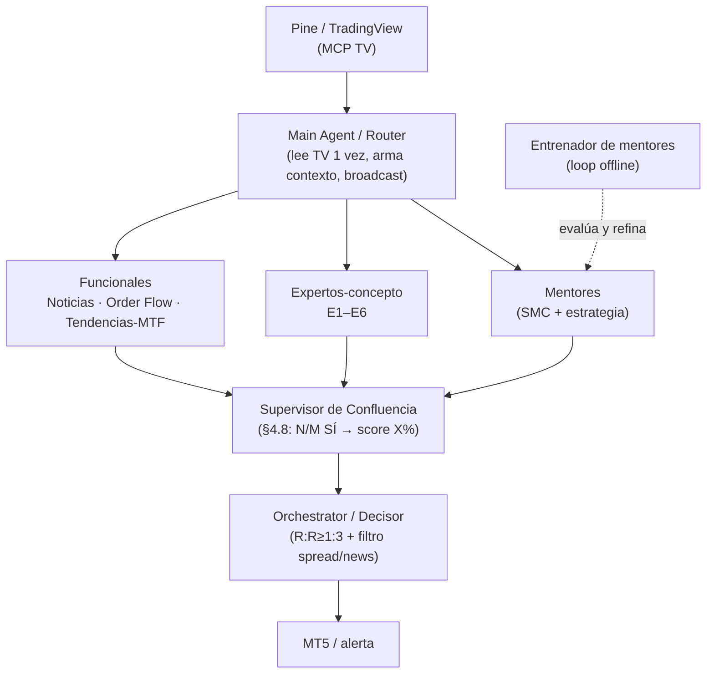

# Módulo Mentores — Workflow completo + Diseño del Swarm

> **Estado:** canónico (Sesión-024, 2026-06-16). Reemplaza a [`MODULO-MENTORES-V1.md`](MODULO-MENTORES-V1.md)
> (queda como histórico). Módulo **paralelo** al sistema Pine/MQL5: vive en Hermes + Obsidian, NO toca el
> CORE de Pine ni el EA. Memorias relacionadas: `[[mentores-modulo-plan]]`, `[[hermes-puter-provider]]`,
> `[[hermes-workspace-setup]]`.

## Propósito
Convertir cursos de YouTube de mentores/estrategas SMC-ICT en **agentes-mentor con personalidad** dentro de
Hermes (chatear con "el mentor"), y diseñar el **Swarm** de agentes que en Fase 5 opinarán en paralelo sobre
las señales del Pine y votarán confluencia antes de decidir una entrada.

Hoy operativo: Hermes + workspace (Claude Sonnet 4.6 vía **Puter**), faster-whisper en **GPU** (RTX 3070,
cuda/float16). Proveedores NIM/OpenRouter suspendidos → **todo por Puter**.

---

## Pipeline en 4 fases

| Fase | Script | Qué hace | Modelo |
|------|--------|----------|--------|
| 1. Ingesta | [`scripts/process-channel.ps1`](../scripts/process-channel.ps1) | Resuelve la lista del canal con `yt-dlp --flat-playlist` e itera `process-video.ps1` (yt-dlp→ffmpeg→faster-whisper GPU). Genera `Index.md`. **Sin LLM.** | — (whisper GPU) |
| 2. Análisis | [`scripts/hermes-analyze-mentor.ps1`](../scripts/hermes-analyze-mentor.ps1) + [`hermes-prompt-analisis-mentor.txt`](../scripts/hermes-prompt-analisis-mentor.txt) | Map-reduce: MAP por video (rápido) → REDUCE de síntesis → `ficha-mentor.md` (8 campos). Orientado a archivos (evita el límite de longitud de comando). | MAP `gemini-2.5-pro` · REDUCE `claude-sonnet-4-6` |
| 3. Personalidad | [`scripts/build-personality.ps1`](../scripts/build-personality.ps1) | Lee la ficha → genera la **skill de Hermes** `mentor-<slug>` (`SKILL.md` + reglas de rol + ruta del vault para recall + sidecar `model.txt` si hay override). | — |
| 4. Uso | [`scripts/hermes-chat-mentor.ps1`](../scripts/hermes-chat-mentor.ps1) | Launcher: resuelve modelo (`-Model` → sidecar → default) y abre `hermes chat -s mentor-<slug> --provider puter -t terminal,file`. | default `claude-sonnet-4-6` |

Reutiliza: [`process-video.ps1`](../scripts/process-video.ps1), [`fw_transcribe.py`](../scripts/fw_transcribe.py)
(GPU vía `_register_cuda_dll_dirs()`).

### Los 8 campos de la ficha
1. Identidad · 2. Tesis centrales · 3. Metodología · 4. Voz · 5. Filosofía/mentalidad · 6. Qué critica ·
7. Reglas cuantificadas · 8. Ejemplos que usa para enseñar. Regla dura: **cero invención** — lo que no está
en el material se marca `[no cubierto en el material]`.

### Decisión de modelo (un único modelo + override)
- **Default global:** `claude-sonnet-4-6` vía **Puter** para todos los mentores. La fidelidad la da la
  ficha/skill, no el modelo.
- **Override por mentor:** añadir `modelo: <id>` al frontmatter de `ficha-mentor.md` → `build-personality.ps1`
  lo copia a `model.txt` → el launcher lo aplica. Orden de resolución: `-Model` → sidecar → default.

### Sub-tipos de mentor
- **Mentor SMC/ICT** — destila metodología SMC (voz + reglas). Aporta criterio de confluencia.
- **Mentor de estrategia** — p. ej. `mentor-boxxocode` (canal `@Boxxocode`). Aporta **ideas de estrategias**,
  no doctrina SMC. **Restricción dura:** sus estrategias son *sugerencias* — pasan por las reglas duras
  (R:R≥1:3, ATR-relativo, anti-repaint) y los expertos-concepto E1–E6 antes de adoptarse.

---

## Diseño del Swarm (propuesta — construcción en Fase 5)

> Esto es **diseño**, no implementación. Los agentes se construyen en Fase 5, cuando existan mentores reales.

**Principio de restricción (todos los agentes):** dominio estricto; el `system_prompt` prohíbe responder
fuera de él ("si no es de tu dominio, dilo y deriva"). Grounding por familia: mentores → sus transcripciones;
expertos-concepto → [`docs/reglas-smc-ict.md`](reglas-smc-ict.md); funcionales → fuentes web/datos de mercado;
control → solo meta (nunca inventan señal).

### Expertos-concepto SMC (agrupan los 24 conceptos de `reglas-smc-ict.md` en 6 dominios)

| # | Experto | Conceptos (§ de reglas-smc-ict.md) |
|---|---------|------------------------------------|
| E1 | **Estructura de Mercado** | §1.1 Swings · §1.2 HH/HL/LH/LL · §1.3 BOS · §1.4 CHoCH · §1.5 MSS · §1.6 Impulso/Corrección |
| E2 | **Zonas institucionales (Order Blocks)** | §2.1 OB · §2.6 Breaker · §2.7 Rejection · §2.8 Flip/Mitigation Block |
| E3 | **Imbalance / FVG** | §2.2 FVG + CE · §4.1 Displacement |
| E4 | **Premium / Discount & OTE** | §2.3 Premium/Discount/EQ · §2.5 OTE/Golden Pocket |
| E5 | **Liquidez** | §2.4 EQH/EQL · §3.1 Pools BSL/SSL · §3.2 Sweep · §3.3 Grab · §3.5 Judas · §3.6 IDM/Inducement · §3.7 False Breakout/Spring/Raid |
| E6 | **Tiempo & Sesiones (ICT)** | §3.4 Kill Zones · §4.2 Session Opens · §4.3 EMAs |

### Roster completo (4 familias)

| Familia | Agente(s) | Función | Restricción | Modelo | Entradas → Salidas | Supervisa |
|---|---|---|---|---|---|---|
| **Mentores** | `mentor-<n>` (1 por mentor) | Opina con la voz/metodología del mentor | Solo su metodología; cita sus videos; no inventa | Sonnet (override opc.) | contexto del Router → voto + razonamiento | Entrenador |
| **Expertos-concepto** | E1–E6 | Juzga la señal contra la definición canónica de su grupo | Estricto a `reglas-smc-ict.md`; sin opinión fuera del grupo | Sonnet (flash en los simples) | zonas/eventos del Pine → veredicto | Confluencia |
| **Funcionales / contexto** | Noticias-Fundamental · Order Flow (depth/tick-vol) · Tendencias-MTF/Macro (DXY, correlaciones) | Contexto de mercado externo al Pine | Solo hechos de su fuente; no dan call de trade | Noticias = flash+web; resto = Sonnet | web/datos → contexto + alertas | Confluencia |
| **Control / meta** | Main Agent (router) · Supervisor de Confluencia · Orchestrator (decisor) · Entrenador de mentores | Orquestar broadcast · consolidar votos (§4.8 las 42 confluencias) · decidir con R:R · evaluar/mejorar mentores | Decisor solo si R:R≥1:3 y reglas duras; Entrenador no da señal | Sonnet | votos → veredicto → decisión | — |

### Flujo

`Pine/TV (MCP)` → **Router** (lee TV una vez, broadcast) → `[Mentores ∥ E1–E6 ∥ Funcionales]` →
**Supervisor de Confluencia** (consolida votos) → **Orchestrator** (decide con R:R + filtros) → `MT5/alerta`.
Lateral, offline: **Entrenador** evalúa y refina las skills de los mentores.

### ¿Los agentes pueden manejar TradingView Desktop? (MCP TV)
- **Sí, pero secuencial.** Hermes ya tiene `mcp_servers: tradingview-desktop` en `~/.hermes/config.yaml`. Un
  agente con el toolset MCP puede usar `capture_screenshot`, `chart_get_state`, `data_get_pine_*`,
  `quote_get`, `chart_set_symbol`… Mandados **uno por uno**, van bien.
- **NO en paralelo.** Es **una sola instancia de TV** (CDP 9222): si varios la tocan a la vez se pisan
  (uno cambia símbolo/timeframe mientras otro lee). `delegate_task` corre hijos en paralelo → acceso directo
  de varios hijos a TV es inseguro.
- **Por eso:** **solo el Router toca TV** (una lectura → paquete de contexto) y lo reparte; los demás opinan
  sobre el contexto. Más barato, sin colisiones.
- **A verificar en ejecución:** que el toolset MCP carga en `hermes chat` (la limitación de modo portable es
  de la *API del workspace UI*, no del agente CLI+gateway).

### Delegación paralela / async — estado real (hermes-agent 0.15.2)
- **NO** existe `delegate_task_async` / toolset `async_delegation`. Issue
  [#5586](https://github.com/NousResearch/hermes-agent/issues/5586) sigue abierto;
  [#11508](https://github.com/NousResearch/hermes-agent/issues/11508) confirma que `delegate_task` bloquea al
  padre durante la espera.
- Lo que SÍ hay: `delegate_task` corre hijos **en paralelo** (hasta `delegation.max_concurrent_children`,
  hoy **3**) pero bloquea al padre hasta que todos terminan. Estables: `terminal(background=True,
  notify_on_complete=True)` y `cron`.
- **Recomendación:** para el broadcast (operación "junta y decide") usar **`delegate_task`** — el bloqueo es
  aceptable porque queremos el veredicto consolidado antes de decidir; subir `max_concurrent_children` a 5–7
  si hace falta. Reservar `terminal background`/`cron` para tareas **largas y desacopladas** (ingestar un
  canal, re-analizar fichas). **No esperar async** solo por esto; migrar es trivial cuando #5586 mergee.

---

## Verificación end-to-end
1. `process-channel.ps1 -ChannelUrl "<.../@canal/videos>" -Mentor "Test" -MaxVideos 2` → `.md` + `Index.md`.
2. `hermes-analyze-mentor.ps1 -MentorFolder "Mentores\Test"` → `ficha-mentor.md` (8 secciones `##`).
3. `build-personality.ps1 -MentorFolder "Mentores\Test"` → skill `mentor-test` en `~/.hermes/skills/`.
4. `hermes-chat-mentor.ps1 -Mentor test -q "<pregunta de su dominio>"` → responde en voz/metodología, cita
   transcripciones, rechaza lo de fuera de su dominio.
5. Override: añadir `modelo: deepseek-v4-flash` a una ficha → el launcher lo usa.
