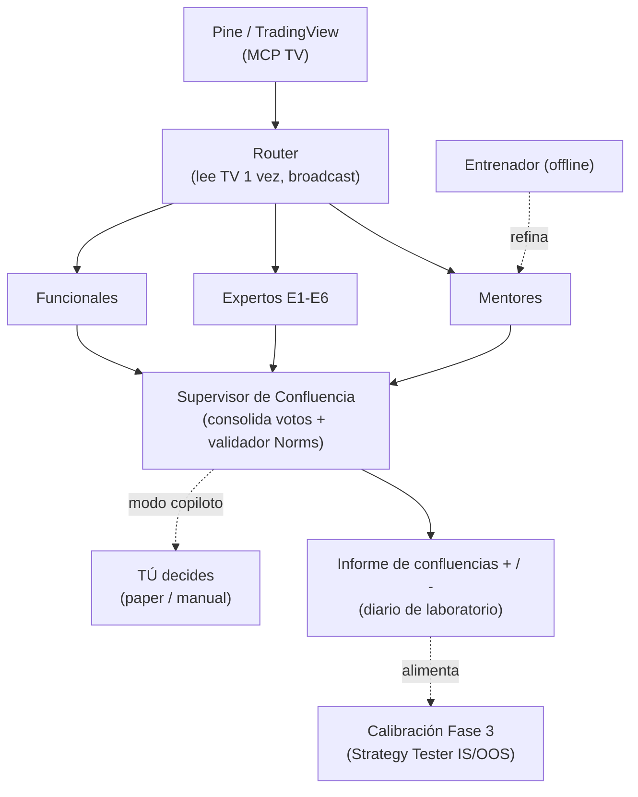

# Módulo Mentores — Workflow completo + Diseño del Swarm

> **Estado:** canónico (revisado Sesión-025, 2026-06-16 por Opus). Reemplaza a
> [`MODULO-MENTORES-V1.md`](MODULO-MENTORES-V1.md) (histórico). Módulo **paralelo** al sistema Pine/MQL5: vive
> en Hermes + Obsidian, NO toca el CORE de Pine ni el EA. Arquitectura raíz: **[ADR-005](adrs/ADR-005-enjambre-laboratorio-no-runtime-ea.md)**.
> Memorias: `[[mentores-modulo-plan]]`, `[[hermes-puter-provider]]`, `[[hermes-workspace-setup]]`.

## Propósito
Convertir cursos de YouTube de mentores/estrategas SMC-ICT en **agentes-mentor con personalidad** dentro de
Hermes, y diseñar el **Swarm** de agentes que ayuda a **pulir, testear y validar las confluencias de la
estrategia en TradingView ANTES de construir el EA**. El swarm **no ejecuta trades**: produce conocimiento que
se cristaliza en Pine determinista, se valida con backtesting, y se porta a MQL5 (ver §Arquitectura).

Hoy operativo: Hermes 0.15.2 + workspace (Claude Sonnet 4.6 vía **Puter**), faster-whisper en **GPU** (RTX
3070, cuda/float16). Proveedores NIM/OpenRouter **suspendidos** → todo por Puter.

---

## Arquitectura: el enjambre frente al EA  ·  [ADR-005]

**Regla de oro:** el enjambre y el EA **nunca se hablan en runtime**. Tres tiempos que no se mezclan:

| Tiempo | Quién actúa | Qué produce | Determinista |
|--------|-------------|-------------|--------------|
| **1. Descubrimiento** (offline) | Enjambre sobre histórico/replay | Hipótesis y ranking de confluencias **+ / –** | No (LLM) |
| **2. Validación** (Fase 3) | Pine Strategy Tester + `smc-backtesting-analyst` | Reglas **cristalizadas** (IS/OOS) | **Sí** |
| **3. Ejecución** (Fase 4+) | EA MQL5 nativo | Trades en MT5 | **Sí** |

- **Modo Laboratorio** (enjambre, offline): propone y juzga confluencias. Nunca da una orden.
- **Modo Copiloto** (enjambre, en vivo, fase TV): opina en tiempo real vía MCP TV para asistir **tu**
  decisión manual/paper. Es herramienta tuya, **no del EA**. Aquí "los expertos opinan en tiempo real".
- **EA MQL5:** hereda solo las reglas validadas. **Sin LLM, sin webhook, sin consultar al enjambre.**
- **Gate funcional determinista:** único puente EA↔exterior en vivo. Veta con **datos que el EA no calcula**
  (noticias/macro) como **bandera binaria con fail-safe**. Arranca mínimo (noticias, **fuente TBD**). No es un
  LLM decidiendo; es un dato externo vetando.

---

## Pipeline en 4 fases (mentor → personalidad)

| Fase | Script | Qué hace | Modelo |
|------|--------|----------|--------|
| 1. Ingesta | [`scripts/process-channel.ps1`](../scripts/process-channel.ps1) | `yt-dlp --flat-playlist` → itera `process-video.ps1` (yt-dlp→ffmpeg→faster-whisper GPU). Genera `Index.md`. **Sin LLM.** | — (whisper GPU) |
| 2. Análisis | [`scripts/hermes-analyze-mentor.ps1`](../scripts/hermes-analyze-mentor.ps1) + [`hermes-prompt-analisis-mentor.txt`](../scripts/hermes-prompt-analisis-mentor.txt) | Map-reduce orientado a archivos → `ficha-mentor.md` (9 campos, ver abajo). | MAP `gemini-2.5-pro` · REDUCE `claude-sonnet-4-6` |
| 3. Personalidad | [`scripts/build-personality.ps1`](../scripts/build-personality.ps1) | Ficha → **skill de Hermes** `mentor-<slug>` (`SKILL.md` + reglas de rol + ruta de recall + sidecar `model.txt`). | — |
| 4. Uso | [`scripts/hermes-chat-mentor.ps1`](../scripts/hermes-chat-mentor.ps1) | Launcher: resuelve modelo (`-Model` → sidecar → default) y abre `hermes chat -s mentor-<slug> --provider puter -t terminal,file`. | default `claude-sonnet-4-6` |

Reutiliza: [`process-video.ps1`](../scripts/process-video.ps1), [`fw_transcribe.py`](../scripts/fw_transcribe.py) (GPU).

### Los campos de la ficha (8 + 1 rescatado del V1)
1. Identidad · 2. Tesis centrales · 3. Metodología · 4. Voz · 5. Filosofía/mentalidad · 6. Qué critica ·
7. Reglas cuantificadas · 8. Ejemplos que usa para enseñar · **9. Conflictos con el sistema 2.0** (NUEVO,
rescatado del pipeline V1): cruza las reglas del mentor contra [`reglas-smc-ict.md`](reglas-smc-ict.md) y los
pesos del scoring — *dónde coincide, dónde contradice, qué aporta de nuevo*. Es la pieza que conecta al mentor
con la estrategia y la más valiosa para el laboratorio. Regla dura: **cero invención** — lo que no está en el
material se marca `[no cubierto en el material]`.

### Decisión de modelo (único + override) — [Sesion-024]
Default global `claude-sonnet-4-6` vía Puter para todos. Override por mentor con `modelo:` en el frontmatter
de la ficha → `build-personality.ps1` lo copia a `model.txt` → el launcher lo aplica
(`-Model` → sidecar → default). La fidelidad la da la ficha/skill, no el modelo.

> **Diversidad de modelos (nota de diseño, swarm):** el override por agente permite **asignar modelos
> distintos a agentes distintos** (Sonnet, DeepSeek-v4, Gemini-2.5-pro, GLM-5…) para **reducir la correlación**
> entre voces. Matices: (a) gran parte de la correlación viene del grounding SMC compartido, no del modelo →
> ayuda al razonamiento/crítica, no elimina el eco; (b) diversificar **solo entre modelos capaces** (un modelo
> débil = opinión equivocada, no diversa); (c) el **Escéptico debe correr un modelo distinto** del proponente;
> (d) las locales (RTX 3070 8 GB) = voz diversa barata **solo en laboratorio offline**, no en el camino crítico
> (latencia/capacidad); (e) **no sustituye el backtest** — mejora hipótesis, no las vuelve evidencia.

### Sub-tipos de mentor
- **Mentor SMC/ICT** — destila metodología (voz + reglas). Aporta criterio de confluencia.
- **Mentor de estrategia** — p. ej. `mentor-boxxocode` (`@Boxxocode`). Aporta **ideas**, no doctrina. **Sus
  estrategias son sugerencias:** pasan por las reglas duras (R:R≥1:3, ATR-relativo, anti-repaint) y los
  expertos-concepto E1–E6 antes de adoptarse.

### Pipeline unificado (decisión Sesión-025)
Canónico = este pipeline (ficha → `mentor-<slug>`). El pipeline V1 (`consult-mentor`,
`mentor-extract-profile`, `mentor-transcribe` con PERFIL de 10 secciones) queda **obsoleto y se archiva** para
no divergir; su única pieza que se rescata es el campo **9. Conflictos con el sistema**. No borrar las skills
viejas sin backup (decisión del usuario).

---

## Diseño del Swarm (propuesta — construcción en Fase 5)

> **Diseño**, no implementación. Se construye en Fase 5, cuando existan mentores reales. Arquitectura: [ADR-005].

### Las 3 capas de contexto de cada agente (Knowledge / Expertise / Norms)
Modelo adoptado (origen: revisión con Sonnet), **corregido** para este proyecto:

- **Knowledge — qué sabe.** Expertos E1–E6 → su fuente canónica es [`reglas-smc-ict.md`](reglas-smc-ict.md) §
  (no se inventa). Mentores → su ficha (campos 1,2) destilada de transcripciones. Funcionales → su fuente de
  datos (calendario económico, DXY/correlaciones, order flow).
- **Expertise — cómo trabaja.** Mentores → ficha campos 3/7/8 (sale del canal real; cero-invención lo
  garantiza). Expertos → criterio "válido/inválido" de su §, **alineado a la implementación Pine real**
  (mismos umbrales que `f_detectOB`, `f_detectFVG`, etc.) para no divergir del código. Versionado: frontmatter
  con fecha/fuente; se completa a medida que se extraen canales.
- **Norms — qué puede y qué no.**
  - **Norms de dominio** ("no salgas de tu tema, deriva"): por agente, en su `SKILL.md` (ya lo ponen los
    scripts).
  - **Norms de riesgo** (R:R≥1:3, % riesgo, máx ops/día, news lockout, umbral de confluencia): **GLOBALES, una
    sola fuente** (las reglas duras de `CLAUDE.md`), **validadas en CÓDIGO** (Pine Strategy → EA MQL5), **no
    en el prompt y no por-mentor**. Un mentor *sugiere* riesgo (eso es Expertise); la Norm dura es del
    sistema.
  - **Validador determinista en el Orchestrator/Confluencia:** check no-LLM que descarta toda propuesta del
    enjambre sin R:R≥1:3 calculable **antes** de mostrarla. *(Un LLM ignora una regla en texto; un check de
    código no — principio de Sonnet, correcto.)*

> **No** se crea el árbol `/context/<mentor>/{knowledge,expertise,norms}.md` que proponía Sonnet:
> fragmentaría la fuente de verdad. Cada agente = **una skill de Hermes** cuyo cuerpo **referencia** su
> grounding (ficha del mentor · §de `reglas-smc-ict.md` · fuente de datos) + las Norms globales. Una sola
> fuente de verdad por pieza.

### Expertos-concepto SMC (24 conceptos de `reglas-smc-ict.md` en 6 dominios)

| # | Experto | Conceptos (§) |
|---|---------|---------------|
| E1 | **Estructura de Mercado** | §1.1–§1.6 (Swings, HH/HL/LH/LL, BOS, CHoCH, MSS, Impulso/Corrección) |
| E2 | **Order Blocks** | §2.1, §2.6 Breaker, §2.7 Rejection, §2.8 Flip/Mitigation |
| E3 | **Imbalance / FVG** | §2.2 FVG+CE, §4.1 Displacement |
| E4 | **Premium / Discount & OTE** | §2.3, §2.5 |
| E5 | **Liquidez** | §2.4 EQH/EQL, §3.1 Pools, §3.2 Sweep, §3.3 Grab, §3.5 Judas, §3.6 IDM, §3.7 Spring/Raid |
| E6 | **Tiempo & Sesiones** | §3.4 Kill Zones, §4.2 Session Opens, §4.3 EMAs |

### Esquema de voto (contrato I/O entre agentes — NUEVO)
Cada opinador (mentor / experto / funcional) emite un voto **estructurado** (no prosa libre):

```yaml
agente: E2-order-blocks          # quién
direccion: long | short | none   # sesgo
postura: a_favor | en_contra | neutral
confianza: 0.0-1.0
concepto: "OB H1 mitigado en discount"
criterio: "reglas-smc-ict.md §2.1"     # o "video <id> mm:ss" para mentores
evidencia: "OB [1.085,1.087] CE 1.086, no mitigado"
```

El **Supervisor de Confluencia** consolida de forma **determinista** (cuenta a favor/en contra por dirección,
pondera por confianza) y lo mapea a las 42 confluencias del §4.8 **SIN recalcularlas**: el Pine ya calcula el
score cuantitativo; el voto del enjambre es una capa **cualitativa** de revisión/veto/descubrimiento. Separar
ambas capas es obligatorio (anti-overfitting).

> **Sesgo de confluencia (lectura honesta):** los mentores SMC coinciden porque comparten el mismo libro de
> jugadas — son fuentes **correlacionadas, no confirmaciones independientes**. Que N agentes voten igual **no**
> sube la probabilidad de éxito; el espejismo de consenso es el riesgo #1. **El valor del panel está en la
> DISCREPANCIA, no en la coincidencia:** cuando un agente entra al FVG y otro exige un OB previo, son **dos
> hipótesis distintas que se backtestean por separado**. La coincidencia dispara *investigar*; el backtest
> IS/OOS **decide**. Por eso existe el rol **Escéptico**.

### Roster (4 familias)

| Familia | Agente(s) | Función | Restricción |
|---|---|---|---|
| **Mentores** | `mentor-<n>` | Opina con la voz/metodología del mentor | Solo su metodología; cita sus videos; no inventa |
| **Expertos-concepto** | E1–E6 | Juzga la señal contra la def. canónica de su grupo | Estricto a `reglas-smc-ict.md`, alineado al Pine real |
| **Funcionales** | Noticias · Order Flow · Tendencias-MTF/Macro | Contexto externo al Pine | Solo hechos de su fuente; no dan call de trade |
| **Control** | Router · Supervisor de Confluencia · Orchestrator · Entrenador · **Escéptico** | Orquestar · consolidar votos · decidir (laboratorio) · refinar mentores · **atacar toda confluencia que backtestee bien** | Validador de Norms en código; el **Escéptico es independiente** del que propone (no juzga su propia señal); nunca inventan señal |

### Flujo (corregido — termina en informe, no en MT5)



### MCP TV — secuencial, no paralelo
Hermes tiene `mcp_servers: tradingview-desktop` (verificado, `enabled: true`). Un agente con el toolset MCP
usa `capture_screenshot`, `chart_get_state`, `data_get_pine_*`, etc. **Una sola instancia (CDP 9222)** → si
varios la tocan a la vez se pisan. **Solo el Router toca TV** (una lectura → paquete de contexto) y reparte.

### Delegación paralela / async (hermes-agent 0.15.2)
No existe `delegate_task_async`. `delegate_task` corre hijos en paralelo (hasta
`max_concurrent_children: 3`, verificado en config) pero **bloquea al padre**. Para el broadcast ("junta y
decide") el bloqueo es aceptable. Tareas largas → `terminal(background=True, notify_on_complete=True)`/`cron`.
**⚠️ A verificar:** los números de issue (#5586/#11508) citados en S024 — confirmar antes de tratarlos como
evidencia firme; el hecho técnico (no hay async) se sostiene por el código instalado.

---

## Metodología de laboratorio (cómo se testean las confluencias)

**El `SMC-Strategy.pine` ya abre/cierra las entradas solo** sobre el histórico → el Strategy Tester es el
backtester. Los agentes **no ejecutan el trade**: proponen qué probar, leen resultados y debaten casos.

**Ciclo de una confluencia:** hipótesis (un agente la propone) → se codifica como regla/input en
`SMC-Strategy.pine` → backtest **IS/OOS 70/30** → `smc-backtesting-analyst` juzga (rentable + robusta, no
overfit) → **Bar Replay** para inspeccionar casos dudosos vela a vela → si sobrevive entra; si no, se
descarta.

**Escalera de validación:**
1. Backtest TV (masivo, histórico) →
2. Replay TV (vela a vela; agentes debaten) →
3. Forward/paper en TV en vivo (copiloto asiste; sin dinero) →
4. **[Fase 4]** EA en MT5 Strategy Tester (histórico del broker + **golden tests de paridad**) →
5. **[Fase 5]** EA en cuenta **demo** MT5 (tiempo real, sin dinero) →
6. Cuenta real.

**Piezas a orquestar (no construir plataforma nueva):** Hermes `delegate_task` (broadcast) · MCP TV
(`data_get_strategy_results`/`data_get_trades`/`data_get_equity`, `replay_*`, `capture_screenshot`) · Strategy
Tester · skills `smc-backtesting-analyst` / `smc-replay` / `smc-multi-scan` · **dos registros** en `docs/laboratorio/`: **(a) diario de reglas** (cada confluencia = quién la propuso,
regla, resultados PF/WR/R/DD IS/OOS, veredicto, decisión); **(b) registro de atribución por agente** [NUEVO
S025] = log estructurado (JSONL/CSV) `fecha_hora · símbolo · TF · agente/mentor · dirección · confianza ·
confluencia · criterio · resultado(win/loss) · R · fuente(backtest/replay/forward)` → construye el **track
record real de cada mentor/agente** (hit-rate por confluencia/sesión/símbolo, con muestra suficiente). El
resultado lo decide el **trade** (reglas de salida deterministas), **no** el enjambre; una señal suelta es
ruido.

**MT5:** el histórico profundo (años de tick data del broker) entra en **Fase 4** (paridad + validación de
spread/slippage), no antes — el sistema actual es Pine y no corre sobre datos de MT5.

---

## Verificación end-to-end (cuando se ejecute, NO en esta sesión)
1. `process-channel.ps1 -ChannelUrl "<.../@canal/videos>" -Mentor "Test" -MaxVideos 2` → `.md` + `Index.md`.
2. `hermes-analyze-mentor.ps1 -MentorFolder "Mentores\Test"` → `ficha-mentor.md` (9 secciones `##`).
3. `build-personality.ps1 -MentorFolder "Mentores\Test"` → skill `mentor-test`.
4. `hermes-chat-mentor.ps1 -Mentor test -q "<pregunta de su dominio>"` → responde en voz, cita
   transcripciones, rechaza lo de fuera de dominio.
5. Override: `modelo: deepseek-v4-flash` en una ficha → el launcher lo usa.
6. **⚠️ Confirmar en el E2E:** el flag correcto es `--yolo` (los scripts lo usan) vs `-yolo` (anotado en el
   doc de flags de S06-14) — uno tiene errata; y que el toolset `file`/MCP carga en `hermes chat`.
