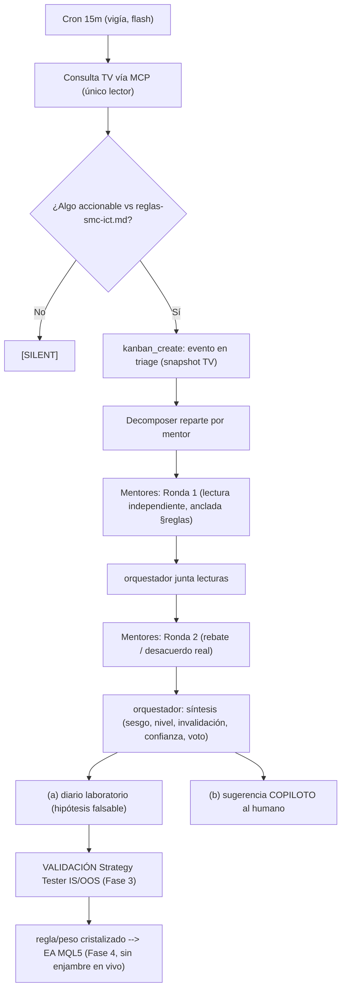

# Briefing v2 — Mentor Module (Cron + Kanban + Swarm Hermes), anclado al proyecto

> **Origen:** perfeccionamiento del briefing `briefing-mentor-module-estrategia-2.0.md` (redactado en paralelo con Sonnet, sin contexto del proyecto). Esta v2 conserva la mecánica operativa buena del original y la **re-ancla a las decisiones ya ratificadas** (ADR-001/002/004/005) y a los hechos verificados de la app Hermes (Sesion-030).
> **Regla:** si esta v2 y el briefing original chocan, manda la v2 (y si la v2 choca con un ADR, manda el ADR).
> **No toca Pine ni MQL5.** Módulo PARALELO. Fase actual del proyecto = **Fase 1 (Pine)**.

---

## 0. Las 4 correcciones que cambian el diseño (léelas primero)

1. **El enjambre es LABORATORIO + COPILOTO, no el runtime del EA `[ADR-005]`.** El briefing original termina en *"Enrutamiento a MetaTrader 5"* como si el debate de mentores ejecutara órdenes en vivo. **No.** Tres tiempos separados:
   - **Descubrimiento** (enjambre offline/copiloto): los mentores discuten y producen *hipótesis de confluencia* + sugerencias para el HUMANO.
   - **Validación** (determinista): esas hipótesis se prueban en **Strategy Tester IS/OOS 70/30**; solo lo que sobrevive se "cristaliza" como regla/peso.
   - **Ejecución** (Fase 4): el **EA MQL5 nativo** ejecuta las reglas cristalizadas. **El EA NO consulta al enjambre en vivo.** Único puente en tiempo real = un **gate funcional determinista** (veto binario por noticias/macro, fail-safe).
2. **MT5 es Fase 4, no ahora.** Elegir/instalar un MCP de MT5 (sección 8 del original) es **prematuro** y sobre-ingeniería en Fase 1. Se decide cuando se entre a Fase 4 (tras gate de Fable + Pine completo, ver ADR-003).
3. **Grounding obligatorio + cero invención.** Cada mentor se **instancia solo al bajar su curso** (de su `ficha-mentor.md`, 9 campos, incluido **"Conflictos con el sistema"**). Su lectura se ancla en `docs/reglas-smc-ict.md` (fuente de verdad SMC) y emite un **voto estructurado** (contrato I/O), no prosa libre. Un mentor sin curso descargado **no existe** (no se inventa su metodología).
4. **El destino del debate NO es una orden, es un registro.** La síntesis va a: (a) **diario de laboratorio** (`docs/laboratorio/`) como hipótesis fechada y falsable, y (b) **sugerencia copiloto** al humano en la fase TV. La promoción a regla/peso pasa SIEMPRE por validación determinista (anti-overfitting, **ADR-002** umbrales congelados hasta Fase 3).

---

## 1. Objetivo (reformulado)

Un grupo de agentes ("mentores"), cada uno con la metodología de un trader real, **observa de forma persistente** lo que pasa en TradingView (vía MCP) y **discute entre sí** —con acuerdos y desacuerdos reales— posibles zonas de reacción, entradas, FVGs, mitigaciones, barridos. La discusión queda **registrada y memorizada**. Su producto es **conocimiento para descubrir y calibrar confluencias** y un **copiloto** para el humano —no una señal autónoma que dispara MT5.

Lo que NO buscamos: un prompt que "analice el gráfico". Lo que SÍ: un proceso persistente, con memoria, donde varias metodologías chocan antes de un veredicto **que luego se valida estadísticamente**.

---

## 2. Por qué cron + kanban + swarm (y no `delegate_task`)

`delegate_task` reparte trabajo en paralelo pero es **síncrono dentro del turno**: los hijos viven solo mientras la sesión padre sigue abierta; si se cierra, su trabajo se descarta. Sirve para "pregunta rápida a 3 mentores ahora", no para vigilar el mercado sin una ventana de chat abierta. (Confirmado Sesion-024: **`delegate_task_async` NO existe en hermes-agent 0.15.2** — #5586/#11508.)

Por eso las tres piezas persistentes y desacopladas:
- **Cron** = CUÁNDO pensar (loop que corre solo, consulta TV, decide si hay algo accionable; si no, `[SILENT]`).
- **Kanban** (`~/.hermes/kanban.db`) = CÓMO queda registrado. Dispatcher que lanza cada tarea como **proceso de SO independiente**; los **comentarios de cada tarea son el protocolo de comunicación** entre mentores (cualquiera re-invocado lee todo el historial). Tiene auto-decompose por perfil.
- **Swarm** (Hermes Workspace) = QUIÉN piensa y bajo qué lente. Cada mentor = un perfil/worker con su metodología.

**Verificado (Sesion-030):** `hermes cron`, `hermes kanban`, `hermes profile` existen en 0.15.2 → el pipeline es construible tal cual.

---

## 3. Hechos verificados de la app Hermes (sustituyen a los "pendientes de verificar" del original)

| Tema | Briefing original | Realidad verificada (S030) |
|---|---|---|
| Puerto 8642 (proxy vs gateway) | "hay que verificar si el proxy.mjs pisa el gateway" | **Resuelto:** el `hermes-proxy.mjs` de V1 (bridge a OpenRouter) quedó **obsoleto** al migrar a **Gemini nativo** (proveedor `google` en `config.yaml`). No coexisten. Acción: retirar el proxy V1; el gateway nativo (`hermes gateway run`, 8642) es el único. Verificar con `hermes gateway status`. |
| TV MCP en paralelo | implícito que varios agentes leen TV | **Single-instance (CDP 9222):** solo UN agente puede tocar TV a la vez (Sesion-024). → **Solo el vigía/cron lee TV** y vuelca el snapshot al kanban; los mentores razonan sobre ese snapshot, **no abren TV en paralelo**. |
| Modelos del swarm | "modelo barato / modelo bueno" | Todo es **Gemini free tier** ahora: vigía = `gemini-2.5-flash` (rápido), mentores = `gemini-2.5-pro` (profundo). El `swarm.yaml` actual lista GPT-5.5 como roster genérico (no provisionado salvo Workspace=flash). |
| swarm.yaml | "presets Sage/Trader/Builder…" | Confirmado: workers genéricos de **código/ops** (Orchestrator, KM, Builder, Reviewer, QA, Researcher, Ops-Watch, Maintainer, Strategist, Inbox-Triage), cada uno con `role/model/tools/skills/greenlightRequiredFor/maxConcurrentTasks/acceptsBroadcast/wrapper`. **Ese schema es el molde para definir los mentores** (ver §6). |

---

## 4. Pipeline concreto (corregido en el nodo final)

### 4.1 Vigía — cron que consulta TradingView (el ÚNICO que toca TV)
```bash
hermes cron create "every 15m" "Revisa EURUSD en 15m con el MCP de TradingView. Busca FVG nuevos/sin mitigar cerca del precio, cercanía a pools de liquidez/BOS/CHoCH, y confluencias con estructura. Si NO hay nada accionable, responde solo [SILENT]. Si SÍ, usa kanban_create para abrir una tarea 'evento' en triage con: precio, nivel exacto, tipo de estructura, timeframe, y la referencia §X de reglas-smc-ict.md que aplica." --name "Vigia TV EURUSD 15m"
```
> **Intervalo 15m, no 5m.** Free tier diario es el cuello de botella real (no el $): 5m = 288 corridas/día solo del vigía, antes de despertar mentores. Empezar conservador y medir RPD. Modelo del vigía = `gemini-2.5-flash`.

### 4.2 Perfiles — cada mentor es un perfil/lane (instanciado de su ficha)
```bash
hermes kanban init
# Reemplazar por los mentores REALES, uno por curso descargado (cero invención):
hermes profile create mentor-no-soy-liquidez --description "<resumen de su ficha-mentor.md: metodología ICT, sesgos, conceptos que prioriza>"
hermes profile create orquestador --toolsets kanban   # coordina, no ejecuta; solo kanban
```

### 4.3 Ronda 1 — lectura independiente · 4.4 Ronda 2 — rebate · 4.5 Síntesis
(Igual que el original — auto-decompose reparte hijos; ronda 2 reacciona a las lecturas de los colegas; síntesis junta todo vía `kanban_show` del padre.) **Cada lectura/voto se ancla a `reglas-smc-ict.md` y declara confianza (baja/media/alta) + invalidación.**

### 4.6 Nodo final CORREGIDO
La síntesis **NO** se enruta a MT5 para ejecutar. Produce:
- **(a)** Entrada fechada en `docs/laboratorio/diario-YYYY-MM.md`: hipótesis de confluencia + nivel + invalidación + qué mentores la apoyan/rechazan + resultado posterior (para falsarla).
- **(b)** Sugerencia **copiloto** al humano (en la fase TV/replay), nunca orden automática.
- La **promoción a regla/peso del scoring** ocurre solo si la hipótesis sobrevive **Strategy Tester IS/OOS** (Fase 3). El **EA (Fase 4)** ejecuta esa regla cristalizada; el enjambre ya no participa en vivo.

### Diagrama corregido


---

## 5. Roster real de mentores y arquetipos (de Sesion-024/025, no los genéricos del original)

En vez de `mentor-smc / mentor-liquidez / mentor-wyckoff` de ejemplo, el roster del proyecto:
- **Mentores SMC/estrategia** — uno por trader real con curso bajado (p.ej. `mentor-no-soy-liquidez`, `mentor-boxxocode`). Juzgan confluencia / recuperan estrategias de su catálogo. Se instancian al bajar su curso.
- **Expertos-concepto E1–E6** — agrupan los 24 conceptos de `reglas-smc-ict.md` (no uno por concepto). Grounding directo al Pine real.
- **Funcionales** — Noticias/macro (alimenta el gate determinista de ADR-005), OrderFlow, Tendencias-MTF.
- **Control** — Router (único que habla con TV), Confluencia, **Escéptico**, Orchestrator.

Cada uno se define con el **schema de `swarm.yaml`** (probado en la app): `role`, `model`, `tools` (incl. `kanban`, `cronjob`), `skills`, y sobre todo **`greenlightRequiredFor`** para forzar aprobación humana en cualquier paso sensible — que es justo el "human greenlight control" que pide ADR-005. Los **Norms de riesgo** son GLOBALES y en código (no por-mentor), validados por un check determinista en el Orchestrator.

---

## 6. Repos externos (sección 7-8 del original): research backlog, NO adoptar ahora

- **`TauricResearch/TradingAgents`** — precedente directo del patrón debate (analistas → bull/bear → trader → riesgo → PM). **Útil como referencia de cómo estructurar las rondas 1/2 y los prompts**, NO para adoptar su stack (apunta a equities/cripto US). Leer; no integrar en Fase 1.
- **Skills LLMQuant / `data-mcp`** — candidatos para dar contexto macro a los Funcionales; **evaluar en su momento**, no instalar ahora.
- **MCPs de MT5** (Qoyyuum / ariadng / Cloudmeru solo-lectura / ali-rajabpour screenshot) — **Fase 4.** Cuando toque, la decisión correcta dado ADR-005 es **solo-lectura para el laboratorio** y la **escritura la hace el EA nativo**, no un MCP que un agente dispare en vivo. Anotar y diferir.

---

## 7. Riesgos / sobre-ingeniería (lo que pidió el punto 9.6 del original)

1. **Reintroducir "enjambre → MT5 ejecución" viola ADR-005.** Es el riesgo #1; el diagrama corregido (§4.6) lo neutraliza.
2. **Cuota free tier de Gemini** es el límite real, no el costo. Intervalo de cron conservador + criterio de "accionable" estricto + medir RPD antes de escalar.
3. **TV MCP single-instance:** si más de un agente intenta leer TV → colisión CDP. Solo el vigía/Router lee.
4. **Overfitting:** meter hipótesis del enjambre al scoring sin pasar IS/OOS rompe ADR-002 (umbrales congelados). El diario es falsable; la validación es determinista.
5. **Construir el roster completo de golpe** (24 conceptos + E1–E6 + funcionales + control) = sobre-ingeniería. **Piloto mínimo primero** (§8).
6. **Deuda V1:** retirar `hermes-proxy.mjs` (OpenRouter) y las refs viejas; ya no se usa.

---

## 8. Próximos pasos mínimos (sin construir de más)

1. **Bajar un curso completo** (en curso: "No soy liquidez", pipeline ya probado E2E — ver `COMANDOS-curso-no-soy-liquidez.md`).
2. **Análisis Fase 2** de ese curso → `ficha-mentor.md` (9 campos, **añadir el campo 9 "Conflictos con el sistema"** al prompt de análisis) con `gemini-2.5-flash`.
3. **Design doc del roster** (pendiente de Sesion-025): rol·dominio·grounding·entradas·salida(voto)·Norms·modelo·relaciones, por arquetipo.
4. **Piloto E2E con DOS mentores reales** (no los 24 conceptos): 1 cron vigía + 1 kanban + 2 perfiles + orquestador, sobre EURUSD, generando 1 entrada de diario de laboratorio. Medir cuota y ruido.
5. **Retirar el proxy.mjs V1** y verificar `hermes gateway status`.
6. Recién entonces evaluar escalar el roster y los repos externos.

---

## 9. Documentos relacionados
- Decisión de arquitectura del enjambre: `docs/adrs/ADR-005-enjambre-laboratorio-no-runtime-ea.md` (**fuente de verdad de §0**).
- Roster/arquetipos y workflow: `docs/MODULO-MENTORES-WORKFLOW.md`, `docs/planes/PLAN-modulo-mentores-swarm.md`.
- Pipeline de ingesta y comandos: `docs/planes/COMANDOS-curso-no-soy-liquidez.md`.
- Fuente de verdad SMC (grounding de los mentores): `docs/reglas-smc-ict.md`.
- Ramas y gate Fase 4: `docs/adrs/ADR-003` (en ESTADO-ACTUAL) + `WORKPLAN-MAESTRO-V2.md` §Fase 4.
- Briefing original (Sonnet): `C:\Users\Fredd\Downloads\briefing-mentor-module-estrategia-2.0.md` (archivar como insumo).
