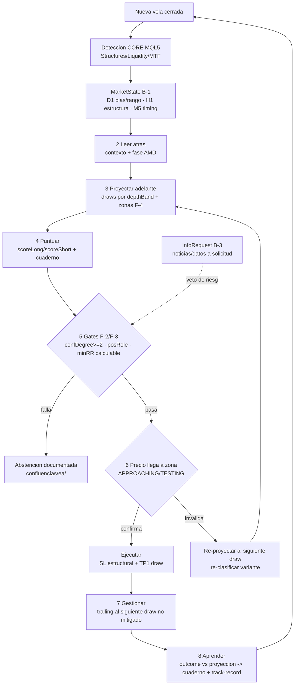
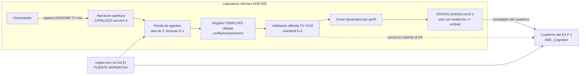
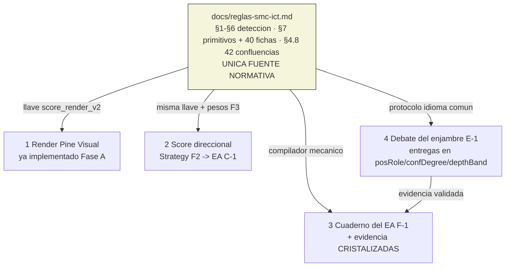
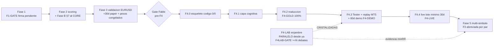

# ESQUELETO — Fase 4 → adelante: EA MT5 + capa cognitiva (percepción · score · perfiles · debate · cuaderno) — entregable Fable

> **Respuesta al [DOSSIER-FABLE-fase4-ea-mt5.md](DOSSIER-FABLE-fase4-ea-mt5.md) (S097).** Esqueleto COMPLETO de la Fase 4 hacia adelante: la capa determinista del EA MQL5 **más** toda la capa cognitiva encima. **Entrega SEPARADA del workplan** — no toca `WORKPLAN-MAESTRO-V2.md` ni los planes vigentes; se revisa aparte ("punto 3") y después se decide qué integrar.
>
> **NADA de este documento está implementado.** Toda pieza nueva es una ficha `[impl]` con cuerpo TODO. El relleno ocurre después, bajo el gate `sprint16` (regla cuantificada + casos EURUSD reales + validación TV antes de codificar) y los gates de fase (§8).
>
> **Marcadores usados:** `[SUPOSICIÓN: …]` supuesto explícito · `[NUEVO: …]` no estaba en el diseño previo · `[✓ MANTENER: …]` correcto del diseño 2026-06-10 · `[CONTRADICCIÓN: …]` choque detectado + resolución.

---

## §0.1 — Cómo rellenar este esqueleto (protocolo para cualquier IA, incluso en frío)

1. **Leer primero, en este orden:** §0.2 (contexto en frío) → `docs/reglas-smc-ict.md` (§1–§6 detección/grading, **§7 proyección/confluencia**) → `docs/workplan/MQL5-PLAN.md` (capa determinista) → `docs/planes/ESQUELETO-FABLE-proyeccion-confluencia.md` (doctrina de proyección) → `confluencias/imagenes-referencia/CATALOGO.md` (catálogo visual de razonamiento).
2. **Una ficha = un ciclo completo:** regla cuantificada escrita (si no existe) → casos EURUSD reales → implementación → compila 0/0 → validación ≥90 → aprobación humana → commit. **Un commit = un concepto verificado.**
3. **Nunca** rellenar una ficha de una fase cuyo gate anterior no esté firmado (§8).
4. Si al rellenar se detecta contradicción con un doc vigente: NO resolver en silencio — marcar `[CONTRADICCIÓN]`, proponer resolución y esperar decisión del usuario (ADR si toca regla dura).
5. **PROHIBICIÓN ABSOLUTA:** jamás leer, copiar o referenciar el EA viejo (`D:\CODE\BOT\Bot\`) ni proyectos previos (`Estrategia-Nueva`). Única referencia externa permitida: indicador LuxAlgo SMC (`pine/reference/LuxAlgo-SMC-base.pine`).

## §0.2 — Contexto en frío (mínimo para arrancar sin ninguna otra conversación)

- **Proyecto:** bot de trading SMC/ICT para Forex. Primero sistema completo validado en TradingView (Pine v6); después **EA 100% nativo MQL5** que replica el sistema validado. **Sin puente webhook** — el EA percibe, piensa y decide solo.
- **Arquitectura Pine:** 1 CORE de detección (sección `LIBRARY CORE`, **byte-idéntica** en `SMC-Visual.pine` y `SMC-Strategy.pine`; hoy 1700 líneas, SHA `5510361166844bd5`) + 2 consumidores. El EA traduce el CORE **función a función**.
- **Estado al escribir esto (S098, 2026-07-06):** Fase 1; rediseño visual Fase A (A-1…A-7) implementado; F1-GATE pendiente de firma. Faltan Fase 2 (scoring) y Fase 3 (validación EURUSD + paper) antes de ejecutar Fase 4.
- **Reglas duras:** anti-repaint (`barstate.isconfirmed` / en MQL5 `shift≥1`, vela cerrada) · CORE byte-idéntico (`scripts/check-core-sync.ps1`) · umbrales **relativos a ATR**, nunca pips fijos · símbolo-agnóstico (ADR-001: lo por-símbolo va en perfil/input) · **R:R mínimo 1:3** (ver §9: default duro, gate parametrizable `minRR`) · scoring **direccional** (scoreLong/scoreShort, 42 confluencias §4.8, jamás score absoluto) · compila 0/0 o no se commitea · ningún gate se salta.
- **Enjambre existente:** perfiles/mentores destilados corriendo en Hermes (NSL verificado E2E, ICT-madre, Wyckoff y roster ESQUELETO-P2 §2.10/§3.1); filosofía **confluencia, no consenso**; olas de 3 (concurrencia dura ≤3); darwiniano por track-record; **ADR-005: enjambre = laboratorio + copiloto, NUNCA runtime dentro del EA** — el EA hereda reglas cristalizadas.
- **Carpetas de registro (creadas S098):** `confluencias/imagenes-referencia/` (referencia visual del usuario + CATALOGO.md) · `confluencias/swarm/` (historial de debates del enjambre) · `confluencias/ea/` (cuaderno del EA: por qué entró / no entró).
- **Decisiones del usuario incorporadas (S098):** orquestador 3-TF (D1/H1/M5) abre el debate · validación contra **TV vivo** (replay solo en MT5; el replay de TV es de pago y NO se usa) · `minRR` default 3.0 parametrizable por orden posterior · el EA puede **pedir** información complementaria (noticias/datos) · meta de largo plazo: capturar el swing completo vía trailing/re-proyección (§7 paso 7).

## §0.3 — Respuesta a la pregunta abierta del DOSSIER (§5.4): la fuente única de verdad

> ¿Cómo estructurar esto para que la MISMA doctrina (leer-atrás → proyectar-adelante bajo confluencia, cuantificada en los primitivos §7) alimente sin duplicarse (1) el render Pine, (2) el score direccional, (3) el cuaderno del EA y (4) el debate del enjambre — y cómo se integra el score darwiniano sin romper los gates deterministas?

**Respuesta: un solo documento normativo y tres compiladores.**

- La **única fuente** es `docs/reglas-smc-ict.md` (§1–§6 detección + §7 proyección/confluencia con `posRole`/`confDegree`/`depthBand` + las 40 fichas 7.2.1–7.2.40 + las 42 confluencias §4.8). **Nadie re-escribe doctrina**; los cuatro consumidores la COMPILAN a su formato:
  1. **Render Pine** — ya lo hace: llave `score_render_v2 = strength×wPos(posRole)×(1+kConf·min(confDegree,3))` (Fase A, Visual).
  2. **Score direccional (Fase 2 → EA)** — la misma llave alimenta scoreLong/scoreShort con los pesos §4.8 (§3 de este esqueleto).
  3. **Cuaderno del EA** — las fichas §7.2.1–40 se compilan a un formato consultable en vivo (§6). El compilador es mecánico: si cambia la regla en reglas-smc-ict.md, se RE-COMPILA el cuaderno; nunca se edita el cuaderno a mano.
  4. **Debate del enjambre** — el protocolo (§5) OBLIGA a los agentes a hablar en primitivos §7 (posRole/confDegree/depthBand + niveles reales). Un agente puede tener doctrina propia (Wyckoff, NSL), pero su ENTREGA se expresa en el idioma común para que sea comparable y verificable.
- **El score darwiniano no toca los gates.** Arquitectura de dos capas inviolable: **capa 1 = gates deterministas** (confDegree≥2 para promoción, R:R≥`minRR` calculable, invalidación definida, anti-repaint) — binarios, nadie los pondera; **capa 2 = ponderación** (score direccional + aporte de perfiles por track-record) — solo ordena/prioriza lo que YA pasó los gates. Un perfil con track-record perfecto que proponga una entrada con R:R 1:2.4 cuando `minRR=3.0` NO entra: el gate manda (resuelve el choque NSL 1:2 — ver §4).

---

## §1 — BLOQUE A · Capa determinista del EA (consolida MQL5-PLAN)

**Veredicto sobre `docs/workplan/MQL5-PLAN.md` (refrescado S097):**

- `[✓ MANTENER]` Los **6 módulos + EA**: `SMC_Types.mqh`, `SMC_Structures.mqh`, `SMC_Liquidity.mqh`, `SMC_MTF.mqh`, `SMC_Scoring.mqh`, `SMC_RiskManager.mqh`, `SMC_Display.mqh`, `EA_SMC_ICT.mq5`. Separación correcta; los bloques B–H de este esqueleto se montan ENCIMA sin romperla.
- `[✓ MANTENER]` Structs espejo con `strength` (ADR-014), `gradedFvg`/`trueFvg`/`propulsion` (§5.16/§5.18), enum KIND≤53 (KIND_GRADIENT=53), campos §7 `posRole`/`confDegree`/`depthBand` marcados [Fase B]. Mapeo Pine→MQL5 función a función + golden tests como prueba de paridad.
- `[SUPOSICIÓN: el CORE crecerá en Fase 2 (scoring) y Fase B (§7 al CORE); la traducción MQL5 se hace contra el CORE CONGELADO al cierre de Fase 3, no contra el de hoy — por eso la materialización del código se difiere, como quedó decidido en S095/S096.]`

**Gaps detectados (fichas a rellenar en Fase 4, sub-fase F4.1 §8):**

#### Ficha A-1 `[impl]` — Módulo cognitivo nuevo: `SMC_Cognition.mqh`
- **Qué es:** módulo que NO existe en MQL5-PLAN — aloja MarketState (§2), el cuaderno (§6) y el bucle de decisión (§7). `[NUEVO: la capa cognitiva vive en un módulo propio para no contaminar la traducción 1:1 del CORE.]`
- **Interfaz candidata:** `BuildMarketState()`, `ReadBack()`, `ProjectForward()`, `EvaluateGates()`, `OnZoneReached()`, `LogDecision()` — firmas exactas se congelan al rellenar.
- **Se rellena en:** F4.1, después de que los 6 módulos deterministas compilen y pasen golden tests.

#### Ficha A-2 `[impl]` — Persistencia entre velas y entre reinicios
- **Qué es:** qué structs sobreviven un reinicio del terminal (zonas vivas, pools, trailing del dealing range, score de perfiles, cuaderno) y en qué formato (archivos en `MQL5/Files/`, JSON por símbolo). Anti-repaint: al recargar, TODO se reconstruye desde velas cerradas — nunca desde estado que el mercado ya invalidó.
- **Se rellena en:** F4.1.

#### Ficha A-3 `[impl]` — Golden tests extendidos a primitivos §7
- **Qué es:** los golden tests del MQL5-PLAN cubren detección; añadir casos de paridad para `posRole`/`confDegree`/`depthBand` y `score_render_v2` (mismos valores que TV en las mismas velas, tolerancia float documentada). Fuente: sistema TV validado al cierre de Fase 3.
- **Se rellena en:** F4.2 (traducción), gate F4-GOLD (§8).

---

## §2 — BLOQUE B · Percepción: cómo LLEGA la información al EA

**Principio:** el EA **no recibe señales de nadie**. Percibe el mercado él mismo, recalculando toda la detección del CORE por vela cerrada, y construye un **estado de mercado estructurado** que es el ÚNICO input del razonamiento. `[✓ MANTENER: espejo exacto de la arquitectura Pine — detección pura primero, consumo después.]`

#### Ficha B-1 `[impl]` — UDT `MarketState` (el snapshot que "ve" el EA)
- **Contenido candidato (cuerpo TODO, campos a congelar al rellenar):**
  - **Por TF (D1 / H1 / M5 — cada uno con su objetivo, mismo reparto que usa el orquestador §5):**
    - D1 → **bias y rango**: dealing range vigente, premium/discount/EQ, gradient grid, estructura mayor (última MSS/BOS), pools HTF vivos.
    - H1 → **estructura operativa**: BOS/CHoCH vigentes, OB/FVG/Breaker/IDM activos con strength y (Fase B) posRole/confDegree/depthBand, sweeps recientes.
    - M5 → **timing/confirmación**: estructura interna, desplazamiento, confirmaciones intra-zona.
  - **Global:** liquidez tomada vs pools vivos (draws por profundidad: cercano/medio/origen), fase del ciclo AMD estimada (leer CATALOGO.md M15), sesión/Kill Zone activa (como CONFLUENCIA #34, no guard — ADR-001), spread actual, ATR por TF, noticias pendientes si se solicitaron (B-3).
- **Persistencia:** zonas/pools/rangos persisten entre velas (con ciclo de vida §5.4 de reglas-smc-ict); el snapshot direccional se recomputa entero en cada vela cerrada del TF de trabajo.
- **Se rellena en:** F4.1.

#### Ficha B-2 `[impl]` — Pipeline por vela
- **Qué es:** orden exacto de construcción en `OnTick`/nueva vela: (1) detectar nueva vela cerrada del TF → (2) actualizar detección CORE (todos los módulos) → (3) actualizar MTF snapshots → (4) construir MarketState → (5) pasar al bucle §7. Nada del futuro: todo con `shift≥1`.
- **Presupuesto:** <50ms/tick, <100MB (límites ya fijados para el EA — los hereda esta capa).
- **Se rellena en:** F4.1.

#### Ficha B-3 `[impl]` — `InfoRequest`: información complementaria A SOLICITUD del EA `[NUEVO: pedido del usuario S098]`
- **Qué es:** interfaz por la que el EA (o el enjambre en laboratorio) **pide** datos que no salen del gráfico: calendario económico/noticias del símbolo, dato puntual de otro activo/divisa correlacionada, o consulta a un agente del enjambre. El EA decide CUÁNDO pedirla (p.ej. antes de ejecutar si hay noticia de alto impacto en ventana ±X min — umbral a cuantificar).
- **Candidatos de fuente (decidir al rellenar):** calendario económico integrado de MT5 (`CalendarValueHistory`), archivo JSON que deposita un agente del enjambre, o WebRequest a fuente permitida. `[SUPOSICIÓN: en demo se parte con el calendario nativo MT5 — cero dependencias externas; lo demás se añade si el laboratorio demuestra que aporta.]`
- **Regla:** la información complementaria entra como **contexto/veto de riesgo** (p.ej. no ejecutar en el minuto de una noticia roja), NUNCA como confluencia nueva (no infla las 42).
- **Se rellena en:** F4.3 (demo), tras validar el bucle base sin noticias.

---

## §3 — BLOQUE C · El SCORE direccional (une visual ↔ Fase 2 ↔ EA)

- `[✓ MANTENER]` **La identidad central** (del esqueleto proyección-confluencia §4): la "importancia visual" y el score de trading son LA MISMA magnitud = calidad de la zona como **proyección verificable**. `score_render_v2` ordena tinta en Pine; `scoreDir` ordena decisiones en Strategy/EA; ambos usan strength × posición estructural × confluencia.
- **Direccional siempre:** `scoreLong`/`scoreShort` por separado (42 confluencias §4.8 votan según su lado); **jamás** score absoluto. #52 gradient = **multiplicador** saturante sobre el score final (ADR-013), no voto plano.
- **Herencia de pesos:** los pesos se calibran en Fase 3 SOLO in-sample (guardián anti-overfitting = `smc-backtesting-analyst-agent`) y quedan congelados en `scoring-weights-final.md`; el EA los carga como **inputs por perfil-de-símbolo** (ADR-001), nunca hardcodeados.

#### Ficha C-1 `[impl]` — `ComputeDirectionalScore(MarketState &ms)` en `SMC_Scoring.mqh`
- **Qué es:** traducción de la función de score de Fase 2 (que aún no existe en Pine — se escribe en F2). Entrada: MarketState; salida: `{scoreLong, scoreShort, desglose por confluencia}` (el desglose alimenta el cuaderno §6 — el EA debe poder DECIR qué sumó).
- **Gate de dependencia:** NO se rellena hasta que Fase 2 congele la función Pine equivalente (evita traducir algo que va a cambiar).
- **Se rellena en:** F4.2.

#### Ficha C-2 `[impl]` — Exactitud de proyección retroalimenta el score `[NUEVO]`
- **Qué es:** el score deja de ser estático — cada proyección registrada (¿el precio reaccionó donde la zona lo proyectaba?) produce una métrica de exactitud (misma métrica darwiniana de §4, congelada en el esqueleto proyección-confluencia §7.2). En el EA esto ajusta SOLO la ponderación entre perfiles (§4) y la estadística por confluencia que Fase 3/5 usa para recalibrar — **no** modifica pesos en vivo (los pesos en vivo son los congelados; recalibración = evento de fase, no de tick). `[CONTRADICCIÓN: "aprender en vivo" vs "pesos congelados Fase 3" — RESOLUCIÓN: en vivo solo se ACUMULA evidencia (cuaderno + track-record); el cambio de pesos es decisión humana con ADR en re-calibraciones programadas.]`
- **Se rellena en:** F4.3 (demo).

---

## §4 — BLOQUE D · El score de los PERFILES del enjambre (darwiniano)

**Qué es un perfil:** un mentor destilado (NSL, ICT-madre, Wyckoff, Chart Fanatic, …) corriendo como agente Hermes con su ficha de doctrina (9 campos), su skill y su **track-record**. Roster y regla de lanzamiento: ESQUELETO-P2 §2.10/§3.1 (arranque operativo exige el roster completo probado 1:1; pruebas incrementales OK).

#### Ficha D-1 `[impl]` — Formato de "lectura de perfil" (la entrega individual)
- **Qué es:** cada perfil, ante el MISMO MarketState (o la misma captura D1/H1/M5), produce una **lectura estructurada**: dirección (long/short/abstención) · zona proyectada (niveles exactos) · confluencias que ve (en primitivos §7: posRole/confDegree/depthBand + variante de concepto, p.ej. "IFVG, no FVG") · invalidación · R:R estimado contra `minRR` · modelo del CATALOGO.md que reconoce (M1–M19) · confianza declarada.
- **Regla de idioma:** doctrina interna libre (Wyckoff puede pensar en fases), entrega SIEMPRE en el idioma común §7 — si no es expresable en primitivos + niveles, no es entregable.
- **Se rellena en:** F4-LAB (laboratorio del enjambre, corre EN PARALELO a F2/F3 — ver §8).

#### Ficha D-2 `[impl]` — Métrica de exactitud de proyección (la moneda darwiniana)
- **Qué es:** al validar contra TV vivo (§5 paso 6), cada proyección se puntúa: ¿el precio llegó a la zona? ¿reaccionó ahí (giro medible) o la atravesó? ¿alcanzó el draw proyectado antes que la invalidación? La fórmula exacta ya quedó candidata-congelada en el esqueleto proyección-confluencia §7.2 — **este esqueleto la ADOPTA, no la redefine** (fuente única).
- **Track-record por perfil:** media móvil de exactitud (ventana a cuantificar) + conteo de aciertos/fallos por familia de concepto y por régimen (tendencia/rango). Vive en `confluencias/swarm/` (archivo de score por perfil).
- **Se rellena en:** F4-LAB.

#### Ficha D-3 `[impl]` — Ponderación y combinación (confluencia, no consenso)
- **Qué es:** cómo se agregan las lecturas: (1) NO se promedian direcciones; (2) se busca **confluencia de proyecciones independientes** (≥N perfiles proyectando reacción en la MISMA zona ±tolConf — N a cuantificar); (3) el peso de cada voz = su track-record (D-2); (4) la salida del debate es una **confluencia cristalizada** (§5 paso 7) o una abstención documentada.
- `[CONTRADICCIÓN resuelta]` NSL opera R:R 1:2 vs gate del sistema: el perfil APORTA lectura (dónde ve la zona, qué ve en ella); el gate `minRR` del sistema decide si es ejecutable. Un setup NSL válido a 1:2 queda registrado como "lectura correcta, no ejecutable bajo minRR vigente" — dato valioso para cuando el usuario ordene probar otros minRR en laboratorio (§9).
- **Se rellena en:** F4-LAB.

---

## §5 — BLOQUE E · El DEBATE del enjambre (mecanismo + orquestador) `[NUEVO: protocolo del orquestador según clarificación del usuario S098]`

**Dónde vive:** SOLO en laboratorio/copiloto (ADR-005). La sala de debate (Discord u otra — decisión S074 DIFERIDA) es **espejo/entrega, nunca bus**: el motor es el registro determinista en `confluencias/swarm/`. El EA en vivo NO espera al enjambre para decidir.

#### Ficha E-1 `[impl]` — Protocolo del orquestador (el ciclo completo de un debate)
1. **Captura:** el orquestador toma el estado de las 3 temporalidades — captura de TV vivo con el indicador Visual aplicado (D1 → bias/rango; H1 → estructura operativa; M5 → timing) vía TV MCP (`capture_screenshot`, `data_get_pine_*`), o el MarketState equivalente en texto.
2. **Narración de apertura:** describe dónde está el precio y qué pasó atrás usando la **plantilla de narración del CATALOGO.md §4** (posición en rango → historia estructural → liquidez tomada/viva → fase AMD → escenarios accionables).
3. **Ronda de veredictos:** cada agente entrega su lectura D-1 (olas de 3; concurrencia ≤3). Puede pedir información complementaria (B-3) antes de responder.
4. **Registro:** el orquestador consolida todo en `confluencias/swarm/` con la plantilla [TEMPLATE-debate.md](../../confluencias/swarm/TEMPLATE-debate.md). Opcional: dibuja las zonas proyectadas en el chart (TV MCP `draw_shape`) y guarda la captura como evidencia.
5. **Decisión del debate:** confluencia cristalizada (D-3) o abstención con motivo. En laboratorio, la "entrada" es simulada/papel — se registra precio, SL, TP, R:R.
6. **Validación diferida contra TV VIVO** (NO replay de TV; el replay pagado no se usa): pasadas H horas/velas (ventana por TF, a cuantificar), el orquestador reabre TV, mide qué se cumplió (D-2) y anota outcome por proyección y por agente.
7. **Cristalización → EA:** las confluencias con evidencia acumulada (≥K validaciones con exactitud ≥ umbral — cuantificar) se escriben al **documento de confluencias cristalizadas** (E-2), que es lo que el EA consume como conocimiento. El enjambre nunca le habla al EA en caliente.
- **Se rellena en:** F4-LAB (puede arrancar apenas el roster mínimo esté probado; no depende del EA).

#### Ficha E-2 `[impl]` — `confluencias/swarm/CRISTALIZADAS.md` (la entrega del enjambre al EA)
- **Qué es:** documento-frontera entre laboratorio y EA: lista versionada de confluencias/variantes con su evidencia (n casos, exactitud, régimen donde funciona, R:R medio real). El compilador del cuaderno (§6) lo lee como fuente SECUNDARIA (la primaria es reglas-smc-ict.md). Nada entra al EA sin pasar por aquí.
- **Se rellena en:** F4-LAB → consumido desde F4.3.

---

## §6 — BLOQUE F · El CUADERNO de confluencias del decisor MT5

**Qué es:** el conocimiento SMC/ICT que el EA "tiene presente" al decidir, en formato consultable en milisegundos. **Se COMPILA, no se escribe a mano** (§0.3): fuentes = reglas-smc-ict.md §7.2.1–40 + §4.8 (normativa) + CRISTALIZADAS.md (evidencia del enjambre) + CATALOGO.md (modelos de razonamiento) + doctrina destilada del vault (`madre-2026.md`, `ficha-mentor.md`).

#### Ficha F-1 `[impl]` — Formato del cuaderno (`SMC_Cuaderno` en `SMC_Cognition.mqh` + volcado JSON)
- **Por concepto/variante** (FVG ≠ trueFVG ≠ IFVG ≠ BPR ≠ propulsion — caso por caso): qué es (1 línea) · cuándo importa (posRole/confDegree/depthBand requeridos, TF mínimo) · qué proyecta (outcome verificable) · invalidación · evidencia acumulada (de E-2) · trampa conocida (p.ej. OB aislado = candidato a trap, CATALOGO M9).
- `[SUPOSICIÓN: el candidato de struct del esqueleto proyección-confluencia §6.1 (volcado JSON por vela de decisión) se mantiene como base y se extiende con los campos de evidencia.]`
- **Se rellena en:** F4.1 (estructura) + contenido compilado continuo.

#### Ficha F-2 `[impl]` — Checklist "ANTES de entrar" (gates capa 1, binarios, en orden)
1. Contexto: ¿bias MTF definido? ¿posición en el dealing range conocida? ¿dónde se tomó liquidez por última vez?
2. Zona: ¿confDegree≥2? ¿posRole ∈ {GIRO, ORIGEN}? ¿variante correcta identificada?
3. Proyección: ¿draw objetivo definido y NO mitigado? ¿reacción esperada descrita ANTES de llegar?
4. Riesgo: ¿invalidación estructural clara? ¿R:R ≥ `minRR` **calculable**? (si no es calculable → **no hay señal**, no hay "casi señal") ¿spread/coste OK? ¿sin noticia-veto (B-3)?
5. Timing: ¿Kill Zone suma como confluencia #34? (suma score; NO es guard — ADR-001).
- **Se rellena en:** F4.1 (los umbrales exactos vienen de Fase 2/3).

#### Ficha F-3 `[impl]` — Lista "en qué NO entrar" (la mitad silenciosa del cuaderno)
- Confluencia insuficiente (confDegree=1 sin promoción) · media-tendencia (posRole=INTERNO) · en equilibrium/chop (consolidación multi-rechazo sin breakout+retest, CATALOGO M14/M21) · contra el draw dominante · R:R<minRR o no calculable · breakout sin confirmar (fakeout, M10) · OB "obvio" sin estructura detrás (OB trap, M9) · patrón sin shift estructural (M13: "structural shifts confirm a trade idea, not just patterns") · zona ya mitigada · demasiado tiempo en zona sin reacción (doctrina madre-2026: "demasiadas velas en zona = no-institucional → salir/no entrar") · noticia roja inminente.
- **Toda abstención se documenta en el cuaderno EA** (las abstenciones son datos tan valiosos como las entradas).
- **Se rellena en:** F4.1.

#### Ficha F-4 `[impl]` — Protocolo "al llegar a la zona proyectada" (el punto clave del usuario)
- **Problema que resuelve:** las confluencias **no se dan 100% exactas** — el precio llega a la zona con variaciones. El EA decide con tolerancias ×ATR (§7.0: tolConf=0.25×ATR, tolPos=0.5×ATR), no con niveles milimétricos.
- **Máquina de estados por zona proyectada `[impl]`:**
  - `APPROACHING` → el precio se acerca (distancia < X×ATR): preparar, re-verificar gates F-2.
  - `TESTING` → el precio está DENTRO de la zona: según la variante del cuaderno, elegir rama —
    - **entrada directa** (variante agresiva: mitigación del extremo de la zona con confluencia intacta), o
    - **esperar confirmación intra-zona** (variante confirmada: CHoCH/MSS en TF menor dentro de la zona, o patrón de rechazo — CATALOGO M17), o
    - **degradar** si la zona pierde confluencia al llegar (p.ej. el pool que la acompañaba ya fue barrido).
  - `CONFIRMED` → ejecutar (tamaño por riesgo fijo, SL estructural).
  - `INVALIDATED` → precio atraviesa la invalidación: descartar zona, **re-proyectar al siguiente draw** (la zona rota puede volverse breaker/IFVG — el cuaderno re-clasifica la variante y el ciclo reinicia).
  - `EXPIRED` → demasiado tiempo en zona sin reacción → abstención documentada.
- **Las dos ramas de TESTING son las que debaten los perfiles** (agresivo vs confirmador); el track-record D-2 dirá cuál gana peso POR RÉGIMEN.
- **Se rellena en:** F4.2 (estados) + F4.3 (umbrales en demo).

#### Ficha F-5 `[impl]` — Modelo canónico "entrada en el origen" (la meta del swing completo) `[NUEVO: pedido del usuario S098]`
- **Secuencia (destilada de las 48 imágenes, CATALOGO M2/M8/M15):** manipulación (sweep de liquidez) → MSS/CHoCH con desplazamiento → retorno a la zona de origen (OB/FVG/OTE, confDegree≥2, posRole=ORIGEN, depthBand profunda) → entrada al inicio del desplazamiento real.
- **SL:** tras el extremo de la manipulación (riesgo mínimo estructural). **TP:** escalonado en draws (TP1 draw cercano asegura ≥minRR; resto trailing §7 paso 7 hacia el draw de origen) = así se "toma todo el swing" sin exigir 1:20 de entrada.
- **Variantes a debatir:** agresiva (en zona, mayor R:R, menor tasa) vs confirmada (CHoCH intra-zona M5, menor R:R, mayor tasa). Ambas viven como perfiles; los datos deciden.
- **Se rellena en:** F4-LAB (primero como proyección del enjambre) → F4.3 (EA demo).

---

## §7 — BLOQUE G · Cómo el EA PIENSA en tiempo real (bucle cognitivo de 8 pasos)

Cada paso es una ficha `[impl]` mapeada a módulo. El bucle corre en cada vela cerrada del TF de trabajo (y un sub-ciclo ligero por tick SOLO para gestión de posiciones abiertas y estados F-4).

| # | Paso | Qué hace | Módulo | Ficha fuente |
|---|------|----------|--------|--------------|
| 1 | **Percibir** | construir MarketState (D1/H1/M5 + global) | `SMC_Cognition` + módulos CORE | B-1/B-2 |
| 2 | **Leer atrás** | narrar el contexto: rango, liquidez tomada, estructura vigente (CHoCH/MSS/BOS), dominante, fase AMD | `SMC_Cognition.ReadBack()` | CATALOGO §4 pasos 1–2 |
| 3 | **Proyectar adelante** | escenarios por profundidad (depthBand): draw cercano/medio/origen; dónde REACCIONARÁ bajo confluencia; poblar zonas proyectadas (F-4) | `SMC_Cognition.ProjectForward()` | §7.2 fichas + F-1 |
| 4 | **Puntuar** | scoreLong/scoreShort (C-1) + consulta del cuaderno (evidencia por variante, E-2) | `SMC_Scoring` + cuaderno | C-1, F-1 |
| 5 | **Decidir con gates** | checklist F-2 (binaria) + lista F-3; si algo falla → abstención documentada | `SMC_Cognition.EvaluateGates()` + `SMC_RiskManager` | F-2/F-3, §9 |
| 6 | **Al llegar a la zona** | máquina de estados F-4: confirmar / entrar / invalidar / re-proyectar | `SMC_Cognition.OnZoneReached()` | F-4/F-5 |
| 7 | **Gestionar** | SL/TP estructural; TP1 asegura ≥minRR; trailing hacia el siguiente draw NO mitigado; re-proyección al alcanzar cada draw; salida por invalidación o time-stop | `SMC_RiskManager` | F-5; doctrina TIME-STOP madre-2026 |
| 8 | **Aprender** | registrar outcome vs proyección → cuaderno EA (`confluencias/ea/`, TEMPLATE-operacion.md, TAMBIÉN abstenciones) + track-record (D-2) + dato "cuánto siguió corriendo tras el TP" (mide swing dejado en la mesa → justificará minRR/trailing futuros con datos) | `SMC_Cognition.LogDecision()` | C-2, D-2, §9 |

- **Anti-repaint transversal:** pasos 1–5 SOLO con velas cerradas; el paso 6 puede reaccionar intra-vela únicamente para ejecución/gestión (nunca para re-detectar).
- **Se rellena en:** F4.1 (esqueleto del bucle) → F4.2 (pasos 3–6 completos) → F4.3 (calibración en demo/replay MT5).

---

## §8 — BLOQUE H · Fases 4 → adelante, con gates medibles

**Anclado a la estructura del WORKPLAN sin integrarse a él** (esta secuencia se propone; al aprobarse la revisión, el usuario decide qué se integra al workplan y cómo).

- **F4-LAB (laboratorio del enjambre) — PARALELO, puede arrancar ANTES de Fase 4** (no toca Pine ni MQL5): roster probado 1:1 → debates con el protocolo E-1 sobre TV vivo → acumular validaciones D-2 → CRISTALIZADAS.md creciendo. **Gate F4LAB-GATE:** ≥N debates completos con validación (N a definir; propuesta 30) y métrica de exactitud estable por perfil.
- **F4.0 — Esqueleto de código:** materializar los módulos MQL5 como andamio compilable `// TODO` **DESPUÉS de Fase 2** (decisión S095/S096 — evita re-work: Fase B añade campos §7 al CORE). **Gate:** compila 0/0 en MetaEditor.
- **F4.1 — Capa cognitiva estructural:** A-1/A-2, B-1/B-2, F-1/F-2/F-3, bucle §7 esqueleto. **Gate:** MarketState reproducible contra TV en las mismas velas (spot-check manual documentado).
- **F4.2 — Traducción + golden tests:** CORE congelado (fin Fase 3) → traducción función a función (skill `mql5-translator` + revisor `mql5-reviewer`) → golden tests de paridad (A-3) incluyendo primitivos §7. **Gate F4-GOLD:** 100% de golden tests en verde; 0 warnings.
- **F4.3 — Strategy Tester + replay MT5 + demo:** backtest MT5 vs resultados TV (paridad estadística, tolerancias documentadas) → **replay MT5** (el replay permitido; TV replay NO se usa) → **60 días demo** con capital demo, cuaderno EA obligatorio por operación/abstención. **Gate F4-DEMO:** paridad TV↔MT5 dentro de tolerancia + 60d demo sin violación de gates (ninguna operación sin ficha, ninguna con R:R<minRR) + métricas ≥ criterios que fije el usuario al abrir la sub-fase.
- **F4.4 — Live lote mínimo:** 30 días con lote mínimo. **Gate F4-LIVE:** expectativa positiva y drawdown dentro del límite fijado; cuaderno completo.
- **F5 — Multi-símbolo (ADR-001):** cada par nuevo repite Fase 3 abreviada (perfil por símbolo: pip, spread, sessionProfile, pesos). El enjambre en producción = **calibración continua y auditoría** (revisa el cuaderno EA, propone recalibraciones con evidencia), NUNCA runtime dentro del EA.
- **Regla transversal:** ningún gate se salta; si un gate falla se retrocede con diagnóstico, no se ajusta el criterio.

---

## §9 — Gate R:R parametrizable (`minRR`) `[NUEVO: decisión del usuario S098]`

- **Default vigente: `minRR = 3.0`** — la regla dura #5 (R:R mínimo 1:3) queda **intacta** en los docs vigentes y es el valor con el que arrancan laboratorio, demo y live. Razón metodológica registrada: con gate fijo, la única variable entre agentes es la calidad de lectura → los datos son comparables; a 1:3 el breakeven ≈25% de aciertos.
- **Mecanismo de flexibilidad (lo que pidió el usuario):** `minRR` es **input/parámetro** (por perfil de símbolo y por modo laboratorio/demo/live), NO constante. Cambiarlo NO requiere re-arquitectura: requiere (a) **orden explícita del usuario**, (b) ADR corto que registre valor/ámbito/motivo (propuesta: **ADR-015 "minRR parametrizado"** — NO escrito aún, se redacta cuando llegue la primera orden), (c) en live, además, evidencia del laboratorio.
- **Uso previsto:** el laboratorio podrá recibir órdenes tipo "probar entradas 1:2" o "1:5" para juntar datos positivos y negativos por familia de setup (CATALOGO M18 sugiere que reversal-desde-origen sostiene múltiplos mayores que continuación — a verificar con datos propios).
- **El camino al swing completo NO es subir minRR:** es TP1 a ≥minRR + trailing/re-proyección (F-5, §7 paso 7) + el dato del paso 8 ("cuánto siguió corriendo") que un día justificará el cambio con historial propio.

---

## §10 — Diagramas

### (a) Flujo percepción → decisión del EA

### (b) Enjambre: debate + entrega al EA

### (c) Doctrina única §7 → 4 consumidores (sin duplicarse)

### (d) Secuencia de fases con gates

---

## §11 — Cumplimiento de restricciones (DOSSIER §4)

| Restricción | Cómo la cumple este esqueleto |
|---|---|
| CORE byte-idéntico, SHA `5510361166844bd5` | No se toca Pine; la traducción es función a función contra el CORE congelado fin-F3; golden tests = prueba de paridad (A-3) |
| Anti-repaint | B-2 (vela cerrada, shift≥1); bucle §7 pasos 1–5 solo velas cerradas |
| Símbolo-agnóstico (ADR-001) | Todo ×ATR; pesos/minRR/spread en perfil por símbolo; F5 repite F3 abreviada por par |
| R:R ≥1:3 sin excepción | §9: default 3.0 intacto; flexibilidad = parámetro + orden + ADR, nunca silencioso |
| No inflar las 42 confluencias | B-3 entra como veto de riesgo, no confluencia; C-0 usa las 42 + #52 multiplicador (ADR-013); KZ = #34 (ADR-001) |
| Números congelados en Fase 3 | C-1 espera a F2; pesos de `scoring-weights-final.md`; recalibración = evento con ADR (C-2) |
| Un commit = un concepto; gates completos | §0.1 protocolo de relleno; §8 gates medibles |
| KZ no es guard | F-2 punto 5 |
| Gate sprint16 | §0.1 paso 2: regla cuantificada + casos EURUSD antes de codificar cada ficha |
| PROHIBIDO EA viejo | §0.1 paso 5; ninguna ficha lo referencia |
| Entrega separada del workplan | Documento nuevo; §8 se integra solo tras revisión aprobada |

## §12 — Congelados y resumen de marcadores

- **Congelados heredados (ADR-002):** wPos {ORIGEN 1.0 / GIRO 0.9 / INTERNO 0.35} · kConf 0.25 · tolConf 0.25×ATR · tolPos 0.5×ATR · bandas 0.33/0.66/1.0 · promoción confDegree≥2 · métrica de exactitud (esqueleto proyección-confluencia §7.2).
- **Nuevos parámetros A CUANTIFICAR al rellenar (no congelados aún):** ventana de validación diferida por TF (E-1.6) · N debates F4LAB-GATE · K validaciones y umbral de cristalización (E-1.7) · N perfiles para confluencia de proyecciones (D-3) · distancia APPROACHING (F-4) · time-stop en zona (F-3/F-4) · ventana de veto por noticias (B-3) · ventana del track-record (D-2).
- **[NUEVO] en este esqueleto:** SMC_Cognition (A-1) · InfoRequest (B-3) · exactitud retroalimenta (C-2) · protocolo del orquestador 3-TF (E-1) · CRISTALIZADAS.md (E-2) · máquina de estados de zona (F-4) · modelo "entrada en el origen" (F-5) · gate `minRR` parametrizable (§9) · F4-LAB como fase paralela (§8).
- **[CONTRADICCIÓN resueltas]:** NSL 1:2 vs gate (D-3) · aprender-en-vivo vs pesos congelados (C-2).
- **[SUPOSICIÓN] principales:** traducción contra CORE congelado fin-F3 (§1) · calendario MT5 nativo como primera fuente de noticias (B-3) · struct cuaderno base = esqueleto proyección-confluencia §6.1 (F-1).

---

*Esqueleto generado por Claude Code (Fable) — Sesion-098, 2026-07-06. Para revisión del usuario ("punto 3"). NO integrado al workplan. Relleno posterior bajo gate sprint16 + gates §8.*
