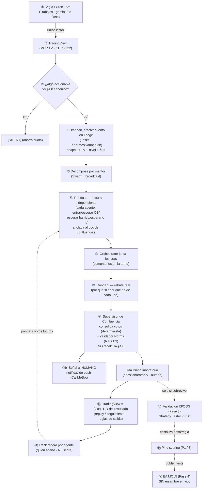
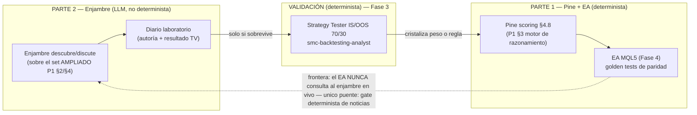

# Esqueleto de integración — PARTE 2: Hermes + Enjambre (runtime · cerebro único · repos)

> **Sesión:** S033 · módulo Mentores (PARALELO a Pine) · rama `pine/sistema-completo`.
> **Qué es:** el *esqueleto* (estructura + ruteo + contratos + orden + diagramas) para construir el **enjambre de mentores** como **laboratorio + copiloto** (ADR-005/007): el runtime continuo (cron/kanban/swarm), el **agente piloto NSL** como plantilla parametrizable (→ `PLANTILLA-agente-mentor.md`), el **cerebro único en Obsidian**, y el **set mínimo de repos/tools**. Es la continuación de `ESQUELETO-P1-conceptos-EA-pine-repos.md §8`.
> **Qué NO es:** NO es código, NO es operación de descarga de cursos, NO instala ningún repo. NO toca ningún `.pine` ni el CORE (módulo paralelo → core-sync sigue MISMO SHA). Cada valor a medir queda `⏳ a cuantificar [impl]` y cada cuerpo/comando real `// TODO [impl]`. Es el plano que la siguiente IA (**[impl]**) ejecuta y construye.
> **Partición (decisión del usuario, S032):** la **PARTE 1** (EA + Pine + repos del plano EA) es `ESQUELETO-P1-conceptos-EA-pine-repos.md`. **Esta es la PARTE 2 (Hermes + enjambre)**. La **plantilla del agente** se entrega aparte en `PLANTILLA-agente-mentor.md` (para poder ajustarla a futuro sin tocar este doc).
> **Léelo junto a:** `docs/adrs/ADR-005-*.md` y `docs/adrs/ADR-007-*.md` (líneas duras), `docs/MODULO-MENTORES-WORKFLOW.md` (roster, 3 capas, voto, escalera de validación), `docs/planes/BRIEFING-mentor-module-v2.md` (cron/kanban/swarm + diagrama), `docs/planes/ESQUEMA-HERMES-mentor-module.md` (superficies de Hermes + qué archivo pide cada una), `docs/planes/GUIA-transcripcion-expertos.md` (playlists NSL/ICT + cerebro único Obsidian), `docs/laboratorio/README.md` (formato diario + track record), `docs/reglas-smc-ict.md §4.8` (documento de confluencias canónico), `docs/planes/HANDOFF-OPUS-MAX-ea-razonamiento-y-enjambre.md` §3.B/§3.C/§3.E/§7/§8/§9, `CLAUDE.md` (reglas duras).

---

## §0 — Reglas duras que el implementador DEBE respetar (innegociables)

Copiadas de `ADR-005`, `ADR-007`, `CLAUDE.md` y `BRIEFING-mentor-module-v2.md §0`. Si el esqueleto y una regla (o un ADR) chocan, **manda la regla / el ADR**.

1. **El enjambre es LABORATORIO + COPILOTO, NUNCA runtime del EA `[ADR-005/007]`.** Tres tiempos que no se mezclan: **Descubrimiento** (enjambre, offline/vivo) → **Validación** (Strategy Tester IS/OOS 70/30, determinista) → **Ejecución** (EA MQL5 nativo). El EA **hereda** reglas cristalizadas; **no consulta** al enjambre en vivo.
2. **El EA no consulta LLM en runtime.** Único puente EA↔exterior en vivo = **gate funcional determinista** (noticias/macro, veto binario con fail-safe). El enjambre alimenta al EA **solo vía validación IS/OOS**.
3. **TV MCP single-instance (CDP 9222).** Solo **UN** agente toca TradingView a la vez (el **Vigía/Router**). Los demás razonan sobre el *snapshot* que ese agente vuelca al Kanban; **nadie más abre TV en paralelo** (colisión CDP).
4. **Persistencia con cron + kanban, NO `delegate_task`.** `delegate_task` es **síncrono** (bloquea al padre; los hijos mueren al cerrar el turno). Para vigilar el mercado sin una ventana abierta → **cron** (cuándo pensar) + **kanban** (dónde queda) + **swarm** (quién y bajo qué lente). (`delegate_task_async` **no existe** en hermes-agent 0.15.2.)
5. **Cuota Gemini free-tier = el cuello de botella real (no el $).** Cron **15m, no 5m** (5m = 288 corridas/día solo del vigía); gating **"accionable" estricto** (si no hay nada → `[SILENT]`); medir RPD antes de escalar. Vigía = `gemini-2.5-flash`; mentores = `gemini-2.5-pro`.
6. **Cero invención + grounding obligatorio.** Un mentor **sin curso descargado no existe** (no se inventa su metodología). Cada lectura/voto se ancla a `reglas-smc-ict.md` (documento de confluencias canónico) y al material real del mentor; lo no cubierto se marca `[no cubierto en el material]`.
7. **Anti-overfitting `[ADR-002]`.** **Nada** del enjambre entra al scoring del sistema sin pasar **IS/OOS**. El diario de laboratorio es hipótesis falsable; la validación es determinista. Los umbrales/pesos del §4.8 están **congelados hasta Fase 3**.
8. **El voto del enjambre es CUALITATIVO y NO recalcula el score §4.8.** El Pine ya calcula el score cuantitativo (determinista). El enjambre es una capa de **revisión/veto/descubrimiento**, no un segundo score. Separar ambas capas es obligatorio.
9. **Una sola fuente de verdad (cerebro único).** NO se crea el árbol `/context/<mentor>/{knowledge,expertise,norms}.md`; NO se duplican transcripciones a `~/.hermes/knowledge/`. El conocimiento del mentor vive **una sola vez en Obsidian** y se lee **on-demand** (§4).
10. **Norms de riesgo GLOBALES y en CÓDIGO.** R:R≥1:3, % riesgo, máx ops/día, news lockout, umbral de confluencia = **una sola fuente** (reglas duras de `CLAUDE.md`), validadas en Pine/EA, **no en el prompt y no por-mentor**. Un mentor *sugiere* riesgo (Expertise); la Norm dura es del sistema. **Validador determinista** en el Orchestrator descarta toda propuesta sin R:R≥1:3 calculable **antes** de mostrarla.
11. **Greenlight humano para todo paso sensible.** `greenlightRequiredFor` por worker (enviar señal, tocar MT5, publicar). El enjambre **no ejecuta trades**; el producto es **conocimiento + señal copiloto para el humano**.
12. **No sobre-ingenierizar.** Piloto mínimo primero (2 mentores reales, §6), no el roster completo de golpe. MT5 = Fase 4 (solo-lectura para laboratorio). No External providers ni knowledge-graph todavía.

---

## §1 — Mapa de superficies de Hermes × módulo (qué hace cada sección y QUÉ ARCHIVO pide)

Derivado de `ESQUEMA-HERMES-mentor-module.md §1` (verificado en la app, Sesion-030). **`[impl]` no inventa rutas: usa estas.**

| Sección (sidebar) | Rol concreto en el enjambre | Archivo / comando / DB que consume |
|---|---|---|
| **Panel** | Dashboard de arranque; no operativo del pipeline. | — |
| **Chat** | Hablar 1:1 con UN mentor (copiloto manual / probar una ficha). | `hermes chat -s mentor-<slug> --provider <prov> -t terminal,file` |
| **Archivos** | Ver/editar fichas, knowledge, diario. | Vault Obsidian + repo |
| **Terminal** | Correr `process-channel.ps1`, `hermes cron/kanban/profile` sin salir de la app. | scripts del repo |
| **Trabajos / Jobs (cron)** | **El VIGÍA vive aquí.** Loop que consulta TV y abre tareas si hay algo accionable. "Cuándo pensar". | `hermes cron create` · estado del cron |
| **Tasks (kanban)** | **El registro del pensamiento.** Tarea = evento; comentarios = protocolo de discusión (ronda 1/2/síntesis). | `~/.hermes/kanban.db` · `hermes kanban init` · `kanban_create`/`kanban_show` |
| **Conductor** | **Visualización** de una ronda de debate en vivo (mesa de agentes). Observar/depurar, no lógica nueva. | — (UI) |
| **Operations** | El **equipo persistente** de mentores + salud (Agent Bus). "Acciones seguras" = greenlight (ADR-005). | estado de la tropa · greenlight |
| **Swarm** | **El despacho de la discusión.** `broadcast` = mandar el evento a todos los mentores (ronda 1); el Orchestrator reparte y junta. | `swarm.yaml` (schema §3) |
| **Memoria** | Hechos durables del **sistema/usuario** (NO la metodología del mentor). **Se queda nativa.** | `~/.hermes/memories/MEMORY.md` + `USER.md` |
| **Knowledge** | Conocimiento especializado del mentor. **En este proyecto vive en Obsidian, no aquí** (§4, regla §0.9). | `~/.hermes/knowledge/` (hoy vacío; ver §4 nota de verificación) |
| **Skills** | La **capa de comportamiento** del mentor: encarna su voz/criterio y apunta el recall al vault. | `~/.hermes/skills/mentor-<slug>/SKILL.md` + `model.txt` |
| **MCP** | Donde se enchufa el **TV MCP** (lectura de gráfico) y, en Fase 4, el MCP de MT5 (solo-lectura). | gestor de servidores MCP |
| **Perfiles** | Cada mentor puede ser un perfil aislado (memoria/skills propios); el `orquestador` = perfil con solo Kanban. | `hermes profile create <slug> [--toolsets kanban]` |
| **External providers** | No se usa por ahora (vacío). | `external_memory_providers.json` |

> **Responsabilidades en una línea:** *Cron = cuándo · Kanban = dónde queda · Swarm/Operations = quién y cómo discute · Knowledge(Obsidian)+Memoria = con qué fundamento · Conductor = cómo lo veo · MCP = de dónde sale el dato · Skills = con qué voz.*

---

## §2 — Runtime del enjambre: el loop continuo (handoff §3.B)

**Qué hacen los agentes (marco).** Cada agente es un **decisor en tiempo real** que, con su personalidad y **sus propias confluencias tomadas del documento de confluencias**, se pregunta y decide ante el gráfico vivo — *"¿entro al FVG que viene? ¿espero un OB? ¿espero una toma de liquidez? ¿espero o no?"* — y argumenta **por qué sí / por qué no**.

**Documento de confluencias = DOS docs con roles distintos** (decisión del usuario, S033):
- **(a) CANÓNICO (grounding):** `reglas-smc-ict.md §4.8` (42 confluencias) **+ el set ampliado de la Parte 1** (#43–#51 candidatas). Es la lista de **qué confluencias existen**; los agentes leen de aquí, no inventan.
- **(b) ANOTACIÓN (descubrimiento):** `docs/laboratorio/` — donde el enjambre **anota** lo que descubre/usa en vivo, con **autoría**. Lo anotado **solo asciende a (a) tras validación IS/OOS** (regla §0.7).

**Producto = señales de entrada para el HUMANO** (modo copiloto, ADR-005), entregadas por **notificación push** (§2.8). El enjambre **no dispara nada**.

### Diagrama 1 — Flujo completo del enjambre (paso por paso, con la superficie/archivo que toca cada nodo)



> **Líneas sólidas = loop del enjambre en vivo. Líneas punteadas = cristalización diferida (nunca en runtime del EA).** El nodo ⑪ es la corrección del usuario (S033): **el árbitro de quién acertó es la acción del precio en TradingView**, no el enjambre.

### §2.1 — Vigía / cron (el ÚNICO que toca TV)
Loop persistente que consulta TV y decide si hay algo accionable. Esqueleto del comando (de `BRIEFING-v2 §4.1`):
```bash
hermes cron create "every 15m" "<PROMPT VIGÍA>" --name "Vigia TV EURUSD 15m"
```
- **`<PROMPT VIGÍA>` (esqueleto):** "Revisa <SÍMBOLO> en <TF> con el MCP de TradingView. Busca <FVG sin mitigar cerca del precio / cercanía a pools / BOS/CHoCH / confluencias §4.8>. Si NO hay nada accionable → responde solo `[SILENT]`. Si SÍ → `kanban_create` una tarea 'evento' en Triage con: precio, nivel exacto, tipo de estructura, TF y la **§ref de `reglas-smc-ict.md` que aplica**." `// TODO [impl]: cerrar el prompt + el criterio exacto de "accionable"`.
- Modelo `gemini-2.5-flash`. Intervalo **15m** (regla §0.5). `⏳ medir RPD antes de bajarlo`.

### §2.2 — Kanban como registro del pensamiento
- `hermes kanban init`. Tarea = evento del vigía (snapshot TV). **Comentarios de la tarea = protocolo** (cualquier agente re-invocado lee todo el historial). Auto-decompose por perfil reparte hijos por mentor.
- DB: `~/.hermes/kanban.db`. Estados: Triage / Ready / Running / Review / Blocked.

### §2.3 — Protocolo de discusión rondas 1/2 + síntesis
Referencia de estructura: **`TauricResearch/TradingAgents`** (patrón analistas → bull/bear → trader → riesgo → PM); se **adapta**, no se adopta su stack.
- **Ronda 1 (lectura independiente):** cada agente decide solo — *entrar / esperar OB / esperar barrido de liquidez / esperar o no* — anclado al doc de confluencias §4.8 + su ficha. Comentario en la tarea.
- **Ronda 2 (rebate real):** cada agente reacciona a las lecturas de los colegas; **por qué sí / por qué no**. El valor está en la **discrepancia** (§3, espejismo de consenso).
- **Síntesis:** el Orchestrator junta vía `kanban_show` del padre y produce el voto consolidado.
- **Todo lo que dijo cada agente queda registrado** (para el track record §2.6). `// TODO [impl]: prompts exactos de ronda 1/2 + cómo se marca el cierre de ronda`.

### §2.4 — Contrato de voto estructurado (I/O)
De `MODULO-MENTORES-WORKFLOW.md §Esquema de voto`. Cada opinador emite **voto estructurado** (no prosa libre):
```yaml
agente: E2-order-blocks          # quién
direccion: long | short | none   # sesgo
postura: a_favor | en_contra | neutral
confianza: 0.0-1.0
concepto: "OB H1 mitigado en discount"
criterio: "reglas-smc-ict.md §2.1"     # o "video <id> mm:ss" para mentores
evidencia: "OB [1.085,1.087] CE 1.086, no mitigado"
```
El **Supervisor de Confluencia** consolida **determinista** (cuenta a favor/en contra por dirección, pondera por confianza × track record) y lo mapea a las confluencias del §4.8 **SIN recalcularlas** (regla §0.8). `// TODO [impl]: validar el schema contra el formato real de comentarios del kanban`.

### §2.5 — Regla de registro de positivas con autoría
Al cerrar una hipótesis (positiva o negativa) → entrada en `docs/laboratorio/DIARIO-<YYYYMM>.md` (plantilla ya existe en `docs/laboratorio/README.md`): fecha/hora, símbolo/TF, zona/nivel, confluencias citadas (§ref), **agente que la propuso (autoría)**, sesgo, invalidación, confianza, resultado. Este es el **lado anotación** del documento de confluencias; lo anotado asciende a §4.8 **solo tras IS/OOS**.

### §2.6 — Scoring / atribución de agentes
- `docs/laboratorio/track-record-<slug>.md` + log estructurado JSONL/CSV: `fecha · símbolo · TF · agente · dirección · confianza · confluencia · resultado(win/loss) · R · fuente(backtest/replay/forward)`.
- **El árbitro de quién acertó = la acción del precio en TradingView** (verificada en replay/seguimiento, resuelta por las **reglas de salida deterministas** R:R / invalidación). **Ni el enjambre ni un agente se autoadjudican el resultado; lo resuelve el gráfico.** Una señal suelta es ruido; se necesita muestra suficiente.
- Construye el **track record real** por mentor (hit-rate por confluencia/sesión/símbolo) → se usa para **ponderar votos futuros** (§2.4). `⏳ [impl]: fórmula de ponderación por desempeño + tamaño mínimo de muestra`.

### §2.7 — Modo replay (laboratorio histórico)
Pedido explícito del usuario ("en replay"). El enjambre opina **vela a vela** sobre histórico con `replay_*` del TV MCP (`replay_start/step/status/stop/trade`). Distinción de modos (ADR-005):
- **Laboratorio** (offline / replay): propone y juzga confluencias sobre histórico → hipótesis/ranking. Nunca da orden.
- **Copiloto** (en vivo, fase TV): opina en tiempo real para asistir al **HUMANO** (paper/manual).
En **ambos**, TradingView es el árbitro del resultado (§2.6).

### §2.8 — Entrega de la señal al humano (copiloto)
Cuando la síntesis (⑨) marca una entrada **accionable**, se envía **notificación push** vía **CallMeBot** (GET HTTP gratis → Telegram/WhatsApp/Signal) con el resumen: símbolo/TF, sesgo, nivel, invalidación, confluencias citadas, agentes a favor. `// TODO [impl]: esqueleto del payload + gating "accionable" (qué umbral de consenso/confianza dispara el push)`.
- Kanban/diario = **registro interno/auditoría**; el push = solo el **aviso**.
- **Solo la alerta, nada sensible** (CallMeBot publica a un tercero). Ver §5 (notificador) y §8 (riesgo de fuga).

> **DOS fuentes de señal — no confundir (importante para `[impl]`):**
> 1. **Alerta del Pine (DETERMINISTA).** El sistema Pine **sí levanta alertas** — ya está en la estructura (stubs `// === ALERTAS ===` en `SMC-Visual.pine:1157` y `SMC-Strategy.pine:851`), planificado: `alertcondition()` en Visual = **Sprint 1.4 (T15)**; `alert_message` JSON por entrada en Strategy = **Sprint 2.1** (plantilla `PINE-PLAN §5`: `"{{ticker}} | <concepto> <dir> @ {{close}} | TF=<tf> | {{timenow}}"`). Estas viven en el **motor del TV** (la dispara TradingView) y, si se quiere, se enrutan a CallMeBot vía **webhook de TV**. **No hay que crear tarea nueva de Pine** — es T15 / Sprint 2.1 ya en el plan.
> 2. **Push del copiloto del enjambre (CUALITATIVO, este §2.8).** El aviso de la **discusión de los mentores** (LLM), distinto de la alerta determinista. En **Fase 4** el **EA** emite su propia alerta nativa → CallMeBot.
> `// TODO [impl]: decidir si el push del copiloto reusa la MISMA plantilla JSON de PINE-PLAN §5 (recomendado, formato único) y si la alerta determinista del Pine y la del enjambre se unifican en un solo canal CallMeBot o quedan separadas.`

---

## §2.9 — Asignación de modelo por rol (razonamiento vs mecánico) + modelo de costos

> **Origen (S044, 2026-06-21):** duda del usuario — *"¿un agente con Nemotron y uno con GLM 5.2 razonan distinto, o como cada agente tiene su contenido propio da igual el modelo? ¿cuánto costará mantener el enjambre? ¿conviene pagar una API?"*. Refina la regla §0.5 y la fila §5 #8 (reparto de proveedores). Hechos **verificados en vivo** contra el endpoint NIM (`integrate.api.nvidia.com/v1`, key actual) ese día.

### §2.9.1 — Principio: el modelo ≠ el contenido del agente (dos ejes distintos)
- **Contenido / ficha / knowledge / prompt → QUIÉN es el agente y QUÉ sabe.** Reduce alucinación, aterriza, da voz. **No** sube la profundidad de razonamiento.
- **Modelo subyacente (Nemotron / GLM / Gemini / Opus) → QUÉ TAN BIEN razona con ese contenido.** Un modelo flojo con la mejor ficha SMC del mundo igual: se salta pasos en inferencias multi-eslabón, pondera mal señales en conflicto (FVG vs OB vs liquidez), inventa confluencias, suena convincente pero plano.
- **Corolario:** la calidad de la **discusión** del enjambre (§2.3) — ponderar hipótesis, proyectar escenarios, asignar el voto/score — depende del modelo, no solo de la ficha. Y como esos votos alimentan el scoring vía IS/OOS (regla §0.7), **basura de razonamiento entra → basura sale** aguas abajo (Pine/EA). El razonamiento del laboratorio es **alto apalancamiento**.

### §2.9.2 — Criterio: qué modelo según el tipo de trabajo
| Tipo de tarea | Roles del enjambre | ¿Importa el modelo? | Modelo recomendado |
|---|---|---|---|
| **Mecánico / detección / formato / visión** | Vigía/cron, describir gráfico, detección (que además es **determinista** por el Pine), router, doc/sync | **Poco** | gratis rápido (mapeados HOY): `nvidia/nemotron-3-super-120b-a12b` · `nvidia/llama-3.3-nemotron-super-49b-v1.5` · visión `meta/llama-3.2-90b-vision-instruct` · `gemini-2.5-flash` |
| **Razonamiento / debate / escenarios** | Mentores que debaten (§2.3 ronda 1/2), Escéptico | **Mucho** | el mejor mapeado HOY: `nvidia/nemotron-3-super-120b-a12b` (NIM gratis) o `z-ai/glm-5.2-free` (ZenMux gratis); **medir primero**; pago solo si la calidad lo pide |
| **Juez / voto consolidado** | Supervisor de Confluencia (la llamada de **mayor apalancamiento**) | **Máximo** | el más capaz mapeado (`nemotron-3-super-120b` / `glm-5.2-free`); aquí es donde un modelo de pago rendiría si se decide escalar |

- **Diversidad cognitiva (refuerza §3, "espejismo de consenso").** Mezclar modelos distintos entre agentes **es deseable**: N agentes con el MISMO modelo cometen errores correlacionados (eco). El Escéptico **ya** debe correr un modelo distinto del proponente (§3, línea de cierre). Extender: el debate gana si proponentes corren modelos heterogéneos (p.ej. `nemotron-super-120b` vs `glm-5.2-free` vs `hermes3:8b` local).
- Esto **refina §0.5** (que fijaba vigía=flash / mentores=pro asumiendo solo-Gemini): con NVIDIA NIM operativo, el reparto por criticidad tiene más opciones gratis.

### §2.9.3 — Modelo de costos: probablemente $0, y por qué
- **Hermes Workspace NO tiene suscripción** — es self-hosted (gateway 8642, modo portable). Lo único que cuesta son las **llamadas a modelos**.
- **NVIDIA NIM free = 40 req/MIN, sin costo por token, sin tarjeta** (vs OpenRouter free 50/día con <$10). Si el enjambre corre sobre NIM + Ollama local → **$0/mes**. El cuello real es **req/min y confiabilidad en picos, NO el dinero** — exactamente lo que decía §0.5, ahora cuantificado.
- **El diseño event-driven (orquestador-vigía único, agentes dormidos hasta evento, cron 15m §0.5) ES el control de costos.** Estimación 1 símbolo/24h: ~900 llamadas/día del vigía + ~150 de ráfagas de enjambre ≈ **~1.000/día**, trivial para 40 rpm (una ráfaga de ~15 llamadas cabe de sobra/min).
- **Cuándo pagar (solo por holgura, no necesidad):** (1) $0 → NIM + ZenMux-free + Ollama, **viable hoy** (es lo mapeado); (2) si NIM falla en picos → red de seguridad de pago (OpenRouter $10/1000-req-día u otra) **solo si la medición lo justifica**; (3) plan de pago para razonamiento → solo si un modelo de pago demuestra ganar a `nemotron-super-120b`/`glm-5.2-free` gratis en un caso SMC real. **Regla: medir RPD/calidad con el enjambre real ANTES de pagar nada** (alineado §0.5). Nota: Gemini free-tier-pro hoy devuelve **429 (límite 0)** → no contar con él; usar NIM como caballo de batalla.

### §2.9.4 — MAPEO ACTUAL de modelos (fuente de verdad — solo lo que existe HOY)
> Saneado en S050 (2026-06-22) contra **`~/.hermes/config.yaml`** (Hermes) y **`~/.hermes/start-jarvis.ps1`** (Jarvis). **Esta es la lista a usar; no inventar modelos fuera de aquí.** Lo que estaba antes y NO está mapeado se retiró (ver "Retirados" abajo).

**HERMES — `providers` de `config.yaml` (4 proveedores):**
| Proveedor | Modelos mapeados | Uso / estado |
|---|---|---|
| `nvidia_nim` | `nvidia/nemotron-3-super-120b-a12b` · `nvidia/llama-3.3-nemotron-super-49b-v1.5` · `meta/llama-3.2-90b-vision-instruct` (en `auxiliary.vision`) | **Caballo de batalla.** Gratis 40 req/min. NIM = razonamiento + mecánico; vision-90b = visión. ✅ verificado (el mentor NSL respondió por aquí, S050). |
| `ollama` (local, `D:\ollama`) | `hermes3:8b` · `alibayram/mimo-7b-rl` | $0, sin cuota, offline. hermes3 = hablar rápido (español); mimo = razonar (verboso/inglés). |
| `zenmux` | `z-ai/glm-5.2-free` · `moonshotai/kimi-k2.7-code-free` · `stepfun/step-3.7-flash-free` | Gratis. GLM-5.2 = alternativa de razonamiento (diversidad cognitiva). *(Resuelve la nota vieja "ZenMux 403": hoy opera con modelos free.)* |
| `google` | `gemini-2.5-flash` · `gemini-2.5-pro` | ⚠️ **free-tier-pro = 429/límite 0 hoy** (no contar con pro). flash sí responde. |

**JARVIS — tiers de `start-jarvis.ps1` (híbrido ahorrativo):**
| Tier | Motor | Modelo mapeado | Uso |
|---|---|---|---|
| 1 LOCAL | `ollama` | `hermes3:8b` (default) · `alibayram/mimo-7b-rl` (`-Model mimo`) | charlar / PC básico (gratis/offline) |
| 2 NVIDIA gratis | `litellm` | `meta/llama-4-maverick` (`default_model`, NO pasar `--model`) | `-Cloud` navegar/investigar/tools · `-Do` orchestrator (browser + web + MCP TV) |
| 3 Claude | — | _pendiente de cablear_ | último recurso |

**Retirados (estaban en el doc, NO están mapeados → no usar):** `puter`/`claude-sonnet-4-6` vía Puter (proveedor eliminado de la config) · `nvidia/nemotron-3-ultra-550b` · `nvidia/nemotron-3-nano-omni-30b-a3b-reasoning` · `minimaxai/minimax-m3` · `mistralai/mistral-large-3` · `openai/gpt-oss-120b` · cadenas OpenRouter (proveedor `openrouter` referenciado en `task_profiles` pero **no configurado** como provider). Si se quiere usar alguno → primero añadirlo a `providers` y verificar 200, recién entonces documentarlo aquí.

> **Pendiente `⏳ [impl]`:** definir un `task_profile` del enjambre con la cadena ya mapeada: razonamiento `nemotron-super-120b` → fallback `glm-5.2-free` → fallback local `mimo-7b-rl`; visión `llama-3.2-90b-vision`; mecánico `nemotron-49b`/`hermes3:8b`. (El mini-test "modelo de pago vs gratis" se hará solo si la medición lo pide.)

---

## §2.10 — Límite máximo de agentes: roster (≈ilimitado) vs concurrencia (tope DURO = 3)

> **Origen (S074, 2026-06-30):** pregunta del usuario — *"¿cuántos agentes máximo puede tener el enjambre en Hermes?"*. Respuesta aterrizada contra **`~/.hermes/config.yaml`** (no de memoria). La clave: **"máximo de agentes" son DOS preguntas distintas** y solo una tiene tope duro.

### §2.10.1 — Dos ejes que no se confunden

- **Eje ROSTER (cuántos agentes puedo *definir*) → ≈ ilimitado.** Cada agente es solo un `profile/` + `skill/` + entrada en `swarm.yaml`. **Hoy hay 2** (`mentor-no-soy-liquidez`, `mentor-ict`). Definir 10 no cuesta runtime — cuesta **mantenimiento y grounding** (regla §0.6: un mentor sin curso bajado no existe). El límite aquí es de *disciplina*, no técnico.
- **Eje CONCURRENCIA (cuántos corren *a la vez*) → tope DURO = 3.** Lo impone Hermes, no el diseño. Citado a `config.yaml`:

| Setting (`config.yaml`) | Valor | Qué acota |
|---|---|---|
| `delegation.max_concurrent_children` | **3** | **Máx. agentes en paralelo por ola del orquestador.** ← cuello de botella real |
| `delegation.max_spawn_depth` | **1** | Jerarquía **plana**: orquestador (nivel 0) → agentes (nivel 1). Sin sub-enjambres. |
| `delegation.child_timeout_seconds` | **600** | 10 min por agente o se mata (acota debates colgados). |
| `delegation.max_iterations` | **50** | Tope de iteraciones del orquestador. |
| `kanban.auto_decompose_per_tick` | **3** | El kanban solo abre **3 tareas-hijas por tick**. |
| `kanban.dispatch_interval_seconds` | **60** | Un tick cada 60 s (ritmo de las olas vía kanban). |
| `cron.max_parallel_jobs` | `null` | Sin cap explícito de crons → el Vigía corre serializado (no compite con el debate). |

### §2.10.2 — El cuello de botella NO es la cuota, es la concurrencia

- **La cuota NIM (40 req/min, regla §0.5/§2.9.3) NO es el límite.** Una ola de 3 agentes en ronda 1+2 ≈ **6–12 llamadas** repartidas en el minuto; incluso 2–3 olas seguidas caben de sobra en 40/min. El que ata es `max_concurrent_children: 3`.
- **Encaje exacto con `max_spawn_depth: 1`:** *1 orquestador + 3 agentes planos por ola*. La config ya dibuja la forma del debate.

### §2.10.3 — Diseño adoptado: **debate en OLAS DE 3**

Consecuencia directa del tope. **No se convoca a todos los mentores a la vez** — se debate por olas:

1. **Vigía/Router queda APARTE** (no cuenta en las 3): es un **cron**, no un *child* del orquestador, y es el único que toca TV (regla §0.3). No compite por los 3 slots.
2. **Ola = hasta 3 agentes** que el orquestador lanza en paralelo (`broadcast` del Swarm → 3 children). Hacen ronda 1/2 y comentan en la tarea del Kanban.
3. **Si el roster > 3**, van en **olas sucesivas** (tick de 60 s, `auto_decompose_per_tick: 3`); el **Supervisor de Confluencia** consolida los votos de todas las olas al final (determinista, no recalcula §4.8 — regla §0.8).

**Composición sugerida de la ola del piloto (§6):** `mentor-ict` + `mentor-no-soy-liquidez` + `esceptico` = **1 sola ola de 3**. El roster del piloto (2 mentores reales, regla §0.12) cabe entero en una ola → cero esperas. Al sumar E1–E6 y más mentores, se agrupan en **olas temáticas** (p. ej. ola "estructura" = E1+E2+escéptico; ola "liquidez" = E5+mentor+escéptico).

### §2.10.4 — Decisión: mantener el tope en 3 para el piloto (y por qué NO subirlo aún)

- **Técnico:** 3 es el default actual y es estable. Subir `max_concurrent_children` a 5–6 sería viable **por cuota** (NIM aguanta), pero arriesga estabilidad del gateway y choca con `child_timeout_seconds: 600` si las olas se solapan. Regla §0.12 (piloto mínimo primero) → no tocar.
- **De diseño (el argumento fuerte):** más agentes simultáneos **NO mejora la calidad del debate** — la empeora. N agentes a la vez con doctrina compartida = **más eco** (espejismo de consenso, §3). El límite de 3 es **saludable**: fuerza debate enfocado (2 proponentes + 1 Escéptico con modelo distinto) y deja la consolidación al Supervisor. El valor está en la discrepancia, no en el número.
- **Cuándo subirlo (gate `⏳ [impl]`):** solo si el roster operativo crece tanto que las olas sucesivas introducen latencia inaceptable para el copiloto en vivo, **y** la medición de RPD/estabilidad NIM lo respalda. Subir como mucho a **5** y re-medir. Nunca por "tener más voces".

> **Resumen de una línea:** *roster = el que quieras (con curso); concurrencia = 3 por ola, debate en olas, Vigía aparte. El tope de 3 es feature, no bug (anti-eco §3).* La **sala-espejo** que haga visible cada ola (WhatsApp/Discord) está **diferida** a su sesión — ver memoria `enjambre-sala-debate-discord-vs-whatsapp`.

---

## §3 — Roster del enjambre (4 familias) y cómo se instancian

De `MODULO-MENTORES-WORKFLOW.md §Roster` + `PLAN-modulo-mentores-swarm.md §C`. La **plantilla concreta** de cada agente está en `PLANTILLA-agente-mentor.md`.

| Familia | Agente(s) | Función | Cuándo se instancia |
|---|---|---|---|
| **Mentores** | `mentor-<slug>` (NSL, Boxxocode, Profittrading, TJ, Fedex…) | Opinan con la voz/metodología del mentor; deciden entrar/esperar | **Al bajar su curso** (cero invención) |
| **Expertos-concepto** | E1–E6 | Juzgan la señal contra la def. canónica de su grupo de §reglas, **alineados al Pine real** | **Se cierran ya** (no dependen de cursos) |
| **Funcionales** | Noticias (→ gate determinista) · Order Flow · Tendencias-MTF/Macro | Contexto externo al Pine; **no dan call de trade** | Según fuente de datos |
| **Control** | Router · Supervisor de Confluencia · Orchestrator · Entrenador · **Escéptico** | Orquestar · consolidar votos · validar Norms · refinar mentores · **atacar toda confluencia que backtestee bien** | Se cierran ya |

**Expertos-concepto E1–E6** (agrupan los 24 conceptos de `reglas-smc-ict.md`): E1 Estructura (§1.1–§1.6) · E2 Order Blocks (§2.1, 2.6–2.8) · E3 Imbalance/FVG (§2.2, §4.1) · E4 Premium/Discount & OTE (§2.3, 2.5) · E5 Liquidez (§2.4, §3.1–3.7) · E6 Tiempo & Sesiones (§3.4, §4.2–4.3). **El gap de la Parte 1 (T26–T40) se asigna al experto de su familia** cuando se implemente.

**Las 3 capas de contexto por agente** (Knowledge / Expertise / Norms) — modelo de `WORKFLOW`:
- **Knowledge (qué sabe):** Expertos → §`reglas-smc-ict.md`; Mentores → su ficha (campos 1,2); Funcionales → su fuente de datos.
- **Expertise (cómo trabaja):** Mentores → ficha campos 3/7/8; Expertos → criterio válido/inválido **alineado a los umbrales del Pine real** (`f_detectOB`, `f_detectFVG`…).
- **Norms (qué puede):** dominio (en su `SKILL.md`) + **riesgo GLOBAL en código** (regla §0.10) + validador determinista en el Orchestrator.

> **Espejismo de consenso (lectura honesta, riesgo #1).** Los mentores SMC coinciden porque comparten el mismo libro de jugadas → fuentes **correlacionadas, no confirmaciones independientes**. Que N agentes voten igual **no** sube la probabilidad. **El valor del panel está en la DISCREPANCIA:** dos hipótesis distintas se backtestean por separado; la coincidencia dispara *investigar*, el IS/OOS **decide**. Por eso el **Escéptico** corre un **modelo distinto** del proponente y es **independiente** (no juzga su propia señal).

---

## §3.1 — Filosofía del roster + roster completo + regla de lanzamiento (decisiones S074)

> **Origen (S074, 2026-06-30):** el usuario fijó la **filosofía del enjambre**, ascendió Wyckoff a agente, definió Chart Fanatic como multi-estrategia y estableció la **regla de lanzamiento**. Estas decisiones **mandan** sobre el roster genérico de §3.

### §3.1.1 — Filosofía: confluencia entre variantes + diversidad + selección darwiniana

- **No se busca consenso, se busca CONFLUENCIA.** Cada mentor aplica SMC/SMC-ICT **a su manera**; donde **coinciden las variantes** = confluencia fuerte. El parecido entre mentores SMC no es ruido a eliminar — es justo la señal que se mide.
- **NO solo SMC → diversidad real.** Se suman agentes de **otras estrategias** (Wyckoff, Chart Fanatic…) que **apoyan o NO apoyan** la decisión. Son el contrapeso que evita la cámara de eco SMC (refina §3, "espejismo de consenso": la diversidad no-SMC es la fuente *independiente* que sí sube probabilidad).
- **Selección darwiniana `[ADR-007]`.** El **track-record/score por agente** (§2.6) decide quién se queda. El agente que no aporta a las decisiones **se saca**. Los tres mecanismos anti-eco = diversidad no-SMC + Escéptico (§3) + poda por score.

### §3.1.2 — Familia NUEVA: "Diversidad / otras estrategias" (no-SMC)

Se añade a las 4 familias de §3. Votan **apoyo/no-apoyo** con su propia lente, sujetos a poda por score:
- **Wyckoff** — **asciende de referencia (§5 #12) a AGENTE propio**. Conceptos propios: acumulación/distribución, **rango vs tendencia**, springs/upthrust, contexto de mercado. Aporte específico: decir *"el mercado está en rango / en movimiento"* → clave para decidir **entradas swing** y si conviene entrar. Se construye **sin bajar curso de YouTube** (teoría canónica + repo `YoungCan-Wang/WyckoffTradingAgent`).
- **Chart Fanatic** (`@chart-fanatics`) — canal de **entrevistas a varios traders**. NO es una sola voz: es **AGENTE multi-estrategia** que habla de **distintas estrategias** en la discusión (cantera de diversidad). Requiere procesar entrevistas (más trabajo que Wyckoff).
- **Mind Math Money** (`@MindMathMoney`) · **CallistoFX** (`@callistofx`) — `⏳ por clasificar` (revisar canal antes de asignar familia SMC vs diversidad).

### §3.1.3 — Roster completo candidato (universo cerrado, ~24)

| Familia | Agentes | Estado |
|---|---|---|
| **Mentores SMC** | ICT ✅ · NSL ✅ · Profittrading · TJ Trading · Fede Esses | 2 listos; 3 con `COMANDOS-*` listos, falta bajar curso→ficha→skill→profile |
| **Diversidad / otras estrategias** | Wyckoff · Chart Fanatic · (MMM, CallistoFX `⏳ clasificar`) | construir todos |
| **Estrategia/EA** (ideas, no doctrina) | Boxxocode | pipeline visión parcial; falta ficha |
| **Expertos-concepto** (vs Pine, sin curso) | E1 Estructura · E2 OB · E3 FVG · E4 P/D&OTE · E5 Liquidez · E6 Tiempo&Sesiones | construir (6), anclados a `reglas-smc-ict.md` |
| **Funcionales** (contexto externo) | Noticias(→gate) · Order Flow · Tendencias-MTF/Macro | construir (3), **dependen de fuentes/MCPs aún no montados** |
| **Control** | Vigía/Router · Supervisor de Confluencia · Orchestrator · Entrenador · Escéptico | construir (5), chicos, sin curso |

### §3.1.4 — Regla de LANZAMIENTO (decisión dura del usuario, S074)

> **NO invierte la regla §0.12 — la matiza en dos fases:**
> - **PRUEBAS (incremental, sigue válido):** se pueden construir y probar piezas sueltas (piloto §6, chat 1:1 con cada agente, medir cuota/ruido). Aquí el piloto mínimo de 2 mentores del §6 sigue vigente **para probar**.
> - **LANZAMIENTO operativo del enjambre (revisar TV + workflow completo + optimizar la discusión/toma de decisiones):** **sí o sí TODOS los agentes del roster deben estar listos** (ficha + skill + profile + todo lo estipulado en el plan) **y probados 1:1**. El swarm no se enciende en modo operativo con un subset — porque el objetivo de esa fase es **evaluar y optimizar la DISCUSIÓN completa** (cómo mejora la conversación, cómo se optimiza para que tomen decisiones), y eso exige el panel entero.

### §3.1.5 — Decisiones ABIERTAS (`⏳ [impl]`, no fijadas en S074)

1. **Alcance exacto de "todos"** para la 1ª instancia: (nivel 1) solo opinión+control ~13 · (nivel 2, recomendado) opinión+Expertos E1–E6+control ~19, Funcionales después por depender de datos externos · (nivel 3) el plan completo ~24. **Pendiente de decisión del usuario.**
2. **Clasificar** Mind Math Money y CallistoFX (revisar canal → familia SMC vs diversidad).
3. **Cuáles mentores "sí o sí"** vs opcionales dentro del roster.

---

## §4 — Cerebro único en Obsidian: arquitectura de conocimiento / almacenamiento (handoff §8 + §9.A)

> **Problema:** mentores de 100+ videos → transcripciones pesan millones de tokens. **Solución:** una sola fuente, lectura on-demand, síntesis compacta como grounding.

### §4.1 — Fuente única, lectura on-demand, sin duplicar
- El conocimiento del mentor vive **una sola vez en Obsidian** (`D:\obsidian\boveda MENTE\Mente\Mentores\<slug>\` para crudas; síntesis como knowledge). El agente lee **on-demand**, **no copia**.
- El agente **NO carga las transcripciones crudas**. Su grounding = **síntesis compacta**: `ficha-mentor.md` (CÓMO decide, siempre cargada, chica) + **1 resumen por tema** (QUÉ sabe, grande, se consulta por búsqueda). Las crudas = archivo/respaldo (comprimible tras sintetizar).

### §4.2 — Contrato de recuperación (RAG)
- **Siempre cargado:** `ficha-mentor.md` (personalidad/criterio de voto).
- **Por búsqueda (on-demand):** los `<tema>.md` de knowledge cuando la confluencia toca ese tema; cita textual = literal del crudo.
- **Mecanismo:** toolset `file`/grep nativo de Hermes **o** MCP de memoria (§4.3). `⏳ [impl]: definir qué se carga, cuándo y con qué — el contrato exacto de recuperación`.

### §4.3 — Decisión: open-second-brain como sustrato del cerebro único (recomendado)
**`itechmeat/open-second-brain`** — memoria local-first para Hermes en vault Obsidian (markdown plano bajo `Brain/`, "dream pass" que agrega correcciones→preferencias con confianza; **plugin Hermes + MCP**). Encaja **directo** con §4.1 (ya es Obsidian = nuestro destino de backup vía `sync-obsidian.ps1`; gana en transparencia).
- **Elegir UNO** entre {open-second-brain, `mnemox-ai/tradememory-protocol`, gbrain} (regla: un solo sustrato de memoria). **Recomendado: open-second-brain.**
- **Gate de verificación antes de instalar `⏳ [impl]`:** (1) compatibilidad con la estructura `Mente/Mentores/<slug>/` y con `sync-obsidian.ps1` (no debe duplicar); (2) que el plugin/MCP no pelee con el gateway nativo (8642); (3) que el "dream pass" no contamine el grounding con preferencias no validadas (regla §0.6/§0.7); (4) coste/latencia de su recall vs `file`/grep simple.

### §4.4 — Regla de no-duplicación + nota de verificación (duda del usuario)
- **Regla §0.9:** no `/context/<mentor>/...`; no copiar a `~/.hermes/knowledge/` lo que ya vive en Obsidian. **Un solo cerebro alimenta todos los agentes.**
- **Nota de verificación `⏳ [impl]` (duda del usuario, S033):** confirmar que tener el cerebro en Obsidian (y **no** en `~/.hermes/knowledge/`) **no afecta** el Workspace ni la Memoria de Hermes. Datos a favor ya conocidos:
  - La **Memoria** (`~/.hermes/memories/MEMORY.md` + `USER.md`) es **otra capa** (hechos durables del sistema/usuario) y **se queda nativa** — no se mueve.
  - `build-personality.ps1` **ya apunta el recall del skill al vault de Obsidian** (`$destDir`, toolset `file`), no a `~/.hermes/knowledge/`. El patrón "leer de Obsidian" ya está en marcha.
  - **Pregunta abierta:** ¿algo del Workspace / sección Knowledge depende de que `~/.hermes/knowledge/` esté poblada, o `open-second-brain` (plugin+MCP) es justo el puente Obsidian↔Hermes? **Verificar antes de comprometer.** Si surge conflicto → candidato a ADR. *(Por ahora la regla queda como está — decisión del usuario.)*

---

## §5 — Set mínimo de repos / tools del enjambre: veredicto + orden

> Construye sobre la investigación S031 (handoff §7/§9.A) y el catálogo raíz. **Fuente raíz = `LLMQuant/awesome-trading-agents`** (el "git de trading" que el usuario señaló): de ese catálogo salieron TradingAgents, multi-agent-investment, ContestTrade, OpenMobius-skill, tradememory-protocol. **`[impl]` debe minar el resto del catálogo** para piezas del enjambre con los criterios de abajo. **Regla: un solo sustrato de memoria + un solo andamiaje de orquestación, NO apilar.** Conteos de estrellas que circularon = **no fiables**, no pesan en la decisión.

| # | Repo / tool | Plano | Decisión | Orden | Qué verificar antes de adoptar |
|---|---|---|---|---|---|
| 1 | **`itechmeat/open-second-brain`** | Memoria / cerebro único | **Adoptar (recomendado)** | AHORA (§4) | Gate §4.3. Es el sustrato de memoria/diario en Obsidian. **Elegir solo este** entre los 3 de memoria. |
| 2 | **`mnemox-ai/tradememory-protocol`** | Memoria (alt.) | **Rechazar si O2B pasa el gate** | — | Memory MCP (17 tools) que registra razonamiento+resultado+evidencia. Más opaco que O2B (no es Obsidian). Solo si O2B falla el gate. |
| 3 | **gbrain** | Memoria (alt.) | **Rechazar (por ahora)** | — | Tercera opción de memoria; descartar para no apilar. |
| 4 | **`witt3rd/oh-my-hermes`** | Orquestación | **Probar vs construir a mano** | Tras piloto §6 | Skills de orquestación nativas Hermes (consensus planning Planner→Architect→Critic, verified execution, triage). **OJO: usar el repo de `witt3rd`**, no el homónimo de Salomondiei08. Evaluar contra construir el loop cron+kanban+swarm a mano. **Elegir UNO.** |
| 5 | **`TauricResearch/TradingAgents`** (paper arXiv 2412.20138) | Debate (referencia) | **Adoptar como referencia** (no software) | AHORA (§2.3) | Patrón de rondas/roles/prompts. NO integrar su stack (equities/cripto US). |
| 6 | **`multi-agent-investment` / `FinStep-AI/ContestTrade`** | Precedente de diseño | **Adoptar como referencia** | AHORA | "LLM propone, capa determinista decide" + "agentes compiten" = **precedente directo de ADR-007**. Informa §2.4/§2.6 (combinación de votos + scoring de agentes). |
| 7 | **`MobiusQuant/OpenMobius-skill`** | Grounding ICT/SMC | **Probar (cruza con P1)** | AHORA | Knowledge cards ICT/SMC compatibles con Hermes. Útil para grounding de mentores/expertos. Cruzar su catálogo vs `MATRIZ §B`; NO copiar definiciones sin verificarlas contra TV (cero invención). *(También está en P1 §7 #1 para el gap.)* |
| 8 | **ZenMux + NVIDIA Nemotron** | Proveedores | **Adoptar (multi-proveedor)** | AHORA (config Hermes) | Redundancia de proveedor para el enjambre: Gemini (razonamiento SMC pesado) · ZenMux free / Nemotron (agentes baratos: router/doc/sync). Reparto por criticidad. *(Operativo S031; config, no diseño.)* |
| 9 | **CallMeBot** (API, no repo) | Notificador copiloto | **Adoptar AHORA** (elevado de Fase 4-5) | §2.8 | **Canal de entrega del copiloto** (push Telegram/WhatsApp). Decisión del usuario S033 → ya no se difiere. **Solo la alerta, nada sensible** (publica a un tercero). |
| 10 | **`chopratejas/headroom`** | Compresión de contexto | **Diferir** | Solo si topan límites | Hermes ya comprime (`compression.enabled`). Reconsiderar solo si los agentes topan límites leyendo knowledge crudo. No es palanca para el flujo Pine/Claude Code. |
| 11 | **MT5 MCPs** (`ariadng/...`, `Qoyyuum/...`) | Laboratorio MT5 | **Diferir a Fase 4** | Fase 4 | Solo-lectura para laboratorio; la escritura la hace el EA nativo. No instalar ahora. |
| 12 | **`YoungCan-Wang/WyckoffTradingAgent`** | Diversidad / movimiento de mercado | **Adoptar como AGENTE propio (S074)** | 1ª instancia | **Ascendido de referencia a agente (§3.1.2).** Conceptos Wyckoff propios (acumulación/distribución, rango vs tendencia, springs/upthrust) → opina si el mercado está en rango o en movimiento; aporta a entradas swing. Se construye sin curso YouTube (teoría canónica + este repo). No copiar sin verificar contra TV (cero invención). |
| 13 | **`6551Team/opennews-mcp`** | Funcional Noticias + **gate determinista** | **Probar (alta)** | Tras piloto §6 | 84+ fuentes + impact-scoring/trading-signal + streaming. **Candidato a la fuente del gate de noticias** que ADR-005 dejó como **"TBD"**. Verificar: cobertura de calendario macro FX (NFP, etc.), latencia, que el veto sea **binario/determinista** (no un LLM decidiendo). |
| 14 | **`LLMQuant/data-mcp`** | Funcional Macro/Tendencias-MTF | **Probar** | Tras piloto §6 | "Knowledge harness for AI-native finance": macro indicators, news, datos. Da contexto a los Funcionales (ya flagueado en `BRIEFING-v2 §6`). Evaluar vs `opennews-mcp`; no apilar dos fuentes de lo mismo. |

> **Conclusión de la revisión COMPLETA del catálogo `LLMQuant/awesome-trading-agents` (S033, 101 proyectos: ~54 Agents + ~34 MCPs + ~13 Skills):**
> - **NO existe un agente SMC/liquidez dedicado** en el catálogo. El único conocimiento ICT/SMC es **`OpenMobius-skill`** (#7, ya adoptado para grounding); la "liquidez/estructura" la aportan **nuestros mentores** (NSL, etc.) + los **Expertos E1–E6** anclados al Pine real. Lo más cercano a "movimiento de mercado" es **WyckoffTradingAgent** (#12, referencia).
> - El resto del catálogo es **equities/cripto/prediction-markets US** (TradingAgents-CN, ai-hedge-fund, nof1.ai, Polymarket/Kalshi, etc.): **no encaja** con FX SMC/ICT + EA nativo MQL5 → **no se adopta**.
> - Piezas ya capturadas (debate/precedente/memoria/TV/MT5): filas #2–#11. Nuevas de esta revisión: #12–#14 (Wyckoff + 2 fuentes para Funcionales/gate de noticias).

---

## §6 — Orden de construcción por fases (piloto → escala)

De `BRIEFING-v2 §8`. **No construir el roster completo de golpe** (regla §0.12).

1. **Pre-requisito:** ≥1 curso bajado + `ficha-mentor.md` (9 campos, incl. campo 9 "Conflictos con el sistema"). NSL ✅ (curso 65 eps); playlists extra = complemento (ver `PLANTILLA-agente-mentor.md §C`).
2. **Piloto mínimo E2E:** 1 cron **Vigía** + 1 **kanban** + **2 mentores reales** + **orquestador**, sobre **EURUSD**, generando **1 entrada de diario**. Medir **cuota (RPD) y ruido**.
3. **Notificador:** cablear CallMeBot al nodo ⑩b (§2.8) — verificar que el push llega con el payload mínimo.
4. **Cerebro único:** pasar el gate de open-second-brain (§4.3) y migrar el recall.
5. **Escala:** cerrar Expertos E1–E6 (no dependen de cursos) → añadir Funcionales/Control → instanciar más mentores al bajar sus cursos.
6. **Deuda V1 / higiene:** retirar `hermes-proxy.mjs` (OpenRouter, obsoleto con Gemini nativo); archivar skills V1 (`consult-mentor`, `mentor-extract-profile`, `mentor-transcribe`) sin borrar (backup).

**Gate de cada fase:** cuota medida + ruido aceptable + 0 colisiones TV + greenlight humano operativo. **MT5 = Fase 4** (no antes). **Lo que se puede pilotar YA:** todo lo de los pasos 1–5 (es Hermes, no Pine/EA).

> **⚠️ Regla de LANZAMIENTO (S074, §3.1.4):** los pasos 1–6 de arriba son **para PROBAR piezas** (incremental, sigue válido). Pero el **arranque operativo del enjambre** (revisar TV + workflow completo + optimizar la discusión/toma de decisiones) exige **sí o sí TODOS los agentes del roster completo (§3.1.3) listos y probados 1:1**. No se lanza en modo operativo con un subset.

---

## §7 — Traza end-to-end Parte 1 ↔ Parte 2 + refactors (handoff §3.C)

### Diagrama 2 — La cadena completa (dónde entra cada parte y la frontera "nunca en runtime")



### Tabla de eslabones (qué existe / qué falta / qué refactor)

| Eslabón | Estado | Qué falta / refactor `[impl]` |
|---|---|---|
| Enjambre descubre (set ampliado P1) | esqueleto (este doc) | construir runtime §2 (piloto §6) |
| Diario + autoría + track record | plantilla (`docs/laboratorio/`) | poblarlo desde el runtime; árbitro = TV (§2.6) |
| Validación IS/OOS | proceso definido (ADR-002) | requiere `SMC-Strategy.pine` + scoring (F2-T01, Fase 3) |
| Cristalización → Pine scoring | P1 §3 (esqueleto) | exponer scores parciales por familia / normalización ATR / umbrales configurables (P1 §3.4 — Fase 3+) |
| Pine → EA MQL5 | P1 (Fase 4) | golden tests de paridad (ADR-002) |

**Marca explícita:** el enjambre alimenta al EA **solo vía validación IS/OOS, nunca en runtime** (regla §0.1/§0.2). El set de conceptos sobre el que el enjambre descubre/discute = el **ampliado por la Parte 1** (§4.8 + #43–#51).

---

## §8 — Riesgos, preguntas abiertas y decisiones pendientes

1. **TV MCP single-instance:** si más de un agente lee TV → colisión CDP. Solo el Vigía/Router lee (regla §0.3).
2. **Cuota Gemini free-tier:** límite real. Cron 15m + "accionable" estricto + medir RPD antes de escalar (regla §0.5).
3. **Espejismo de consenso:** fuentes correlacionadas; el valor está en la discrepancia; el Escéptico es la salvaguarda (§3).
4. **Overfitting:** meter hipótesis al scoring sin IS/OOS rompe ADR-002 (regla §0.7).
5. **Sobre-ingeniería:** roster completo de golpe; piloto mínimo primero (§6).
6. **Seguridad / deuda V1:** keys en texto plano (`config.yaml`, `hermes-proxy.mjs:5`) → rotar a env var (Fase 5, incidente SEC-01). CallMeBot publica a un tercero → solo alertas, nada sensible (§2.8). Retirar el proxy V1.
7. **Preguntas abiertas / candidatos a ADR:**
   - Adopción de **open-second-brain** como sustrato de memoria + cerebro-en-Obsidian vs Knowledge nativo (§4.4) → candidato a ADR si hay conflicto.
   - Adopción de **oh-my-hermes** vs construir el loop a mano (§5 #4) → candidato a ADR de arquitectura de orquestación.
   - Fuente del calendario de noticias para el gate determinista (era "TBD" en ADR-005 → **candidato encontrado: `opennews-mcp`** §5 #13; verificar cobertura macro FX + veto binario).
   - Fórmula de ponderación de votos por track record (§2.6).

---

## §9 — Documentos relacionados
- Parte 1 (engancha aquí): `docs/planes/ESQUELETO-P1-conceptos-EA-pine-repos.md` §8.
- Plantilla del agente piloto: `docs/planes/PLANTILLA-agente-mentor.md`.
- Encargo + repos: `docs/planes/HANDOFF-OPUS-MAX-ea-razonamiento-y-enjambre.md` §3.B/§3.C/§3.E/§7/§8/§9.
- Líneas duras: `docs/adrs/ADR-005-*.md`, `docs/adrs/ADR-007-*.md`, `CLAUDE.md`.
- Roster / 3 capas / voto / escalera de validación: `docs/MODULO-MENTORES-WORKFLOW.md`.
- Cron/kanban/swarm + diagrama + riesgos: `docs/planes/BRIEFING-mentor-module-v2.md`.
- Superficies de Hermes (qué pide cada sección): `docs/planes/ESQUEMA-HERMES-mentor-module.md`.
- Playlists NSL/ICT + cerebro único Obsidian: `docs/planes/GUIA-transcripcion-expertos.md`.
- Formato diario + track record: `docs/laboratorio/README.md`.
- Documento de confluencias canónico: `docs/reglas-smc-ict.md §4.8` (+ set ampliado P1).
