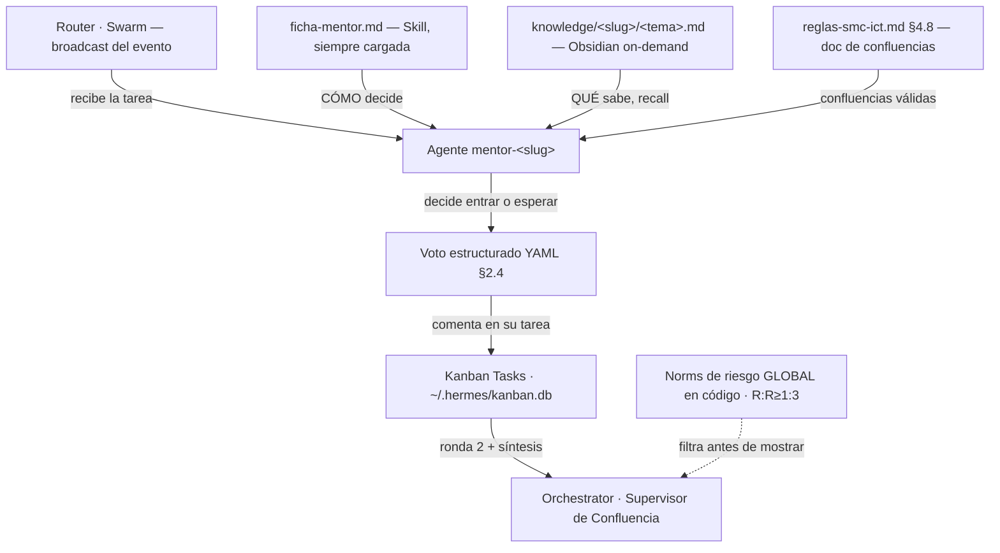

# Plantilla parametrizable de un agente del enjambre (piloto NSL)

> **Sesión:** S033 · módulo Mentores (PARALELO a Pine) · acompaña a `ESQUELETO-P2-hermes-enjambre.md`.
> **Qué es:** la **plantilla de un agente de punta a punta** — todo lo que necesita y todo lo que le pide al workspace — de modo que **los demás mentores/expertos se clonen/ajusten de esta plantilla** según su función (handoff §3.E). Se entrega **aparte** del ESQUELETO-P2 para poder ajustarla a futuro sin tocar el documento maestro.
> **Caso trabajado:** `mentor-no-soy-liquidez` (NSL) — el norte del usuario: se baja TODO NSL y se usa **SOLO este mentor como ejemplo** para rediseñar lo que se hará en el enjambre. *"Su mente ya está en esos canales que bajamos"* (curso 65 eps ✅; playlists extra = complemento).
> **Qué NO es:** NO es código ni operación de descarga. Cada valor no fijado queda `⏳ [impl]`. Respeta TODAS las reglas duras de `ESQUELETO-P2 §0`.
> **Léelo junto a:** `ESQUELETO-P2-hermes-enjambre.md` (§1 superficies, §2 runtime, §3 roster, §4 cerebro único), `ESQUEMA-HERMES-mentor-module.md §3` (un mentor con múltiples knowledge), `GUIA-transcripcion-expertos.md` (playlists NSL/ICT + plantilla de carpetas), `scripts/build-personality.ps1` (genera el skill).

---

## §A — Anatomía de un agente del enjambre

Las **5 piezas** que TODO agente necesita (las mismas para mentor, experto, funcional o control; cambia el contenido, no la estructura):

| # | Pieza | Dónde vive | Quién la genera | Qué contiene |
|---|---|---|---|---|
| 1 | **Perfil Hermes** | instancia Hermes | `hermes profile create <slug>` | Aislamiento (memoria/skills propios). El `orquestador` = perfil con `--toolsets kanban`. |
| 2 | **Skill `mentor-<slug>`** | `~/.hermes/skills/mentor-<slug>/SKILL.md` (+ `model.txt`) | `build-personality.ps1` (desde la ficha) | Voz + criterio + reglas de comportamiento + **ruta de recall al vault** (toolset `file`). |
| 3 | **Carpeta de knowledge** | **Obsidian** (`Mente\Mentores\<slug>\` crudas; síntesis = knowledge) | `process-channel.ps1` → síntesis Gemini | `ficha-mentor.md` (CÓMO decide) + 1 `.md` por tema (QUÉ sabe). **Cerebro único, on-demand (§4).** |
| 4 | **Entrada en `swarm.yaml`** | config del swarm | `[impl]` (schema abajo) | Rol del agente dentro del enjambre + restricciones. |
| 5 | **Tools de Hermes** | declaradas en su skill/worker | — | Qué superficies usa (file, kanban, cronjob, MCP TV…). |

**Schema de la entrada `swarm.yaml`** (verificado en la app, `WORKFLOW §swarm.yaml`):
```yaml
- name: mentor-<slug>
  role: "<rol en una línea>"
  model: <gemini-2.5-pro | override>
  tools: [file, kanban]            # cronjob/MCP TV solo donde aplique
  skills: [mentor-<slug>]
  greenlightRequiredFor: [external-send]   # paso sensible → visto bueno humano
  maxConcurrentTasks: <n>
  acceptsBroadcast: true           # recibe la ronda 1 del Router
  wrapper: <opcional>
```

### Diagrama 3 — Cómo se comunica un agente (paso por paso)



> Lectura: el agente **nunca** abre TV (regla §0.3); razona sobre el snapshot del Kanban. Su voz sale de la ficha (Skill), su conocimiento de Obsidian on-demand (cerebro único), y sus confluencias del documento canónico §4.8. El validador de Norms (en código) descarta lo que no cumple R:R≥1:3 **antes** de llegar al humano.

---

## §B — Tabla de parámetros (lo que cambia por agente)

> **Una fila por agente.** La columna NSL está rellena (caso trabajado §C); el resto = `⏳ [impl]` al instanciar cada uno. Esta tabla es la que se "clona y ajusta".

| Parámetro | Qué define | Valor para NSL (piloto) | Para clonar |
|---|---|---|---|
| `slug` | id del agente | `no-soy-liquidez` | `⏳` |
| `nombre` | nombre legible | "No soy liquidez" | `⏳` |
| `arquetipo` | familia (§3) | **Mentor SMC/ICT** | mentor / experto / funcional / control |
| `grounding` | fuente de verdad | ficha + knowledge (curso ICT) | ficha · §reglas (E1–E6) · fuente de datos (funcionales) |
| `knowledge topics` | carpetas de tema | curso · price-action · live-execution · entradas-precision · high-precision · smart-money-flow · feedback | `⏳` por mentor |
| `modelo` | LLM (override) | default `gemini-2.5-pro` | override en frontmatter `modelo:` → `model.txt` |
| `toolsets` | superficies | `file, kanban` | + `cronjob`/MCP TV solo Vigía/Router |
| `greenlightRequiredFor` | pasos sensibles | `external-send` | según rol |
| `acceptsBroadcast` | recibe ronda 1 | `true` | `false` para Control puro |
| `relaciones` | con quién debate | rebate con otros mentores; lo ataca el Escéptico | `⏳` |

---

## §C — Caso trabajado: `mentor-no-soy-liquidez` (piloto)

Relleno real hasta donde el material lo permite. **Estado de la fuente:** curso madre (65 eps) ✅ bajado; **playlists extra = complemento pendiente** (nota del usuario: *"aún me quedan por bajar unos archivos de sus clases pero son complemento, su mente ya está en esos canales"*). El piloto **es construible ya** con el curso madre; los temas extra enriquecen el knowledge.

### Estructura de knowledge (cerebro único en Obsidian) — de `ESQUEMA §3` + `GUIA §4`
```
Mente/Mentores/no-soy-liquidez/                 # crudas (.md + Index.md) — archivo/respaldo
~/… cerebro único (Obsidian, on-demand) →
    ficha-mentor.md            # 9 campos (incl. 9 "Conflictos con el sistema 2.0") — CÓMO decide
    mentoria-curso.md          # síntesis del curso madre (65 eps) ✅
    price-action.md            # 22 vids  (PLOwrTT3cFiA4aLY0PxiFCY2VO1paxV9xf)   ⏳ complemento
    smart-money-flow.md        # 20 vids  (PLOwrTT3cFiA4CdYD__c0Sqd1U81IX8nVb)   ⏳ complemento
    live-execution.md          # 32 vids  (PLOwrTT3cFiA5raD2oTFE5JTo48uw7o3fR)   ⏳ complemento
    entradas-precision.md      # 8 vids   (PLOwrTT3cFiA4Oq5tx5WsmTu5hZ9LIbroi)   ⏳ complemento
    high-precision.md          # 7 vids   (PLOwrTT3cFiA4J3gr2fBoqvcxhE746uUvY)   ⏳ complemento
    feedback.md                # 23 vids  (PLOwrTT3cFiA6ozzF8PHaiDY-0N03Os0N9)   ⏳ complemento
```
> NSL es **UN agente con varios knowledge**, no varios agentes. El skill `mentor-no-soy-liquidez` carga la ficha (siempre) y **busca** en los `<tema>.md` cuando la confluencia toca ese tema. ICT (canal raíz) alimenta el cierre del gap de conceptos (Parte 1) como mentor-experto raíz separado (`slug: ict`).

### Qué le pide NSL a cada superficie de Hermes (concreto)
- **Skills:** su `SKILL.md` (voz + recall al vault). **Memoria:** no la usa para metodología (esa va en la ficha). **Knowledge (Obsidian):** lee on-demand. **Swarm:** recibe el broadcast del Router (ronda 1). **Kanban:** comenta su voto en la tarea. **MCP TV:** **no** (no toca TV; razona sobre el snapshot). **Cron:** **no** (el Vigía es otro agente).

### Voto de ejemplo (formato §2.4)
```yaml
agente: mentor-no-soy-liquidez
direccion: long
postura: a_favor
confianza: 0.7
concepto: "espera barrido de SSL bajo el mínimo asiático y entrada en FVG de retorno"
criterio: "video <id-curso> mm:ss + reglas-smc-ict.md §3.2 (sweep) §2.2 (FVG)"
evidencia: "SSL en 1.0840 sin barrer; si barre y deja FVG alcista → entro en CE"
# decisión: ESPERAR el barrido (no entrar aún) — por qué: sin sweep no hay confirmación de su modelo
```

---

## §D — Cómo clonar la plantilla para otro agente

1. **Mentor nuevo** (se instancia **al bajar su curso**, cero invención): bajar curso → `ficha-mentor.md` (9 campos) → `build-personality.ps1` → poblar knowledge por tema → fila en `swarm.yaml`. (Boxxocode = mentor de **estrategia**: sus ideas son **sugerencias** que pasan por reglas duras + Expertos.)
2. **Experto E1–E6** (se **cierra ya**, no depende de cursos): grounding = §`reglas-smc-ict.md` de su dominio (E1–E6 en `ESQUELETO-P2 §3`), Expertise alineado a los umbrales del Pine real (`f_detect*`). Su skill referencia el §, no una ficha de mentor.
3. **Funcional** (Noticias/Order Flow/Tendencias-MTF): grounding = su **fuente de datos**; **no da call de trade**. Noticias alimenta el **gate determinista** (ADR-005), no es confluencia.
4. **Control** (Router/Supervisor de Confluencia/Orchestrator/Entrenador/Escéptico): `acceptsBroadcast: false` (no opina, orquesta/valida). El **Escéptico** corre **modelo distinto** del proponente y es **independiente**.

> Cada agente = **una skill de Hermes** que **referencia** su grounding + las Norms globales. **No** se fragmenta la verdad en árboles `/context/` (regla §0.9).

---

## §E — Documentos de creación del entorno (qué crear en Hermes y en el repo)

Checklist de creación de **un** agente (esqueleto con `<placeholders>`; la **operación de descarga** la hace Claude Code en sesión aparte, **no** `[impl]`):

```bash
# 1. Perfil (aislamiento)
hermes profile create mentor-<slug> --description "<resumen de su ficha: metodología, sesgos, conceptos que prioriza>"
# (orquestador: hermes profile create orquestador --toolsets kanban)

# 2. Ficha + knowledge (cerebro único en Obsidian) — tras bajar y sintetizar el curso
#    ficha-mentor.md (9 campos) + <tema>.md por playlist  → ver GUIA-transcripcion-expertos.md

# 3. Skill (voz + recall)
powershell -File scripts/build-personality.ps1 -MentorFolder "Mentores\<slug>"
#    → ~/.hermes/skills/mentor-<slug>/SKILL.md (+ model.txt si hay override)

# 4. Entrada en swarm.yaml (schema §A)

# 5. Registro inicial en laboratorio
#    docs/laboratorio/track-record-<slug>.md  (vacío, se puebla con resultados de TV)
```

**Verificación del agente (E2E, cuando se ejecute — no en `[impl]`):**
1. `hermes-chat-mentor.ps1 -Mentor <slug> -q "<pregunta de su dominio>"` → responde en su voz, cita transcripciones, rechaza lo de fuera de dominio.
2. Recibe un broadcast de prueba y emite **voto estructurado** válido (§2.4).
3. Su recall lee de **Obsidian** (cerebro único), no de `~/.hermes/knowledge/` (§4.4).
4. El validador de Norms descarta una propuesta sin R:R≥1:3 **antes** de mostrarla.

---

## §F — Documentos relacionados
- Documento maestro de la Parte 2: `docs/planes/ESQUELETO-P2-hermes-enjambre.md`.
- Un mentor con múltiples knowledge: `docs/planes/ESQUEMA-HERMES-mentor-module.md §3`.
- Playlists NSL/ICT + plantilla de carpetas + traducción EN→ES: `docs/planes/GUIA-transcripcion-expertos.md`.
- Pipeline (qué genera cada fase): `docs/MODULO-MENTORES-WORKFLOW.md` + `scripts/build-personality.ps1` / `hermes-analyze-mentor.ps1` / `process-channel.ps1`.
- Ficha de 9 campos (incl. campo 9): `scripts/hermes-prompt-analisis-mentor.txt`.
